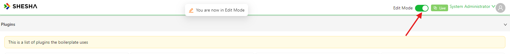

# Toggling Edit Mode

Every Shesha application runs in one of two modes. **Live Mode** is how your end users experience the app day to day. **Edit Mode** unlocks the parts of the app an administrator can reconfigure right there on the page, without switching over to the Configuration Studio.

---

## Turning Edit Mode On

Look for the **Live Mode** / **Edit Mode** switch in the application header. It's only visible to users who hold the `app:Configurator` permission - if you don't have that permission, you won't see it at all.

Flipping the switch takes effect straight away, with a brief "You are now in Edit Mode" message confirming the change (and "You are now in Live Mode" when you flip it back). Flip it again to return to Live Mode.

---

## What You Can Edit in Edit Mode

### The Menu

Move your mouse to the top-left edge of the menu on the left and a small pencil icon appears. Click it to open the **Sidebar Menu Configuration** dialog, where you can add, remove, reorder, and rename menu items and groups without leaving the page you're on.

This edits the same menu covered in [Main Menu Settings](../../settings/settings-overview.md#main-menu-settings) - the pencil icon here is just a quicker way to reach it.

### The Logo

:::warning Removed on this version
The "Edit logo" hover button has been removed from the framework - the component that rendered it no longer exists in `shesha-reactjs`. Logo changes now go through the application's [Settings](../../settings/settings-overview.md) instead of an inline hover control.
:::

### The Form or View You're Looking At

Hover over the main content of a page built from a configured form, and a small bar appears showing that form's name along with its own pencil icon. Click the pencil to open that form in a quick-edit dialog, so you can go straight from looking at a screen to editing it.

:::tip
This works form by form. If a page is made up of several forms, for example one with an embedded sub-form, hovering over each part shows that part's own name and its own pencil icon.
:::
