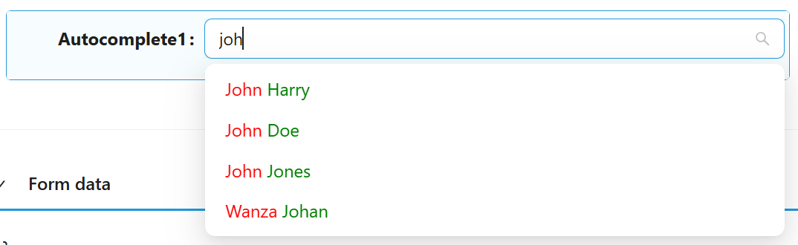
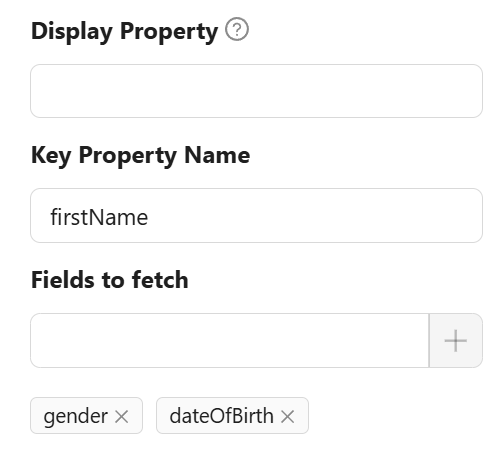

# Autocomplete

The Autocomplete component enhances user input fields with dynamic suggestions based on the user's typing. It is an input box with text hints, and users can type freely. The keyword is aiding input.


---

## Properties

The following properties are available to configure the behaviour of the component from the form editor (this is in addition to [common properties](../common-component-properties.md)).

The panel is organised into three tabs: **Common**, **Events**, and **Appearance**. Properties below appear in the same order as the live panel.

---

### Common

#### **Selection Mode** `object`

Sets how many options can be selected.

| Option | Description |
|---|---|
| `Single` *(default)* | The user can pick one option. |
| `Multiple` | The user can pick more than one option. |

#### **Disable Search** `boolean`

Hides the search bar and disables real-time filtering.

___

### Data

A collapsible panel on the Common tab.

#### **Data Source Type** `object`

Chooses where the suggestions come from.

| Option | Description |
|---|---|
| `Entities List` *(default)* | Suggestions are fetched from a Shesha entity using the standard entities endpoint. |
| `URL` | Suggestions are fetched from a custom endpoint you specify. |

#### **Data Source URL** `string`

Shown only when Data Source Type is **URL**. The custom endpoint Shesha calls to fetch suggestions. The endpoint should accept a `string term` parameter for filtering and return either a plain array or a standard paged response:

```ts
export interface ITableDataResponse {
    readonly totalCount: number;
    readonly items: object[];
}
```

#### **Query Param** `object`

Shown only when Data Source Type is **URL**. Additional name/value parameters sent with every request to the custom Data Source URL.

#### **Entity Type** `string`

Shown only when Data Source Type is **Entities List**. The Shesha entity to search within.

#### **Entity Filter** `object`

A query builder filter that narrows the search to a subset of records. Shown once an Entity Type has been selected.

#### **Custom Source URL** `string`

Shown only when Data Source Type is **Entities List**. An endpoint used in place of the standard entity search, while still using Entity Type to resolve field metadata for the other Data settings.

:::note
This shares the same underlying value as Data Source URL above. Configure one or the other depending on your Data Source Type, since setting both is not meaningful.
:::

#### **Display Property** `string`

The property used as each option's display text. Leave empty to use the default display property defined on the backend.

#### **Key Property Name** `string`

The property used as the selected value when Value Format is `Simple ID` or `Custom`. Leave empty to use the default key evaluator. Hidden when Value Format is **Entity Reference**.

#### **Fields to Fetch** `object`

Extra entity properties to fetch alongside each item, beyond what Display Property and Display Value Function already need. Hidden when Data Source Type is **URL**.

#### **Sort By** `object`

Sorts the returned options by one or more properties. Hidden when Data Source Type is **URL**.

#### **Grouping** `object`

Groups options by a property. Hidden when Data Source Type is **URL**.

___

### Value

A collapsible panel on the Common tab, controlling what actually gets stored when the user picks an item.

#### **Value Format** `object`

The shape of the value stored on the form when an item is selected. The available options depend on Data Source Type.

| Option | Available when | Description |
|---|---|---|
| `Simple ID` | Always | Stores the item's raw key value. |
| `Entity Reference` | Data Source Type is Entities List | Stores an entity reference object (`id`, `_className`, `_displayName`). |
| `Custom` | Always | Stores a value built by your own script. |

#### **Value Function** `function`

Shown only when Value Format is **Custom**. A script that returns the value to store for the selected item, built from the item object.

**Form type to use:** Edit Form or Create Form - use when the field's stored value needs a custom shape.

**Example - Build a compound custom value:**

```ts
//#region Exposed variables
import {
  item
} from './outcomeValueFunc.variables';
//#endregion

const outcomeValueFunc = () => {
    return `${item.firstName}|${item.gender}|${item.dateOfBirth}`;
};
```

#### **Key Value Function** `function`

Shown only when Value Format is **Custom**. A script that turns the stored custom value back into the key used to re-fetch the correct item from the backend. Used together with Key Property Name.

**Example - Extract the key from a compound custom value:**

```ts
//#region Exposed variables
import {
  value
} from './keyValueFunc.variables';
//#endregion

const keyValueFunc = () => {
    return value?.split('|')[0];
};
```

#### **Display Value Function** `function`

A script that returns the text shown for each item in the dropdown. Available regardless of Data Source Type or Value Format. In `Entities List` mode you can request extra fields with Fields to Fetch; in `URL` mode you can only use fields the endpoint already returns.

**Form type to use:** Any form type - this only affects how items are displayed.

**Example - Show first and last name in different colours:**

```js
//#region Exposed variables
import {
  item
} from './displayValueFunc.variables';
//#endregion

const displayValueFunc = () => {
  return `<span style="color: red">${item.firstName}</span> <span style="color: green">${item.lastName}</span>`;
};
```



#### **Filter Selected Function** `function`

Shown only when Value Format is **Custom**. A script that returns a [JsonLogic](https://jsonlogic.com/) filter used to look up the selected item on the backend when a single field is not enough to uniquely identify it.

**Example - Filter by a compound key:**

```ts
//#region Exposed variables
import {
  value
} from './filterSelectedFunc.variables';
//#endregion

const filterSelectedFunc = () => {
    const parts = value?.split('|');
    if (parts.length < 2)
        return null;
    return {
        and: [
            {"==":[{"var":"firstName"}, parts[0]]},
            {"==":[{"var":"gender"}, Number(parts[1])]}
        ]
    };
};
```

#### **Allow Free Text** `boolean`

Shown only when Value Format is **Simple ID**. Lets the user type a value that is not present in the source list.

___

### Quickview

A collapsible panel on the Common tab.

#### **Use Quickview** `boolean`

Adds a quickview button next to a selected item, letting the user preview the full record in a modal without navigating away.

#### **Form Path** `string`

The form used to render the quickview modal's content.

#### **Get Entity URL** `string`

The endpoint used to fetch the full record shown in the quickview modal.

#### **Display Property** `string`

The property used as the quickview modal's title. Leave empty to use the default display property.

#### **Width** `string`

The width of the quickview modal. Accepts any CSS unit.

___

### Validations

A collapsible panel at the bottom of the Common tab.

#### **Required** `boolean`

The form cannot be submitted while no option has been selected.

#### **Message** `string`

The text shown when validation fails, in place of the default message.

#### **Custom Validation** `function`

Your own validation rule, written as a script that returns a promise.

---

### Events

#### **On Change** `function`

Fires when the selected value changes. Alongside the standard script variables, the handler also receives `value` (the component's current value) and `option` (metadata about the currently selected item).

**Form type to use:** Edit Form - use when reacting to a user's selection.

---

## Examples

The Autocomplete component can work with two types of list sources - standard Entities endpoints (`Entities List` Data Source Type) and custom endpoints (`URL` Data Source Type).

### Entities List Data Source Type

<LayoutBanners url="https://app.guideflow.com/embed/6kw11ndfzp" type={1}/>

If the standard entities endpoint is used, the backend returns a list of entities with items in the following format:

```js
{
    "id": "d519b92f-86e9-4f0f-8df4-00aae8a43158",
    "_className": "Shesha.Domain.Person",
    "_displayName": "Alex Stephens"
}
```

If you specify a value for **Display Property**, the received data contains an additional field used as the display name of the item. For example, **Display Property** = `firstName`:

```js
{
    "id": "d519b92f-86e9-4f0f-8df4-00aae8a43158",
    "_className": "Shesha.Domain.Person",
    "_displayName": "Alex Stephens",
    "firstName": "Alex"
}
```

#### Entity Reference Value Format

If you use the `Entity Reference` Value Format, the selected value is stored on the model as:

```js
{
    "autocomplete": {
        "id": "d519b92f-86e9-4f0f-8df4-00aae8a43158",
        "_className": "Shesha.Domain.Person",
        "_displayName": "Alex Stephens"
    }
}
```

#### Simple ID Value Format

If you use the `Simple ID` Value Format, the selected value is stored on the model as:

```js
{
    "autocomplete": "d519b92f-86e9-4f0f-8df4-00aae8a43158"
}
```

If you specify a value for **Key Property Name**, the received data contains an additional field used as the selected value. For example, **Display Property** = `firstName`, **Key Property Name** = `lastName`:

```js
// Received item
{
    "id": "d519b92f-86e9-4f0f-8df4-00aae8a43158",
    "_className": "Shesha.Domain.Person",
    "_displayName": "Alex Stephens",
    "firstName": "Alex",
    "lastName": "Stephens"
}

// Selected value
{
    "autocomplete": "Stephens"
}
```

### URL Data Source Type

<LayoutBanners url="https://app.guideflow.com/embed/ok8eev2fxk" type={1}/>

Standard format of the response from custom endpoints:

```js
// Received item
{
    "value": 1,
    "displayText": "First option"
}

// Selected value
{
    "autocomplete": 1
}
```

You can use a source with any other format of items. To do this, specify in **Display Property** the field used as the name of items, and in **Key Property Name** the field used as the value.

### Custom Value Format

Regardless of Data Source Type, you can use the `Custom` Value Format. Without additional settings, or with only **Display Property** and **Key Property Name** set, this mode behaves like `Simple ID`.

To set up a custom mode, you can use the following scripts:

- **Value Function** - uses the item received from the backend to return a value in a custom format.
- **Key Value Function** - uses the value in the custom format to return the key value, used with **Key Property Name** to build the filter for the request.
- **Display Value Function** - gets the display name of items. Use **Display Property** instead, or leave both empty to use the standard display property.

#### Example

Configure Autocomplete to fetch additional fields (`firstName`, `gender`, `dateOfBirth`). Use `firstName` as Key Property Name.



Configure **Value Function** to return the value in a custom format:

```ts
const outcomeValueFunc = () => {
    return `${item.firstName}|${item.gender}|${item.dateOfBirth}`;
};
```

Now, when a list item is selected, the value has the custom format:

```js
{
  "autocomplete": "Alex|1|2088-06-06T00:00:00"
}
```

Configure **Key Value Function** to get the correct key value (needed to fetch the correct item from the backend). This takes the first element of the split value, which is `firstName`:

```ts
const keyValueFunc = () => {
    return value?.split('|')[0];
};
```

#### Advanced filtering

In the example above, only the `firstName` field is used. One field may not be enough to uniquely identify an item. For more accurate identification, use **Filter Selected Function**, which returns a filter in [JsonLogic](https://jsonlogic.com/) format:

```ts
const filterSelectedFunc = () => {
    const parts = value?.split('|');
    if (parts.length < 2)
        return null;
    return {
        and: [
            {"==":[{"var":"firstName"}, parts[0]]},
            {"==":[{"var":"gender"}, Number(parts[1])]}
        ]
    };
};
```

This script uses two fields as a compound key for filtering.
