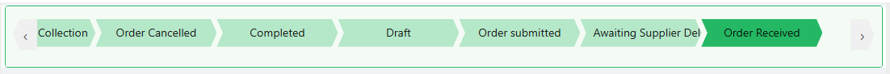

# Chevron

The Chevron component displays a row of arrow-shaped stages built from a reference list, with the stage matching the bound property's current value highlighted. Use it to show progress through a fixed sequence of statuses, such as an order's fulfilment pipeline.

:::note Clicking a stage does not change the value
Each stage is a fully configurable button (the same underlying button component used by Button and Button Group), so clicking one only does whatever action you configure for it - it does not automatically advance the bound property. The highlighted stage is purely a visual match against the property's current value, driven separately from whatever a click does.
:::

---

## Properties

The following properties are available to configure the behavior of the component from the form editor (this is in addition to [common properties](../common-component-properties.md)).

The panel is organised into two tabs: **Common** and **Appearance**. Properties below appear in the same order as the live panel.

### Common

The Common tab starts with the standard Property Name, Label, Tooltip, and Visible settings described in [common properties](../common-component-properties.md), followed by the Data panel below. Chevron has no Interaction Mode setting, since the user does not type a value into it.

___

### Data

A collapsible panel on the Common tab.

#### **Reference List** `object`

Defines which reference list drives the Chevron's stages.

:::note Item changes are picked up automatically
Changes to the reference list items are reflected here without reconfiguring the component.
:::

#### **Items** `object`

Selects which items from the chosen reference list appear as stages. Selecting an item opens a small per-item builder (shared with Kanban's column items, not Button Group) where you can hide that stage or attach an **Action Configuration** that fires when the stage is clicked.

:::note No per-item icon setting
There is no icon field in this builder. Each stage's icon is inherited from the icon already configured on that reference list item, and is only shown when **Show Icons** (below, under Appearance) is switched on.
:::

___

### Appearance

#### **Font** `object`

Sets the font (family, size, weight, colour, alignment) applied to each stage's label text.

#### **Dimensions** `object`

Sets the **Width** and **Height** of each stage. Unlike the standard Dimensions panel, there is no min or max width and height here.

#### Margin & Padding

The standard spacing panel described in [common properties](../common-component-properties.md#appearance).

#### **Color Settings**

#### **Color Source** `object`

Controls where each stage's colour comes from:

| Option | Behaviour |
|---|---|
| **Primary color** *(default)* | Uses the application theme's primary colour. |
| **Custom color** | Uses the colour you set in **Active Color** below. |
| **From reflist item** | Uses the colour configured on each reference list item itself. |

#### **Active Color** `string`

The colour applied to the currently active stage. Only shown when Color Source is set to **Custom color**.

#### **Show Icons** `boolean`

Shows each stage's configured icon alongside its label.
