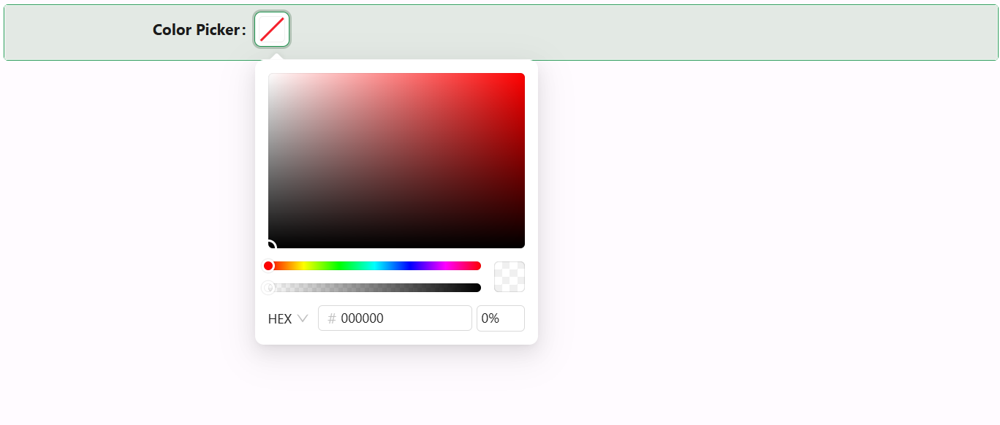

# Color Picker

The Color Picker component lets users pick a colour from a visual palette, or type in their own hex, RGB, or HSB value. Use it wherever a form needs to capture a colour, for example a category colour or a themed status indicator.

:::tip Binding to a theme colour
The value can also be one of the application's theme colour keywords - `primary`, `success`, `warning`, `error`, `info`, or `processing` - instead of a literal colour string. When the bound value matches one of these keywords, the picker resolves and displays the application's actual theme colour for it rather than treating the keyword as a raw colour value.
:::

---

## Properties

The following properties are available to configure the behavior of the component from the form editor (this is in addition to [common properties](../common-component-properties.md)).

### Data

#### **Title** `string`

Text shown at the top of the picker's popover panel, above the colour palette itself.

#### **Allow Clear** `boolean`

Adds a clear button that resets the selected colour to empty.

#### **Show Color Code** `boolean`

Shows the colour's value (in whichever format - hex, RGB, or HSB - the user last switched to in the picker) as text alongside the colour swatch.

#### **Disable Opacity** `boolean`

Removes the alpha/transparency slider from the picker, restricting selection to fully opaque colours.

___

### Events

#### **On Change** `function`

Fires when the user picks a new colour, receiving the newly selected colour value alongside the standard script variables.

___

### Appearance

Color Picker's Appearance tab exposes Size (Small/Middle/Large), Margin & Padding, and Custom Styles.
