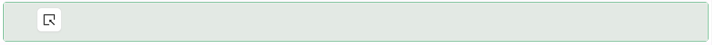

# Icon Picker

The Icon Picker component lets a user choose an icon from Shesha's icon library by clicking a button that opens an icon browser. The chosen icon's name is stored as the component's value, so it binds to a text field on your entity like any other input.

:::note Shown in the toolbox as "Icon"
The component's internal type is `iconPicker`, but it appears in the form designer's toolbox labelled just **Icon**.
:::

---

## Properties

The following properties are available to configure the behavior of the component from the form editor (this is in addition to [common properties](../common-component-properties.md)).

### Common

#### **Property Name** `string`

The icon the user picks is written here, and an existing value shown here is what pre-selects an icon when the form loads - there is no separate "default icon" setting.

___

### Appearance

The next three properties sit inside the panel's **Icon Style** group. Together they replace the standard common Font group with a reduced set specific to this component (no family or weight options).

#### **Size** `number`

The icon's font size.

#### **Color** `object`

A colour picker for the icon.

#### **Align** `object`

Positions the icon within the component's width: `left`, `center`, or `right`.

___

Icon Picker also exposes the standard **Margin & Padding** group (see [common properties](../common-component-properties.md)), which controls the spacing around and inside the component.

___

#### **Custom Styles** `function`

A script that returns the style of the element as an object, conforming to `CSSProperties`.
