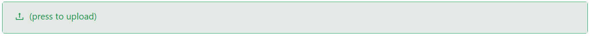

# Image

The Image component displays a picture on a form, sourced from a stored file, a URL, or a base64 string. It comes with preview support, flexible sizing, object-fit controls, and visual filters for a complete image experience.

---

## Properties

The following properties are available to configure the behaviour of the component from the form editor (this is in addition to [common properties](../common-component-properties.md)).

Image has not yet moved to the reworked settings layout, so its panel keeps four tabs: **Common**, **Validation**, **Appearance**, and **Security**. Properties below appear in the same order as the live panel.

### Common

#### **Alt Text** `string`

Alternative text shown when the image fails to load.

#### **Allow Preview** `boolean`

Enables an image preview popup when the image is clicked.

#### **Allowed File Types** `object`

The file extensions allowed for upload, for example `.jpg`, `.png`, `.gif`.

#### **Image Source Type** `object`

Selects where the image comes from:

| Option | Description |
|---|---|
| `Stored File` | The image is a file stored in Shesha's file storage, identified by a file ID. |
| `URL` | The image is loaded directly from a URL. |
| `Base64` | The image is stored as a base64-encoded string on the property. |

The next property shown depends on which option you pick here.

#### **URL** `string`

The image URL to load. Only shown when Image Source Type is `URL`.

#### **Upload Image** `object`

An upload control for a base64-encoded image. Only shown when Image Source Type is `Base64`. The uploaded file is converted to a base64 string and stored directly on the component's Base64 setting.

#### **File ID** `string`

The ID of the stored file to display. Only shown when Image Source Type is `Stored File`.

:::note
When Image Source Type is `Stored File` and File ID is left empty, the component instead reads and writes the file bound to its own Property Name, uploading a new file there when the user picks one.
:::

___

### Validation

#### **Required** `boolean`

See [common properties](../common-component-properties.md) for how Required behaves. On Image, it requires a file, URL, or base64 value to be present before the form can be submitted.

___

### Appearance

#### **Dimensions**

Image exposes the standard Dimensions group (Width, Min Width, Max Width, Height, Min Height, Max Height - see [common properties](../common-component-properties.md)).

___

#### **Picture Styles**

The next five properties sit inside the panel's Picture Styles group and control how the image itself is rendered, separately from the component's outer dimensions.

#### **Object Fit** `object`

How the image is resized to fit its box:

| Option | Description |
|---|---|
| `Cover` | Fills the box, cropping the image if needed. |
| `Contain` | Fits the whole image inside the box, may leave empty space. |
| `Fill` | Stretches the image to fill the box exactly, ignoring aspect ratio. |

#### **Object Position** `object`

Sets the alignment of the image content within its box, for example `top left` or `center center`.

#### **Filter** `object`

Applies a visual filter to the image:

| Option | Description |
|---|---|
| `None` | No filter applied. |
| `Grayscale` | Removes colour. |
| `Sepia` | Applies a warm, brownish tone. |
| `Blur` | Blurs the image. |
| `Brightness` | Adjusts brightness. |
| `Contrast` | Adjusts contrast. |
| `Hue Rotate` | Rotates the colour hue. |
| `Invert` | Inverts the image's colours. |
| `Saturate` | Adjusts colour saturation. |

#### **Filter Intensity** `number`

The strength of the selected Filter. For `Blur` this is in pixels, for `Hue Rotate` it is in degrees, and for the others it is a percentage.

#### **Opacity** `number`

Controls the transparency of the image.

___

Image also exposes the standard **Border**, **Shadow**, **Margin & Padding**, and **Custom Styles** groups (see [common properties](../common-component-properties.md)). Border includes an extra visibility toggle button that lets you hide the border outline without clearing its configured values.

---

### Security

#### **Permissions** `object`

Restricts the component to users holding one of the named permissions. See the [common Permissions property](../common-component-properties.md#permissions).
