# Kanban

The Kanban board is a visual project management tool that helps teams organise tasks and track their progress. It provides a clear overview of the status of each task, letting users move task cards between columns such as "To Do," "In Progress," and "Done."

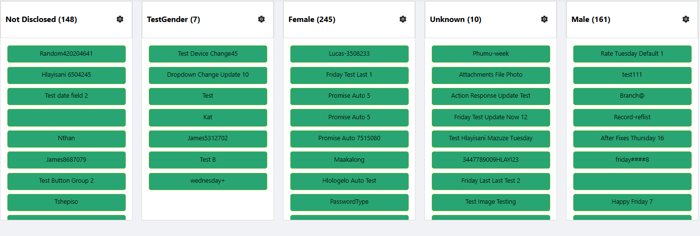

:::warning Requires a Data Table Context
Kanban does not fetch its own data or define its own entity type. It must be placed inside a **Data Table Context** component, and reads the records that context has already loaded. Settings such as the entity type and the maximum number of records to fetch belong to the surrounding Data Table Context, not to Kanban itself. If Kanban is not inside a Data Table Context, the designer shows "Kanban must be used within a Data Table Context" instead of the board.
:::

---

## Properties

The following properties are available to configure the behaviour of the component from the form editor (this is in addition to [common properties](../common-component-properties.md)).

### Common

#### **Component Name** `string`

A unique name for this Kanban instance, separate from the common Component Name convention used elsewhere - required so multiple boards on the same form can be told apart.

#### **Render Form** `object`

The form that opens in a modal when a card is clicked, used to display or edit the task's details. Required.

#### **Grouping Property** `string`

The field on your data model used to group items into columns. This should be a reference list property, such as `status` or `priority`. Required.

#### **Collapsible** `boolean`

When enabled, each column can be collapsed to save space and reduce visual clutter. Hidden when Readonly is on.

#### **Readonly** `boolean`

Disables drag-and-drop, editing, and deleting cards.

#### **Allow Delete** `boolean`

Toggles the ability to remove cards from the board. Hidden when Readonly is on.

#### **Show Icons** `boolean`

Toggles icon visibility on card headers.

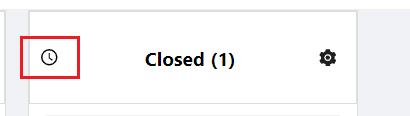

#### **Allow New Record** `boolean`

Lets users add new items to the board. Hidden when Readonly is on.

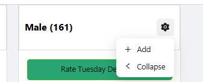

#### **Create Form** `object`

The form used to create new tasks. Only shown when Allow New Record is enabled.

#### **Allow Edit** `boolean`

Enables in-place or modal editing of existing cards. Hidden when Readonly is on.

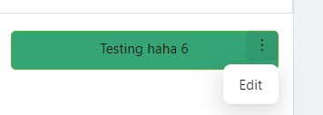

#### **Edit Form** `object`

The form used to edit existing tasks. Only shown when Allow Edit is enabled.

___

### Data

#### **Reference List** `object`

The reference list used to define the board's columns. Re-select this if the reference list's items are modified after configuring the component - the item selector below does not update automatically.

#### **Items** `object`

Selects which items from the chosen reference list appear as columns, and lets you reorder them and configure per-column actions (such as what happens when a card is dropped into that column, or hiding a column entirely).

___

### Appearance

#### **Header Styles**

Header Styles applies the standard Font, Background, Shadow, and Border groups (see [common properties](../common-component-properties.md)) to each column's header, plus a Custom Styles script.

___

#### **Column Styles**

#### **Gap** `number`

The space between columns on the board.

Column Styles also applies the standard Dimensions, Background, Shadow, Border, and Margin & Padding groups (see [common properties](../common-component-properties.md)) to each column card itself, plus a Custom Styles script.

---

## How to Configure the Component

The Kanban component is found under the **Advanced** group in the form designer.

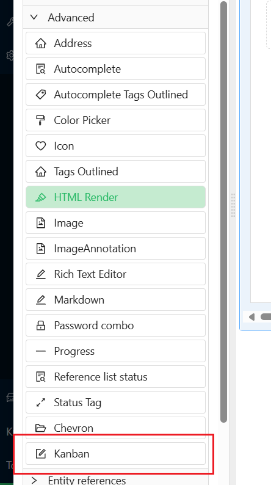

Drag it onto your form, inside a Data Table Context component.

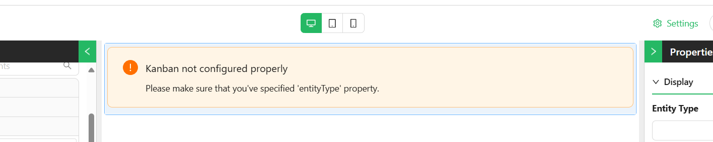

Configure its properties in the settings panel.

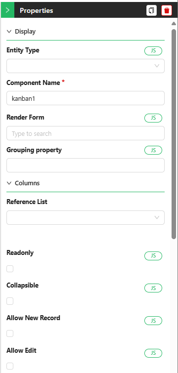
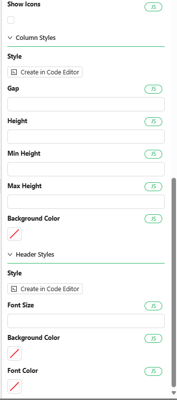

Select a **Reference List** on the Data tab to define the board's columns - for example a `status` reference list with items like `To Do`, `In Progress`, and `Done`.

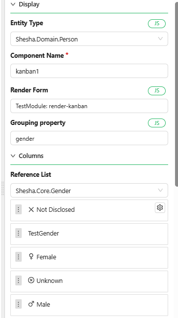

You can reorder the columns to match your workflow. Hovering over a column reveals a gear icon that opens per-column configuration, such as what should happen when a task is dropped into it, or hiding the column entirely.

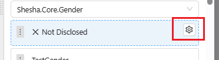

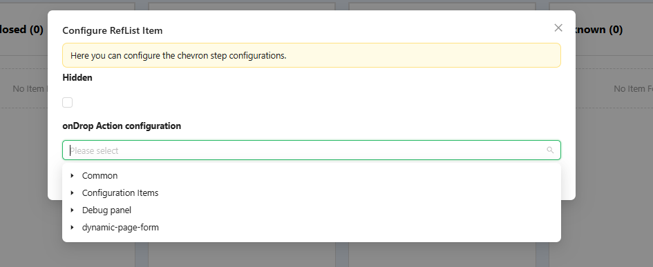
