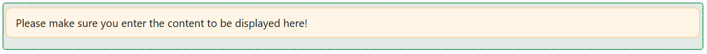

# Markdown

The Markdown component displays richly formatted text written in Markdown syntax - headings, bold and italic text, lists, links, images, and fenced code blocks with syntax highlighting. Use it for documentation, help text, or any other content that needs more formatting than a plain Text component allows.



:::tip Starts with example content
When you first drag a Markdown component onto a form, its **Content** is pre-filled with a short example covering headings, lists, links, and code blocks, so you have something to see and edit immediately rather than a blank editor.
:::

---

## Properties

The following properties are available to configure the behavior of the component from the form editor (this is in addition to [common properties](../common-component-properties.md)).

### Common

#### **Property Name** `string`

Used only as a fallback - if **Content** is empty, the component displays the value bound to this property instead.

#### **Content** `string`

The Markdown text to display, written directly in a Markdown-aware code editor (not a JavaScript expression). It supports `{{ }}` placeholders that are substituted from the form's `data` and `page.state` before rendering, the same templating used by [`application.utils.evaluateString`](../../javascript-api/application/utils/utils.md).

**Form type to use:** Any form type - the component is display-only and does not submit a value.

**Example - Mix static Markdown with a data placeholder:**

```markdown
## Order Summary

Order **{{data.orderNumber}}** was placed on {{data.orderDate}}.
```

If Content is left empty, the component falls back to whatever value is bound via **Property Name** instead.

___

### Appearance

This tab exposes Font, Border, Background, Shadow, and Margin & Padding, plus two adjustments: **Dimensions** is limited to Width, Min Width, and Max Width (no Height control), and **Custom Styles** only exposes a Style script (no Custom CSS Class field).
