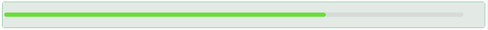

# Progress

The Progress component is a visual indicator that represents task completion, processes, or status in either linear or circular form. It supports various styles, types, and customization options for a dynamic and informative user interface.

---

## Properties

The following properties are available to configure the behavior of the component from the form editor (this is in addition to [common properties](../common-component-properties.md)).

### Common

#### **Percent** `number`

Sets the current progress percentage (0 to 100).

#### **Type** `object`

Visual type of the progress bar.

| Option | Description |
|---|---|
| `Line` *(default)* | Horizontal bar. |
| `Circle` | Circular progress. |
| `Dashboard` | Semi-circular gauge-like view. |

#### **Status** `object`

Indicates the progress status.

| Option | Description |
|---|---|
| `Normal` | Neutral, in-progress appearance. |
| `Active` | Shows an animated stripe to indicate the process is running. |
| `Success` | Shows a success colour. |
| `Exception` | Shows an error colour. |

#### **Show Info** `boolean`

Whether to display the percentage inside the progress bar.

___

### Appearance

#### Progress Style

#### **Stroke Color** `object`

The active bar color.

#### **Trail Color** `object`

The background (trail) color of the progress track.

#### **Stroke Linecap** `object`

Line ending style.

| Option | Description |
|---|---|
| `Round` *(default)* | Rounded ends. |
| `Butt` | Flat, flush ends. |
| `Square` | Flat ends that extend slightly past the track. |

#### **Stroke Width** `number`

Thickness of the progress stroke, as a percentage of the canvas width (default is 6).

#### **Width** `number`

The canvas width of the progress indicator, in pixels. Shown only when Type is `Circle` or `Dashboard`.

#### Type Specific Settings

The following properties only appear for certain progress Types.

#### **Steps** `number`

The total number of discrete steps to divide the bar into. Shown only when Type is `Line`.

#### **Gap Degree** `number`

The gap degree of the circle, from 0 to 295. Shown only when Type is `Circle` or `Dashboard`.

#### **Gap Position** `object`

The position of the gap around the circle: `Top`, `Bottom`, `Left`, or `Right`. Shown only when Type is `Circle` or `Dashboard`.
