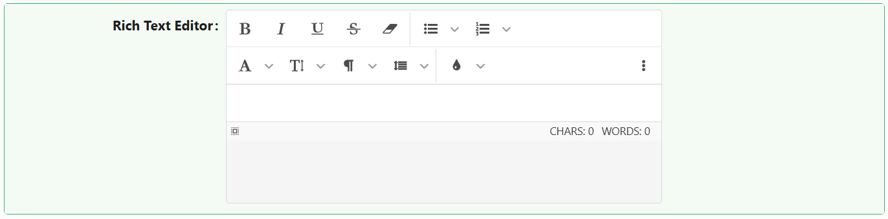

# Rich Text Editor

The Rich Text Editor component allows users to write and format content with a WYSIWYG interface. It supports various toolbars, plugins, and storage options, making it ideal for complex input scenarios such as note-taking, content creation, or documentation.

---

## Properties

The following properties are available to configure the behavior of the component from the form editor (this is in addition to [common properties](../common-component-properties.md)).

### Data

#### Toolbar

#### **Show Toolbar** `boolean`

Toggles the main formatting toolbar. *(default: true)*

#### **Size Of Icons** `object`

Sets icon size.

| Option | Description |
|---|---|
| `Tiny` | Smallest icon size. |
| `Extra small` | Compact icon size. |
| `Middle` | Default icon size. |
| `Large` | Largest icon size. |

#### **Hidden Actions** `object`

Specify toolbar actions that should be hidden from the user. A great way to simplify the editor.

#### Options

#### **Auto Focus** `boolean`

If enabled, the editor automatically focuses when the page loads.

#### **Presets** `object`

Chooses a pre-configured toolbar layout.

| Option | Description |
|---|---|
| `None` *(default)* | No preset applied. |
| `Inline Mode` | A compact, inline-editing layout. |

#### Display

#### **Direction** `object`

Controls text direction.

| Option | Description |
|---|---|
| `Auto` *(default)* | Follows the browser's default direction. |
| `rtl` | Right-to-left. |
| `ltr` | Left-to-right. |

#### **Show Characters Counter** `boolean`

Displays a live character counter beneath the editor.

#### **Show Words Counter** `boolean`

Displays a live word count for the content in the editor.

#### Advanced

#### **Element That Will Be Created On Enter** `object`

Controls what tag is created on Enter.

| Option | Description |
|---|---|
| `Break (BR)` | Inserts a line break. |
| `Paragraph (P)` | Starts a new paragraph. |
| `Block (DIV)` | Starts a new block-level `div`. |

#### **Insert Image As Base64 URI** `boolean`

Stores images as base64 strings.

#### **Iframe Mode** `boolean`

Isolates the editor content in a separate iframe for better style separation.

#### **Remember Height** `boolean`

Remembers the editor height for the next session.

#### **Remember Mode** `boolean`

Remembers the editor mode (WYSIWYG or Source) for the next session.

#### **Ask Before Paste HTML** `boolean`

If enabled, asks the user to confirm before allowing content copied from a web page to be pasted in.

#### **Ask Before Paste From Word/Excel** `boolean`

If enabled, asks the user to confirm before allowing content from Word or Excel to be pasted in.

___

### Appearance

#### **Theme** `string`

Choose between:

| Option | Description |
|---|---|
| `Default` *(default)* | The standard light editor theme. |
| `Dark` | A dark editor theme. |

#### Dimensions

#### **Auto Width** `boolean`

When enabled, the editor's width follows its container instead of a fixed size.

#### **Auto Height** `boolean`

When enabled, the editor's height grows to fit its content instead of a fixed size.

The next four properties are shown only when the matching Auto Width or Auto Height setting is off.

#### **Width** `string`

The editor's fixed width. Shown only when Auto Width is off.

#### **Min Width** `string`

The minimum width the editor can be resized to. Shown only when Auto Width is off and Allow Width Resize is on.

#### **Max Width** `string`

The maximum width the editor can be resized to. Shown only when Auto Width is off and Allow Width Resize is on.

#### **Height** `string`

The editor's fixed height. Shown only when Auto Height is off.

#### **Min Height** `string`

The minimum height the editor can be resized to. Shown only when Auto Height is off and Allow Height Resize is on.

#### **Max Height** `string`

The maximum height the editor can be resized to. Shown only when Auto Height is off and Allow Height Resize is on.

#### **Allow Width Resize** `boolean`

Lets the user drag-resize the editor's width. Shown only when Auto Width is off.

#### **Allow Height Resize** `boolean`

Lets the user drag-resize the editor's height. Shown only when Auto Height is off.

#### **Custom Styles**

A **Style** script that returns the style of the element as an object, conforming to `CSSProperties`. The script has access to the standard script variables, including `data` (the current form values).
