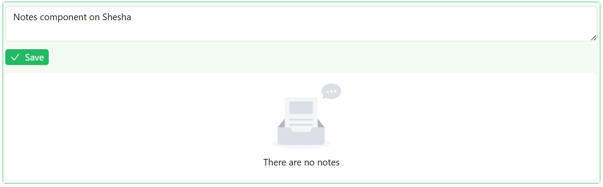

# Notes

The Notes component is a collaborative and versatile feature for capturing and managing threaded notes against a record. It supports data ownership, conditional visibility, layout adjustments, and event scripting.

Allowing notes to be captured on a form is as simple as adding the `Notes` component to the form. The `Notes` component automatically displays any notes that have already been captured against the entity the form is bound to, and lets users add new ones.



---

## Properties

The following properties are available to configure the behavior of the component from the form editor. These are in addition to the [common properties](../common-component-properties.md) shared by all Shesha components.

The panel is organised into three tabs: **Common**, **Events**, and **Appearance**. Properties below appear in the same order as the live panel.

---

### Common

The Common tab starts with the standard Component Name, Visible, and Interaction Mode settings described in [common properties](../common-component-properties.md), followed by the three panels below.

___

### Owner

A collapsible panel on the Common tab. These settings tell the component which record the notes belong to.

#### **Owner Type** `string`

The type of entity that owns these notes, for example `Shesha.Domain.Person`. Required, and picked using an entity type autocomplete.

#### **Owner ID** `string`

The ID of the specific entity record that owns the notes. Required.

Shesha sets this to `{data.id}` by default, which reads the ID of the record the current form is bound to. In most cases the default is what you want, so notes are tied to whichever record the form is displaying.

#### **Notes Category** `string`

Groups notes into categories, for example `general` or `compliance`. Only notes saved under the same category are shown together. Leave it empty if you do not need to separate notes into groups.

___

### Behaviour

A collapsible panel on the Common tab.

#### **Allow Edit** `boolean`

Lets a user edit a note after it has been posted, using an inline editor on the note card.

:::note
A user can only edit their own notes. The edit control does not appear on notes posted by other users, regardless of this setting.
:::

#### **Allow Delete** `boolean`

Lets a user delete a note directly from the thread.

:::note
A user can only delete their own notes. The delete control does not appear on notes posted by other users, regardless of this setting.
:::

#### **Auto Size** `boolean`

Grows and shrinks the note input to fit its content, instead of keeping a fixed height with a scrollbar.

#### **Show Chars Count** `boolean`

Shows a character count below the note input, so the user can see how long their note is running.

___

### Validations

A collapsible panel at the bottom of the Common tab.

#### **Min Length** `number`

The minimum number of characters a note must contain before it can be posted.

#### **Max Length** `number`

The maximum number of characters a note can contain.

:::tip Pair Max Length with Show Chars Count
On its own, Max Length simply stops the user typing. Turning on Show Chars Count makes the limit visible while they write.
:::

---

### Events

Events are JavaScript handlers that run after a note is created, updated, or deleted. Use them to react to note activity, such as refreshing a related counter or sending a notification.

#### **On Create** `function`

Fires after one or more notes are successfully created and saved.

All event handlers have access to the following variables:

| Variable | Type | Description |
|---|---|---|
| `createdNotes` | `Array<object>` | The notes that were just created. |
| `data` | `object` | The current values of all fields on the form. |
| `form` | `FormApi` | The form instance. |
| `page.state` | `object` | Data shared by every component on the current page |
| `actions.callApi` | `object` | HTTP client for calling APIs. Exposes `get`, `post`, `put`, `patch`, and `delete` |
| `actions.showMessage` | `object` | Shows a toast notification: `success`, `error`, `warning`, `info`, `loading` |
| `utils.moment` | `function` | The Moment.js library, for working with dates and times |

**Form type to use:** Edit Form - use when the Notes component is displayed against an existing record.

**Example - Show a toast confirming how many notes were added:**

```js
actions.showMessage.success(`${createdNotes.length} note(s) added`);
```

---

#### **On Update** `function`

Fires after an existing note is successfully updated. In addition to the shared variables listed under On Create, this event exposes the updated note as `note`:

| Variable | Type | Description |
|---|---|---|
| `note` | `object` | The updated note, including its `id`, `noteText`, `author`, `category`, `priority`, and `creationTime`. |

**Form type to use:** Edit Form.

**Example - Log the text of the note that was edited:**

```js
actions.showMessage.info(`Note updated: ${note.noteText}`);
```

---

#### **On Delete** `function`

Fires after a note is successfully deleted. In addition to the shared variables listed under On Create, this event exposes the deleted note as `note`, using the same shape described under On Update.

**Form type to use:** Edit Form.

---

### Appearance

#### **Buttons Layout** `object`

Controls where the save button appears below the note input box.

| Option | Description |
|---|---|
| `Left` | The save button appears on the left. This is the default. |
| `Right` | The save button appears on the right. |
