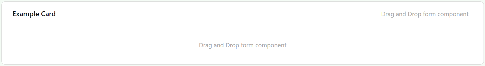
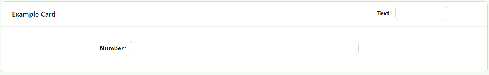

# Card

The Card component wraps other components in a styled container with an optional heading, giving you a visually distinct section on the form. Use it to group related fields together and separate them visually from the rest of the form.

:::info Two separate drop areas
A Card has two independent places to drop components: the main **content** area, and a **header** area next to the heading text (useful for a small action button or icon alongside the title). Dragging a component onto the header area keeps it separate from the card's body.
:::

---

## Properties

The following properties are available to configure the behavior of the component from the form editor (this is in addition to [common properties](../common-component-properties.md)). Card groups its settings into **Common**, **Events**, and **Appearance** tabs. Permissions are set on the Visible and Interaction Mode settings on the Common tab, using the lock icon beside each.

### Common

#### **Heading** `string`

The text displayed at the top of the card. This is a scriptable field, so it can be computed rather than fixed.

#### **Hide Heading** `boolean`

Hides the heading area entirely, even if a Heading value is set and even if components have been dropped into the header area.

#### **Hide When Empty** `boolean`

Hides the card when all of its child components are hidden or have no content.

___

### Appearance

Card's Appearance tab is a per-device property router, the same as most other components. It exposes the standard **Border**, **Background**, **Shadow**, and **Margin & Padding** panels described in [common properties](../common-component-properties.md) - there is no separate Font, Dimensions, or Size panel.

:::note
Border, Background, and Shadow are hidden while a Card is set to a text, link, or ghost button style. This condition is inherited from a shared style panel and has no effect on a normal Card, which is never a button.
:::

#### Custom Styles

Card's Custom Styles panel exposes two properties:

- **Style** `function` - a script returning a style object for the card, conforming to `CSSProperties`.
- **Custom CSS Class** `string` - a custom class name applied to the card.
