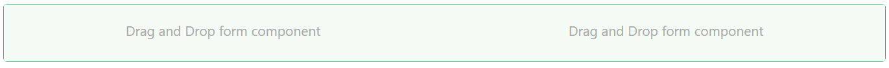
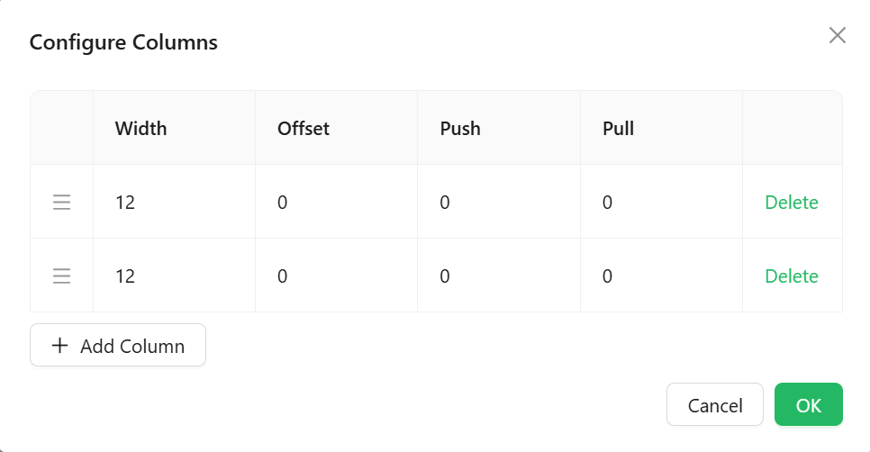

# Columns

The Columns component splits a section of your form into side-by-side vertical columns. You drop other components into each column to build multi-column layouts such as a two-column form, a card row with equal-width panels, or a narrow label column alongside a wide input column. The number of columns, their widths, and the spacing between them are all configurable.




## Get Started

<LayoutBanners url="https://app.guideflow.com/embed/gky90d2hdp" type={1}/>

---

## Properties

The following properties are available to configure the behavior of the component from the form editor (this is in addition to [common properties](../common-component-properties.md)). Columns groups its settings into **Common**, **Events**, and **Appearance** tabs. The Common tab holds only the standard properties, and permissions are set on its Visible and Interaction Mode settings using the lock icon beside each.

### Common

#### **Columns** `object`

Opens the column builder where you define how many columns exist and how wide each one is. Click **Configure Columns** to open the editor. Each row in the editor is a column, with a drag handle on the left to reorder it.



Each column in the builder has the following settings:

**Width** - The column's span in the 24-column grid. A value of `24` fills the full available width, `12` fills half, `8` fills one third, and `6` fills one quarter. Both default columns start at `12` so they share the space equally.

**Offset** - The number of grid columns to leave empty before this column. Use this to indent a column or create a visual gap without adding a blank column.

**Push** - Shifts the column visually to the right by the given number of grid columns without changing the layout flow of other columns.

**Pull** - Shifts the column visually to the left by the given number of grid columns. Use together with Push to swap the visual order of two columns without changing the markup order.

:::note
Width, Offset, Push, and Pull all use the same 24-column grid. The total Width values across all columns in a row should add up to `24` to fill the row. If the total exceeds `24`, columns will wrap onto a new line.
:::

---

### Appearance

#### **Gutter X** `number`

The horizontal space between columns, in pixels. Both new columns default to `12`.

#### **Gutter Y** `number`

The vertical space between rows when columns wrap onto multiple lines, in pixels. Defaults to `12`.

Gutter X and Gutter Y are both scriptable ("fx") fields, so each can be a fixed value or a JavaScript expression.

The rest of the tab is a per-device property router with the standard **Dimensions**, **Border**, **Background**, **Shadow**, and **Margin & Padding** panels described in [common properties](../common-component-properties.md).

#### **Style** `function`

A JavaScript expression that returns a CSS style object applied to the row wrapper around all columns. Use this to set background colour, borders, padding, or any other CSS property on the outer container. There is no separate Custom CSS Class field alongside it.

Available variables:

| Variable | Type | Description |
|---|---|---|
| `data` | `object` | The form's current field values. |
| `formMode` | `string` | The current form mode: `'edit'`, `'readonly'`, or `'designer'`. |
| `page.state` | `object` | Data shared by every component on the current page |
| `value` | `any` | The item value when this component is rendered inside a SubForm. |

**Example - Add a light background and padding to the column row:**

```js
return {
  backgroundColor: '#f9f9f9',
  padding: '16px',
  borderRadius: '4px',
};
```
