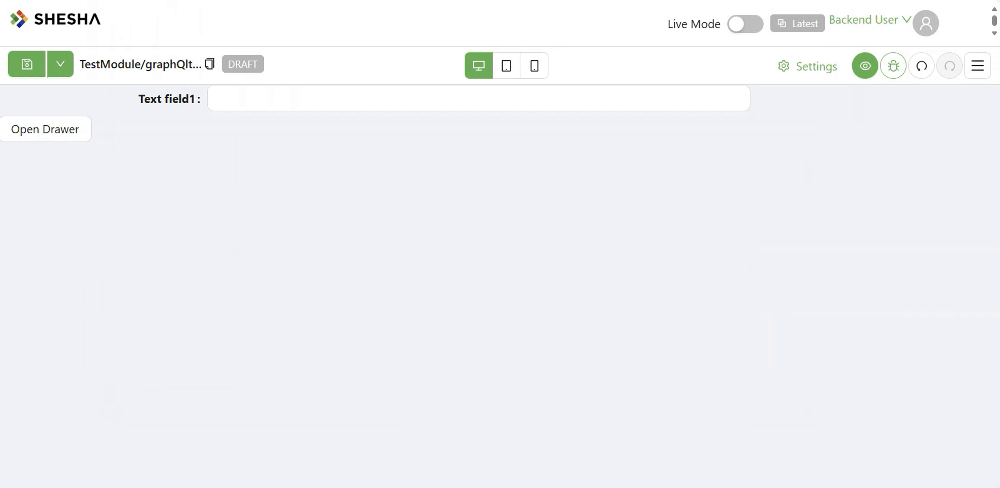

# Drawer

The Drawer component is a panel that slides in from an edge of the screen to show content on top of the form, without navigating away from it. Use it for things like a quick-edit form, supplementary details, or an action that doesn't need a full page.

:::info The Drawer only opens when something tells it to
Unlike most container components, a Drawer does not open on its own and has no click behaviour of its own. It starts closed, and only opens or closes when a **Button** (or any other component with an Execute Action) is configured to run the **Open drawer** or **Close drawer** action, using this Drawer's Component Name as the action's target.
:::

:::note Only visible while previewing at runtime
In the form designer, the Drawer is shown as a plain inline panel with a warning banner, so you can still see and edit its contents. It only renders as an actual sliding drawer when the form is running (Edit, Create, or Details mode).
:::

---

## Properties

The following properties are available to configure the behavior of the component from the form editor (this is in addition to [common properties](../common-component-properties.md)). Drawer has no Security tab, so it does not support the Permissions setting most other components do.

### Common

#### **Component Name** `string`

This is the name you target when configuring a Button's Execute Action to open or close this Drawer.

#### **Header Title** `string`

The text shown in the Drawer's header. Only shown when **Show Header** is enabled.

#### Actions

The rest of the Common tab sits inside a labelled **Actions** panel.

#### **Show Header** `boolean`

Toggles whether the Drawer displays a header bar with the Header Title.

#### **Show Action Buttons** `boolean`

Toggles whether the Drawer displays a footer with Ok and Cancel buttons. Turning this on reveals two collapsible panels, **Ok Button** and **Cancel Button**, each with:

| Field | What it does |
|---|---|
| Ok Action / Ok Cancel | A [Configurable Action](../../configured-views/client-side-scripting/basic-scripting.md) run when the button is clicked |
| Ok Text / Cancel Text | The text shown on the button (defaults to "Ok" / "Cancel") |
| Custom Enabled | A script returning whether the button is enabled |

:::note
The Cancel Button's action field is literally labelled **Ok Cancel** on the live panel, not "Cancel Action" - this is how it appears in the designer.
:::

**Form type to use:** Any form type - the Drawer is a layout component available wherever standard script variables are.

**Example - Close the Drawer from its own Cancel button:**

Set the Cancel Button's Ok Cancel (Cancel Action) to Execute Action, targeting **Close drawer** on this Drawer's Component Name.

___

### Appearance

The Appearance tab is a per-device property router, same as most other components.

#### **Slide Direction** `object`

Which edge of the screen the Drawer slides in from: **Top**, **Right** *(default)*, **Bottom**, or **Left**.

#### **Body Styling**

The Drawer's own body has its own set of Dimensions, Background, Border, Shadow, Margin & Padding, and Custom Styles controls, independent from the Header Styles and Footer Styles below.

#### **Header Styles** `object`

Only shown when **Show Header** is enabled. A separate Background, Shadow, and Style script scoped to the header bar only, independent of the Drawer body's own styling above.

#### **Footer Styles** `object`

Only shown when **Show Action Buttons** is enabled. A separate Background, Shadow, and Style script scoped to the Ok/Cancel button footer only, independent of the Drawer body's own styling above.
