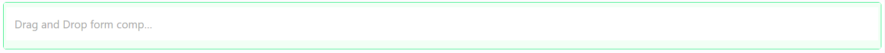
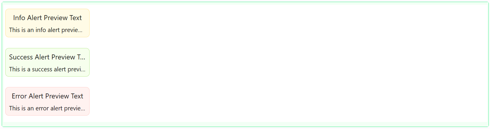
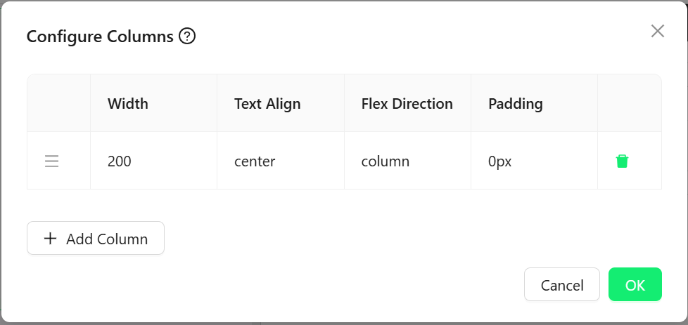

# Key Information Bar

The Key Information Bar component lays out a row (or column) of separate content areas side by side, each separated by a configurable divider line. Use it for a strip of key stats, labels, or mixed content that should sit in evenly-spaced columns, with full control over each column's own layout and contents.

---

## Properties

The following properties are available to configure the behavior of the component from the form editor (this is in addition to [common properties](../common-component-properties.md)). Key Information Bar uses the standard tabbed **Common**, **Events**, and **Appearance** layout. Permissions are set on the Visible and Interaction Mode settings on the Common tab, using the lock icon beside each.

### Common

#### **Columns** `array`

Opens a **Configure Columns** dialog where you add, delete, and drag-reorder the columns that make up the bar. Each column is its own drop target that can hold any other components, and has its own:

| Setting | What it controls |
|---|---|
| Width | The column's width in pixels |
| Text Align | How the column's contents are aligned (`start`, `end`, `center`, `inherit`) |
| Flex Direction | Whether the column's own contents stack in a `row`, `column`, `row-reverse`, or `column-reverse` |
| Padding | Padding inside the column |

A new Key Information Bar starts with a single 200px-wide column, centered, with its contents stacked as a column.

___

### Appearance

Two settings here are unique to Key Information Bar, shown before the rest of the tab:

#### **Orientation** `object`

Defines the layout direction:

| Option | Behaviour |
|---|---|
| **Horizontal** | Columns are laid out in a row, side by side. |
| **Vertical** | Columns are stacked one above the other. |

#### **Align Items** `object`

Only shown when Orientation is **Horizontal**. Aligns the columns within the bar: Flex Start, Flex End, or Center.

#### **Gap** `function`

The spacing between columns. Scriptable via the "fx" toggle.

The rest of the tab has the standard Dimensions, Border, Background, Shadow, and Margin & Padding panels (no separate Font panel), and Custom Styles exposes only the Style script.

#### Divider

A dedicated panel controlling the line drawn between columns:

#### **Divider Margin** `function`

The space around the divider line.

#### **Divider Width** `function`

Only shown when Orientation is **Vertical**. The width of the divider line.

#### **Divider Height** `function`

Only shown when Orientation is **Horizontal**. The height of the divider line.

#### **Divider Thickness** `function`

How thick the divider line is.

#### **Divider Color** `string`

The colour of the divider line.

:::note
Divider Margin, Width, Height, and Thickness are all scriptable ("fx") fields, so each can be a fixed value or a JavaScript expression.
:::
