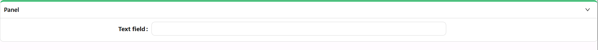

# Panel

The Panel component helps group and visually segment content inside a form. It acts as a flexible container that can include headers, icons, and conditional logic to show or hide its contents. Panels make forms easier to scan and more organized.

---

## Properties

The following properties are available to configure the behavior of the component from the form editor (this is in addition to [common properties](../common-component-properties.md)). Panel groups its settings into **Common**, **Events**, and **Appearance** tabs. Permissions are set on the Visible and Interaction Mode settings on the Common tab, using the lock icon beside each.

### Common

#### **Icon Position** `object`

Position of the icon in the header:

- Hide
- Start
- End *(default)*

#### **Collapsible** `object`

Controls where the panel's collapse/expand trigger lives, not simply whether it can collapse:

| Option | Behaviour |
|---|---|
| **Header** | Clicking anywhere on the header bar collapses or expands the panel. |
| **Icon** | Only the expand/collapse icon toggles the panel; clicking elsewhere on the header does nothing. |
| **Disabled** | The panel cannot be collapsed at all. |

#### **Collapsed By Default** `boolean`

If enabled, the panel starts off collapsed.

#### **Hide When Empty** `boolean`

If true, hides the panel when it contains no content.

:::warning Custom Header removed
The **Custom Header** toggle from older versions, which let you replace the standard title/icon header with a custom layout of your own components, no longer appears on the Panel settings panel - forms that used it are automatically migrated so the custom header content becomes the panel's regular header area. To put custom components (like an action button) next to the panel's title, drop them directly into the header drop zone in the designer instead.
:::

___

### Appearance

#### **Ghost** `boolean`

Removes background and borders for a minimal, transparent look.

#### **Simple Design** `boolean`

Toggles a lightweight, minimal styling for a flatter design.

#### **Accent** `boolean`

Applies an accent border to visually emphasize the panel.

#### **Hide Top Bar** `boolean`

Hides the top bar area including title, icon, and actions.

The rest of the tab is a per-device property router with the standard **Dimensions**, **Border**, **Background**, **Shadow**, **Margin & Padding**, and **Custom Styles** (Style script only) panels described in [common properties](../common-component-properties.md). Border, Background, and Shadow are hidden while **Ghost** or **Simple Design** is enabled, since those styles are cleared by the flatter looks.

#### Header Style

A separate, collapsed-by-default group of styling controls that applies only to the panel's header bar (the title and icon row), independent of the body styling above:

- **Font** - family, size, weight, colour, and alignment for the header text.
- **Dimensions** - height, minimum height, and maximum height only (there is no width control for the header).
- **Border** - hidden while Ghost, Accent, or Simple Design is enabled.
- **Background** - hidden while Ghost or Simple Design is enabled.
- **Margin and Padding**.
- **Custom Styles** - a Style script scoped to the header only.
