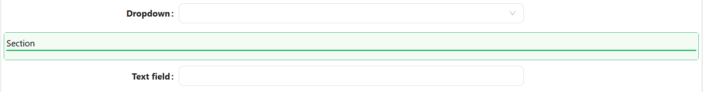

# Section Separator

The Section separator is a line that is used to organize content by dividing it into sections, it provides a structured layout that will make it easier to locate sections.

---

## Properties

The following properties are available to configure the behavior of the component from the form editor (this is in addition to [common properties](../common-component-properties.md)). Section Separator groups its settings into **Common**, **Events**, and **Appearance** tabs. Permissions are set on the Visible and Interaction Mode settings on the Common tab, using the lock icon beside each.

### Common

#### **Label** `boolean / string`

Sets the separator's title text, with the same enable/text toggle used by the common Label property, plus a left/center/right alignment option for where the title sits on the line. Only shown when Orientation is **Horizontal**.

#### **Tooltip** `string`

The same common Tooltip property described in [common properties](../common-component-properties.md). Only shown when Orientation is **Horizontal**.

#### **Orientation** `object`

Defines the line direction:

- **Horizontal** *(default)*
- **Vertical**

#### **Inline** `boolean`

Only for horizontal separators. Places the label in line with the divider.

___

### Appearance

#### Line Style

**Thickness** `number`
Line thickness in pixels.

**Color** `string`
Color of the line.

**Type** `object`
Line style options:
- **Solid** *(default)*
- **Dashed**
- **Dotted**

---

#### Dimensions

**Width** `string`
Only shown when Orientation is **Horizontal**. Sets the width of the line itself.

**Height** `string`
Only shown when Orientation is **Vertical**. Sets the height of the line itself.

---

#### Title Style

Collapsed by default. Applies only to the separator's title text, independent of the line above.

**Font Family / Size / Weight / Color** - `font`
Customize typography for the section title.

**Style** `function`
A script that returns the title's style as an object, conforming to `CSSProperties`.

---

#### Container Style

Collapsed by default. Applies to the separator's own outer container.

**Margin & Padding** `object`
Configure spacing around and inside the separator.

**Style** `function`
A script that returns the outer container's style as an object, conforming to `CSSProperties`.
