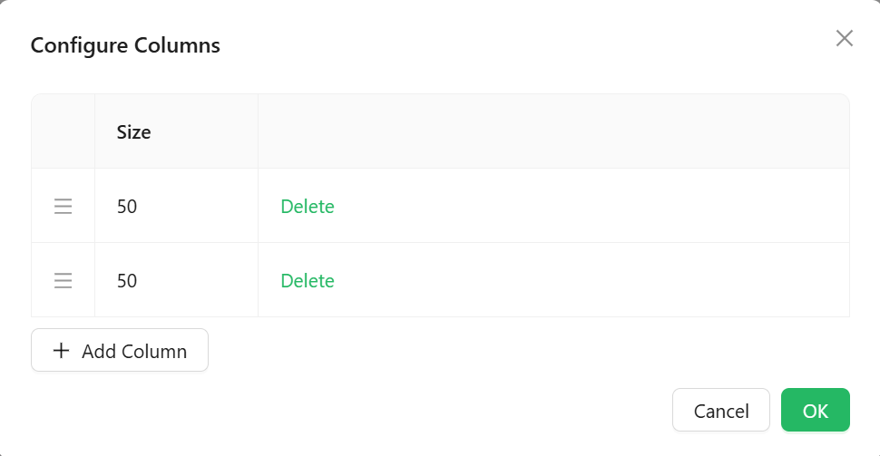

# SizableColumns

The SizableColumns component splits its area into a row of columns that the end user can resize by dragging the divider between them at runtime. Use it when a fixed-width [Columns](./columns.md) layout is too rigid and users need to adjust how much space each side gets.

---

## Properties

The following properties are available to configure the behavior of the component from the form editor (this is in addition to [common properties](../common-component-properties.md)). SizableColumns groups its settings into **Common**, **Data**, **Appearance**, and **Security** tabs (Common and Security hold only the standard properties, not covered further here).

### Data

#### **Columns** `object`

Opens a **Configure Columns** dialog where you add, delete, and reorder the columns that make up the row.

Each column only has one configurable value here: a relative **Size** number (columns default to `25` when added). This sets each column's initial share of the row's width, not a fixed pixel width - a column with Size `50` starts out twice as wide as one with Size `25`. It is not a minimum or maximum boundary, and it does not carry any per-column styling.

:::note Sizes are a starting point, not a limit
Once the form is running, the user can drag the divider between any two columns to resize them, overriding whatever Size values you configured. There is no setting to lock columns at a fixed width or to cap how far a user can resize them.
:::

___

### Appearance

The standard Dimensions, Border, Background, Shadow, and Margin & Padding panels are all present. The one difference is in Custom Styles:

#### **Style** `function`

A script that returns the style of the element as an object, conforming to `CSSProperties`. There is no separate Custom CSS Class field alongside it.
