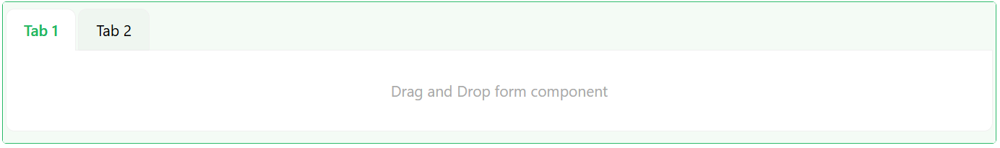
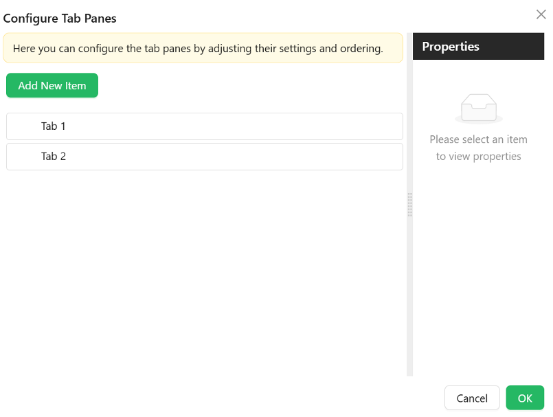

# Tabs

The Tabs component is used to organize content into separate sections or panes, where users can switch between these sections by clicking on the tabs. Each tab represents a different section, and only one section is visible at a time.

## Properties

The following properties are available to configure the behavior of the component from the form editor (this is in addition to [common properties](../common-component-properties.md)). Tabs groups its settings into **Common** and **Appearance** tabs. Permissions are set on the Visible and Interaction Mode settings on the Common tab, using the lock icon beside each.

### Common

#### **Default Active Tab** `enum`

Choose which tab should greet your users first. This dropdown lets you set the initial active tab based on tab configurations.

#### **Tab Type** `card | line`

Defines the visual style of your tabs.

| Option | Description |
|---|---|
| `Line` | Sleek underline style for the minimalists. |
| `Card` *(default)* | Each tab looks like a clickable card. |

#### **Tabs**

##### Configure Tab Panes

The Configure Tab Panes option is where you add the tabs. Each tab has its own settings, all on a single **Common** tab in the tab editor.

#### **Name** `string`

Internal identifier used to reference the tab.

#### **Title** `string`

The text displayed on the tab label.

#### **Visible** `boolean`

Whether the tab is shown. Switch it to a script to show a tab only under certain conditions. Permissions can be set on this setting with the lock icon beside it, so a tab can be hidden from users who do not hold a given permission.

#### **Interaction Mode** `object`

Whether the content of this tab can be edited.

| Option | Behaviour |
|---|---|
| `Inherited` *(default)* | The tab takes the mode of the form it belongs to |
| `Editable` | The tab's content can always be edited |
| `Read Only` | The tab's content is always display-only |

Permissions can be set on this setting too, so a tab can be shown to everyone but edited only by certain users.

#### **Animated** `boolean`

Enables animated transitions when switching tabs.

#### **Icon** `object`

An optional icon shown beside the title.

#### **Force Render** `boolean`

Renders the tab's content even while the tab is not selected. Use it when something inside the tab has to run or be measured before the user opens it.

#### **Destroy Inactive Tab Pane** `boolean`

Removes an inactive tab's content from the page instead of keeping it hidden. This keeps a heavy form lighter, at the cost of rebuilding the tab each time the user returns to it.

#### **Key** `string`

A unique key for the tab.

#### **Class Name** `string`

An optional CSS class applied to the tab.

:::note Per-tab permissions moved
Tabs no longer have a separate Security tab. Set permissions on the **Visible** and **Interaction Mode** settings instead, using the lock icon next to each. Existing permission values were migrated across automatically. See [Permissions](../common-component-properties.md#permissions).
:::

___

### Appearance

The Appearance tab is a per-device property router with the standard **Font**, **Dimensions**, **Border**, **Background**, **Shadow**, and **Margin & Padding** panels described in [common properties](../common-component-properties.md), plus the settings below.

#### **Position** `string`

Set where your tabs appear:

- Top *(default)*
- Bottom
- Left
- Right

:::note
Border's corner-radius controls hide or show individual corners based on the selected Position, so the visible corners always match the side the tabs sit on.
:::

#### Line Color

Only shown when Tab Type is **Line**. A single **Color** field that sets the colour of the underline indicator beneath the active tab.

#### Card Styles

Collapsed by default, and only relevant when Tab Type is **Card**. These settings style the tab buttons themselves, separately from the tab bar's own Font, Dimensions, Border, Background, and Shadow settings above.

- **Font** - family, size, weight, colour, and alignment for the text on each tab button.
- **Dimension** - width, minimum/maximum width, height, and minimum/maximum height for each tab button. This sub-panel is labelled "Dimension" (singular) on the live panel.
- **Background** - hidden while Tab Type is Line.
- **Custom Styles** - a Style script scoped to the tab buttons only.
