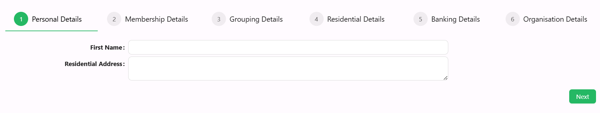
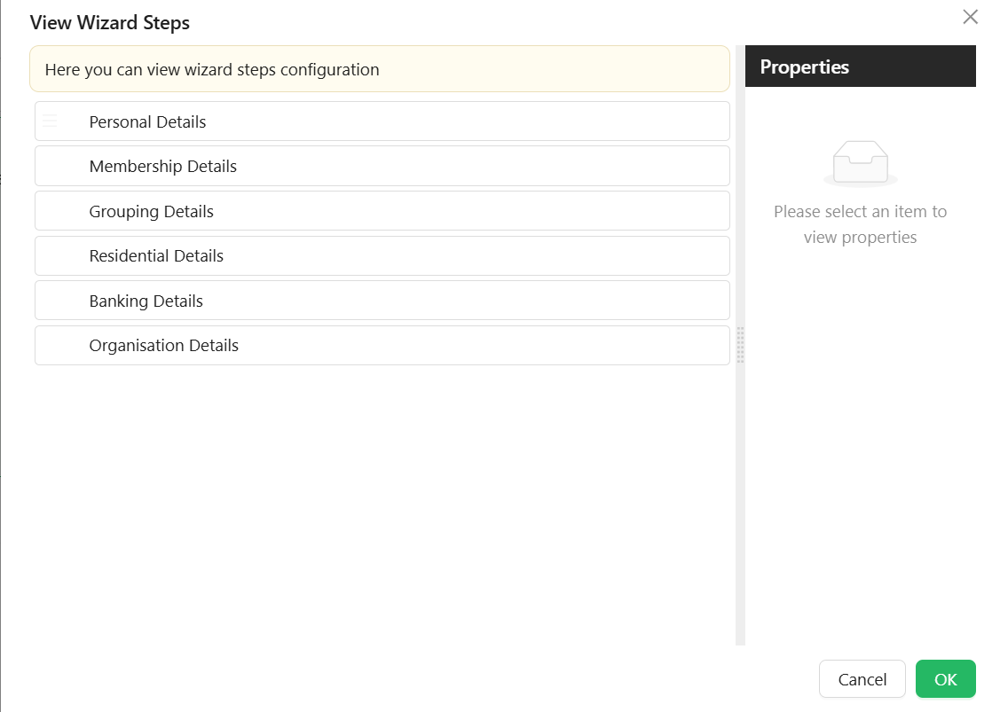

# Wizard

The Wizard component enables multi-step forms by segmenting fields across several pages with navigation controls. It's ideal for complex data entry processes where progressive disclosure improves the user experience.



## Get Started

<LayoutBanners url="https://app.guideflow.com/embed/3r3w71vf9k" type={1}/>
___

## Properties

The following properties are available to configure the behavior of the component from the form editor (this is in addition to [common properties](../common-component-properties.md)). Wizard groups its settings into **Common**, **Appearance**, and **Security** tabs (Security holds only the standard Permissions setting, not covered further here).

### Common

#### **Wizard Type** `string`

Sets the layout style:

- Default *(default)*
- Navigation

#### **Direction** `object`

Defines orientation of the step bar:

- Vertical
- Horizontal *(default - this is Ant Design's own default when no value is set)*

#### **Label Placement** `object`

Controls how step labels are positioned:

- Vertical
- Horizontal *(default - this is Ant Design's own default when no value is set)*

#### **Default Active Step** `object`

The step that should be active on load, chosen from a dropdown of the steps you've configured. Defaults to the first step.

#### **Configure Steps**



List of steps with their titles, icons, and content configuration. Each step's own settings panel has **Common**, **Appearance**, and **Security** tabs.

##### Common

- **Name** `string` – Internal identifier for the step (this field is labelled "Name" on the live panel, not "Component Name").
- **Title** `string` – Step title shown in the wizard UI.
- **Subtitle** `string` - Step subtitle is a secondary heading or a supporting piece of text that provides additional context or information related to the main title.
- **Description** `string` - Step description is a more extensive piece of text that elaborates on the details introduced in the title and subtitle. It provides a comprehensive explanation or additional information.
- **Key** `string` – Unique key for the step.
- **Icon** `object` - Users can select an icon to be displayed on each wizard step.
- **Allow Cancel** `boolean` - When set to true, this property enables a cancel button for the wizard step. The behavior is determined based on the configurations defined in the cancel event.
- **Can Skip To** `boolean` – Whether this step can be skipped to from other steps.
- **Custom Footer** `boolean` – When enabled, the standard Next/Back/Done/Cancel button row is replaced by a drop zone you can fill with your own components, for this step only. The Next Button, Back Button, Done Button, and Cancel Button panels below are hidden while this is on.

###### Button Titles

Each button title can be customized to meet business requirements. Each Wizard Step has 4 button panels, hidden while Custom Footer is enabled:

- **Next Button**
    - Text `string` – This is the title of the Next button.
    - Custom Enabled `function` - Code that returns whether the Next button is enabled.
    - Before Next Action `function` - An action triggered before the step moves to the next one.
    - After Next Action `function` - An action triggered after the step has moved to the next one.
- **Back Button**
    - Show Back Button `boolean` – Whether the Back button appears on this step at all (defaults to shown).
    - Text `string` – This is the title of the Back button.
    - Custom Enabled `function` - Code that returns whether the Back button is enabled.
    - Before Back Action `function` - An action triggered before the step moves to the previous one.
    - After Back Action `function` - An action triggered after the step has moved to the previous one.
- **Done Button**
    - Show Done Button `boolean` – Whether the Done button appears on the final step at all (defaults to shown).
    - Text `string` – This is the title of the Done button.
    - Custom Enabled `function` - Code that returns whether the Done button is enabled.
    - Before Done Action `function` - An action triggered before the wizard completes the final step.
    - After Done Action `function` - An action triggered after the wizard has completed the final step.
- **Cancel Button**
    - Text `string` – This is the title of the Cancel button.
    - Custom Enabled `function` - Code that returns whether the Cancel button is enabled.
    - Before Cancel Action `function` - An action triggered before the cancel event occurs.
    - After Cancel Action  `function` - An action triggered after the cancel event occurs.

_After any of the button events, you can handle both success and failure._

###### On Before Render

`function` - An action triggered before the step renders.

###### Other

Two further scripted settings sit in an "Other" panel:

- **Custom Visibility** `function` - Code that returns whether this step appears in the wizard at all. Return `true` to show the step. Use this to hide an entire step conditionally, similar to a Hide condition on a regular component.
- **Custom Enabled** `function` - Code that returns whether this step itself is enabled. Returning `false` disables the whole step (the user cannot interact with its fields) rather than a specific button.

**Example - Disable a step until its mandatory fields are filled in:**

```javascript
if (form.formMode != "designer") {
  //this is to prevent movement to the next step while on the form designer
  return (
    isValidProperty(data.firstName) &&
    isValidProperty(data.lastName) &&
    isValidProperty(data.emailAddress1)
  );
}

function isValidProperty(value) {
  return value !== undefined && value !== "";
}
```

##### Appearance

Each step also has its own **Font**, **Border**, **Background**, **Shadow**, **Margin & Padding**, and **Custom Styles** (Class Name and Style) panels, styling that step's own content area independently of the wizard's own Appearance settings below.

##### Security

Each step has its own **Permissions** field, restricting which users can see that specific step - separate from the Wizard component's own Permissions setting.

#### Using JS code
You can use JS script of some controls (Buttons, etc.) to manage Wizard Component

| Value | What it holds |
|---|---|
| `current` | The index of the current step, counting from zero |
| `currentStep` | The current step, as an `IWizardStepProps` object |
| `visibleSteps` | The steps currently visible, as an array of `IWizardStepProps` |
| `api` | The actions listed below |

```typescript
interface IWizardStepProps {
  id: string;
  icon?: string;
  key: string;
  title: string;
  subTitle: string;
  description: string;
  allowCancel?: boolean;
  label?: string;
  name?: string;
  tooltip?: string;
  permissions?: string[];
  childItems?: IWizardStepProps[];
}
```

Actions to move between steps:
- `form.components.wizardName.api.next()` - to the next step
- `form.components.wizardName.api.back()` - to the previous step
- `form.components.wizardName.api.done()` - finish the wizard (execute Done configurable actions)
- `form.components.wizardName.api.cancel()` - cancel the wizard (execute Cancel configurable actions)
- `form.components.wizardName.api.close()` - close the wizard's containing modal, if it is inside one
- `form.components.wizardName.api.reset()` - reset back to the wizard's starting step
- `form.components.wizardName.api.setStep(index)` - move to the step with Index (will be executed `On Before Render` configurable action)
___

### Appearance

The Appearance tab is a per-device property router with the standard **Font**, **Dimensions**, **Border**, **Background**, **Shadow**, **Margin & Padding**, and **Custom Styles** (Style script only) panels described in [common properties](../common-component-properties.md), plus an **Additional Styles** panel below.

#### Additional Styles

- **Step Width** `string` - the width of each step marker in the step bar. Accepts any CSS unit (%, px, em, etc), px by default if no unit is given.

- Button Layout `string`: Layout direction of navigation buttons. *(Left, Right, Space between)*

- Primary Color `object`: Main highlight color.

- Primary Text Color `object`: Text color for primary elements.

- Secondary Color `object`: Secondary accent color.

- Secondary Text Color `object`: Text color for secondary elements.

___

## Advanced Wizard

<LayoutBanners url="https://app.guideflow.com/embed/dkdwl20a9r" type={1}/>
