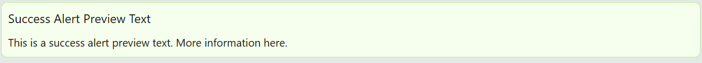
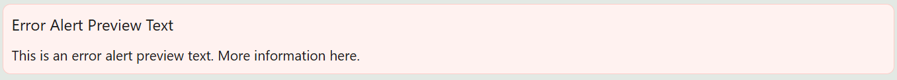

# Alert

The Alert component is used when you need to show alert messages to users. It is also useful when you need a persistent static container that is closable by user actions.

---

## Properties

The following properties are available to configure the behavior of the component from the form editor (this is in addition to [common properties](../common-component-properties.md)).

The panel is organised into three tabs: **Common**, **Events**, and **Appearance**. Properties below appear in the same order as the live panel.

---

### Common

The Common tab starts with the standard Component Name and Visible settings described in [common properties](../common-component-properties.md). Alert has no Interaction Mode setting, since the user does not enter a value into it.

#### **Dismissable** `boolean`

Adds a close control so the user can dismiss the alert.

:::tip Dismissable for advisory, fixed for blocking
Let the user close an alert that is merely informative. Keep a warning about something they still have to act on fixed, or they will dismiss it and forget.
:::

#### **Type** `object`

The type of alert to display.

| Option | When to use |
|---|---|
| `Success` | Positive confirmation messages. |
| `Info` | General information. This is the default. |
| `Warning` | Important alerts that require caution. |
| `Error` | Critical issues that need immediate attention. |

#### **Message** `string`

The main text shown inside the alert. Supports expressions and variables.

#### **Description** `string`

Supporting text shown below the message, inside the alert itself. Supports expressions and variables.

:::note Different from the common Description property
On most components, Description is a note for whoever is configuring the form and is never shown to the end user. On Alert it is rendered as part of the alert.
:::

#### **Show Icon** `boolean`

Shows an icon next to the message.

#### **Marquee** `boolean`

Scrolls the content horizontally, for emphasis on a long message in a narrow space.

#### **Icon** `object`

Picks the icon shown next to the message. Shown only when Show Icon is enabled.

---

### Events

The Alert exposes **On Click**, **On Double Click**, **On Mouse Enter**, **On Mouse Move**, and **On Mouse Leave**, described in [common properties](../common-component-properties.md#events).

---

### Appearance

#### **Custom Style** `function`

A script returning the style of the element as an object, conforming to CSSProperties.

The tab also holds the standard [Font, Dimensions, Border, Background, Shadow, and Margin & Padding](../common-component-properties.md#appearance) panels, configurable per device.
