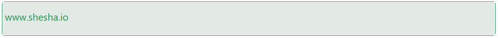

# Link

The Link component is a versatile way to navigate users either within your application or to external destinations. It can be styled richly and supports dynamic content, child elements, and target behavior customization.

## Properties

The following properties are available to configure the behavior of the component from the form editor (this is in addition to [common properties](../common-component-properties.md)).

The panel is organised into two tabs: **Common** and **Appearance**. Properties below appear in the same order as the live panel.

---

### Common

The Common tab starts with the standard Property Name and Visible settings described in [common properties](../common-component-properties.md).

#### **Custom Link** `boolean`

Turns the link into a container other components can be dropped into, so the link's content is made up of child components rather than text. Enabling it hides Content below and unlocks the Layout settings.

#### **Content** `string`

The text displayed inside the link. Shown only when Custom Link is off.

#### **URL** `string`

The URL or path the link points to.

#### **Target** `object`

Where the linked document opens. Required.

| Option | Behaviour |
|---|---|
| `Blank` | Opens in a new tab. |
| `Parent` | Opens in the parent frame. |
| `Self` | Opens in the same frame. This is the default. |
| `Top` | Opens in the topmost frame. |

The Common tab also carries the standard Label setting, followed by Direction and a Layout panel, which are the same settings described under Appearance below.

___

### Appearance

These layout settings control how the link's child components are arranged, so they matter once **Custom Link** is enabled.

#### **Direction** `object`

Controls the layout direction of the link's child components. Defaults to `Vertical`.

| Option | Behaviour |
|---|---|
| `Vertical` | Child components stack top to bottom. This is the default. |
| `Horizontal` | Child components sit side by side in a row. |

#### **Justify Content** `object`

Controls how child components are spaced along the main axis. Only appears when Direction is `Horizontal`. Defaults to `Left`.

#### **Align Items** `object`

Controls how child components are aligned across the cross axis. Shown alongside Justify Content, when Direction is `Horizontal`.

#### **Justify Items** `object`

Controls item alignment within their grid area. Only appears when Direction is `Horizontal`.

#### **Custom CSS Class** `string`

A custom CSS class name applied to the link's child container. Shown whenever **Custom Link** is enabled.

:::note
The Font settings under Appearance (Family, Size, Weight, Colour) apply only to the plain-text link, and are hidden once **Custom Link** is enabled - once the link wraps child components, those components control their own typography.
:::
