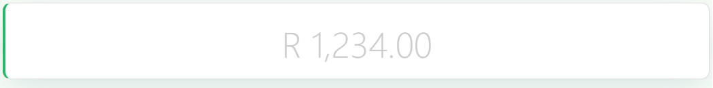

# Statistic

The Statistic component displays a single key numerical indicator, such as a total, a count, or a performance metric, with its own title, prefix/suffix decoration, and independent font styling for the title and the value. Use it on dashboards or summary sections where one number needs to stand out.

---

## Properties

The following properties are available to configure the behavior of the component from the form editor (this is in addition to [common properties](../common-component-properties.md)).

### Common

#### **Title** `string`

A heading shown above the value. Defaults to "Statistic" for a new component.

#### **Placeholder** `string`

Text shown, dimmed, in place of the value when no value is bound or set yet.

#### **Value** `number`

A fallback numeric value to display. This only takes effect when there is no value bound via **Property Name** - Property Name always takes priority when both are set.

#### **Precision** `number`

The number of decimal places to show. Minimum 0.

#### **Prefix** `string`

Text shown immediately before the value.

#### **Prefix Icon** `object`

An icon shown before the value, to the left of the Prefix text if both are set.

#### **Suffix** `string`

Text shown immediately after the value.

#### **Suffix Icon** `object`

An icon shown after the value, to the right of the Suffix text if both are set.

___

### Events

#### **On Click** `function`

A script that runs when the user clicks the statistic. Unlike most components, this is a plain code editor field rather than a full [Action Configuration](../../configured-views/action-configurations.md).

___

### Appearance

Statistic splits Font into two independent panels instead of one, each with its own **Align** option and its own Custom Styles script:

#### **Title Font**

Typography for the Title text - Family, Size, Weight, Colour, and Align.

#### **Value Font**

Typography for the value itself - Family, Size, Weight, Colour, and Align.
