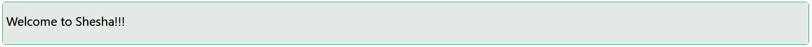

# Text

The Text component is responsible for displaying text content on a form. Text components can vary in complexity and functionality, and they are a fundamental part of building user interfaces.

## Properties

The following properties are available to configure the behavior of the component from the form editor (this is in addition to [common properties](../common-component-properties.md)).

### Common

#### Type `string`

Select the HTML element type:
- **Span** *(default)*: Inline text.
- **Paragraph**: Paragraph block.
- **Title**: Heading style.

#### Content Display `object`

Controls the text source:
- **Content** *(default)*: Manual text.
- **Property name**: Dynamically fetch text from the property.

#### Data Type `object`

Specify the data format:
- **String** *(default)*
- **Date Time**
- **Number**
- **Boolean**

#### Date Format `string`

The format string used to display the value. Only appears when Data Type is `Date Time`.

#### Number Format `object`

Controls how a numeric value is formatted. Only appears when Data Type is `Number`.

| Option | Description |
|---|---|
| `Currency` | Formats the value as currency. |
| `Double` | Formats the value as a decimal number. |
| `Round` | Rounds the value to a whole number. |
| `Thousand separator` | Adds thousand separators without changing decimal places. |

#### Content `string`

The static text content to display. Hidden when Content Display is set to `Property name`.

#### Italic `boolean`

Renders the text in italics if enabled.

#### Code `boolean`

Styles the text to look like code, using a monospace font.

#### Strikethrough `boolean`

Applies a line through the text for a strikethrough effect.

#### Underline `boolean`

Adds an underline to the text for emphasis.

#### Ellipsis `boolean`

Truncate overflowing text with an ellipsis (`...`).

#### Mark `boolean`

Highlights the text with a background color (like a marker).

#### Keyboard `boolean`

Styles the text to represent keyboard input (e.g., `<kbd>` styling).

#### Copyable `boolean`

Allows users to easily copy the text by clicking an icon or button.

___

### Appearance

#### Font `object`

Typography for the text - Family, Weight, Colour, and Align.

The **Size** field is replaced by a **Level** dropdown (`H1`-`H5`) whenever **Type** is set to `Title`, so a title's size is chosen as a heading level instead of a raw font size.

#### Content Type `object`

Defines the tone or theme of the text:
- **Default** *(default)*
- **Primary**
- **Secondary**
- **Success**
- **Warning**
- **Info**
- **Error**
- **Custom Color**

#### Custom Color `string`

The colour used for the text. Only appears when Content Type is set to `Custom Color`.
