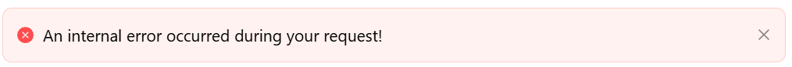

# Validation Errors

The Validation Errors component displays the current form's validation errors as a single alert banner. Add it to a form when you want a centralised summary of what's wrong, instead of relying only on the red messages shown under each individual field.

:::note Only visible with errors at runtime
The component always shows validation errors for the whole form, not a specific field, and it isn't tied to a Property Name. In the form designer, it shows a placeholder message instead of real errors ("Validation Errors (visible in the runtime only)") - open the form at runtime and trigger a validation failure to see the actual banner.
:::

---

## Properties

The following properties are available to configure the behavior of the component from the form editor (this is in addition to [common properties](../common-component-properties.md)).

### Common

:::note No Hide setting
Validation Errors does not expose a Hide property - it is designed to always be present on the form so validation feedback is never accidentally hidden.
:::

The only other setting on this tab is the generic **Component Name** property, covered in [common properties](../common-component-properties.md).

___

### Appearance

#### **Font** `object`

Typography for the banner text - Family, Size, Weight, Colour, and Align.

#### **Custom CSS Class** `string`

A custom CSS class name applied to the component's outer element.
