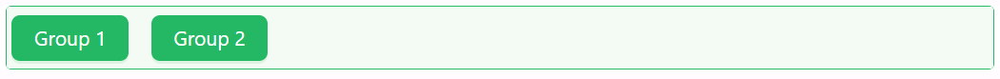
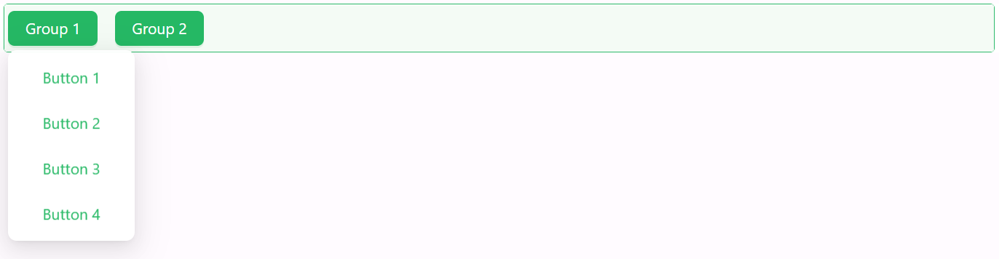
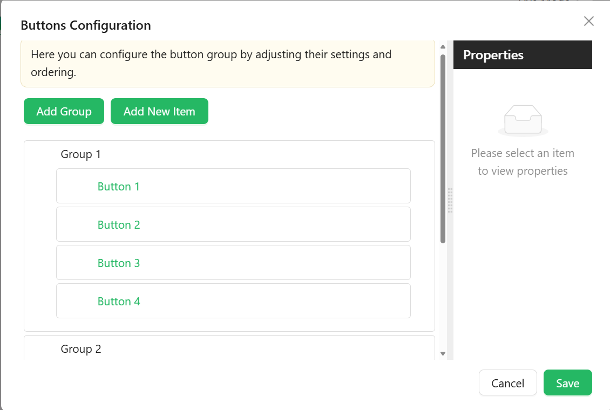

# Button Group

The Button Group component offers a flexible way to present a set of action buttons in a single row or column layout. With options for layout orientation, spacing, and complete styling control, it's ideal for organizing grouped actions in a visually consistent manner.

[//]: # '<iframe width="100%" height="500" src="https://pd-docs-adminportal-test.shesha.dev/shesha/forms-designer/?id=4d5f3201-2ba4-4a19-b3de-08153124ea65" title="button group Component" ></iframe>'

---

## Properties

The following properties are available to configure the behavior of the component from the form editor. These are in addition to the [common properties](../common-component-properties.md) shared by all Shesha components.

The panel is organised into **Common** and **Appearance** tabs.

---

### Common

#### **Configure Buttons** `object`

Configure the buttons and groups shown in the component using a visual builder. Each entry in the list is either a **Group** or a **Button**, and each opens its own settings drawer. A group has **Common** and **Appearance** tabs; a button has **Common**, **Events**, and **Appearance** tabs.

**Group**

Used to nest multiple buttons under a common label, for example a dropdown of related actions.

| Property | Type | Description |
|---|---|---|
| `Group Name` | `string` | Internal identifier for the group. Required. |
| `Label` | `string` | The text shown on the group. |
| `Group Tooltip` | `string` | Tooltip displayed when hovering over the group. |
| `Icon` | `string` | Optional icon shown next to the group label. |
| `Down Icon` | `string` | Optional icon shown to indicate the group expands, such as a chevron. |
| `Button Type` | `object` | The button style used for the group trigger. One of `default`, `primary`, `dashed`, `link`, `text`, `ghost`. Defaults to `default`. |
| `Interaction Mode` | `object` | See the [common Interaction Mode property](../common-component-properties.md#interaction-mode-object). |
| `Visible` | `boolean` | Whether the group is shown. Permissions can be set on this setting with the lock icon beside it. |
| `Hide When Empty` | `boolean` | Automatically hides the group if none of its child buttons are currently visible. |

Groups have no Security tab. Permissions are set on the group's **Visible** and **Interaction Mode** settings using the lock icon beside each, so a group can be hidden from some users and merely disabled for others. See [Permissions](../common-component-properties.md#permissions).

**Button**

Used to define an individual button, a visual separator, or a set of dynamically generated buttons.

| Property | Type | Description |
|---|---|---|
| `Item Type` | `object` | What this entry renders as: `Button` (default), `Separator`, or `Dynamic item(s)`. |

The next fields are shown only when Item Type is `Button`:

| Property | Type | Description |
|---|---|---|
| `Name` | `string` | Internal identifier for the button. Required. |
| `Caption` | `string` | The text shown on the button. |
| `Tooltip` | `string` | Helper text displayed on hover. |
| `Icon` | `string` | Optional icon shown beside the caption. |
| `Icon Position` | `object` | `Start` or `End`. Only shown once an icon is selected. |
| `Interaction Mode` | `object` | See the [common Interaction Mode property](../common-component-properties.md#interaction-mode-object). |
| `Visible` | `boolean` | Whether the button is shown. Permissions can be set on this setting with the lock icon beside it. |
| `Action Configuration` | `object` | Defines what happens when the user clicks this button, configured the same way as the [Button component's Action Configuration](./button.md). |

When Item Type is `Dynamic item(s)`, a **Dynamic Items Configuration** field replaces the fields above, letting you generate buttons from a provider (for example, one button per record returned by an entity or URL data source).

Each button's Appearance tab exposes a **Type** setting (the same `default` / `primary` / `dashed` / `link` / `text` / `ghost` options as the group's Button Type) plus the standard [Font, Dimensions, Border, Background, Shadow, Margin & Padding, and Custom Styles](../common-component-properties.md#appearance) groups. A Separator item instead shows **Thickness** and **Color** fields for the dividing line. A button's permissions are set on its **Visible** and **Interaction Mode** settings using the lock icon beside each, rather than on a Security tab. For a Dynamic item, the Events and Appearance tabs are shown only when the provider is an Entity or a URL.

---

#### **Is Button Inline** `boolean`

Displays buttons as inline-flex elements to keep them aligned in a single line.

___

### Appearance

#### **Gap** `object`

Spacing between buttons.

| Option | Description |
|---|---|
| `small` | Minimal spacing between buttons. |
| `middle` | The default spacing. |
| `large` | Increased spacing between buttons. |

The remaining Appearance settings (Dimensions, Border, Background, Shadow, Margin & Padding, Custom Styles) follow the same [common style properties](../common-component-properties.md#appearance) shared by all components.

---
