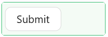

# Button

The Button component adds a clickable button to your form. Buttons trigger actions - submitting the form, resetting fields, opening a dialog, navigating to another page, or running a custom script. Every button has a caption, an optional icon, and an On Click action that controls exactly what happens when the user clicks it.

---

## Properties

The following properties are available to configure the Button component from the form designer. These are in addition to the [common properties](../common-component-properties.md) shared by all Shesha components.

The panel is organised into three tabs: **Common**, **Events**, and **Appearance**. Properties below appear in the same order as the live panel.

:::note
The Appearance tab is device-aware. Every style setting on that tab can be configured separately for desktop, tablet, and mobile using the device switcher at the top of the designer canvas.
:::

---

### Common

#### **Component Name** `string`

A unique identifier for this button within the form. Required.

#### **Caption** `string`

The text displayed on the button. Keep this short and action-oriented, for example `Save`, `Cancel`, or `Submit Application`.

#### **Style** `object`

The visual style of the button. Choose one that matches the button's importance in the layout. The same setting also appears on the Appearance tab.

| Option | When to use |
|---|---|
| `Default` | A standard outlined button. Use for secondary actions that are available but not the main focus. |
| `Primary` | A filled, high-contrast button. Use for the main action on the form. |
| `Link` | Renders the button as a plain hyperlink. Use when the action should feel like navigation. |
| `Text` | Renders the button with no border or background. Use for low-priority actions in tight layouts. |

:::tip One primary button per form
Use `Primary` for the single action the user is expected to take, and `Default` or `Text` for everything else, so the main action stands out.
:::

#### **Icon** `string`

An optional icon displayed alongside the caption, selected from the icon picker.

#### **Icon Position** `object`

Where the icon appears relative to the caption. Shown only once an icon has been selected.

| Option | Description |
|---|---|
| `Start` | The icon appears to the left of the caption. |
| `End` | The icon appears to the right of the caption. |

#### **Tooltip** `string`

Helper text shown when the user hovers over the button.

#### **On Click** `object`

What happens when the user clicks the button. You configure it through the action builder in the designer, so no code is required for standard actions.

The most commonly used actions when the action owner is set to `Form` are:

| Action Name | What it does |
|---|---|
| `Submit` | Validates the form and submits the data to the server. This is the default for new buttons. |
| `Reset` | Clears all field values back to their initial state. |
| `Start Edit` | Switches the form from read-only mode to edit mode. |
| `Cancel Edit` | Discards any unsaved changes and returns the form to read-only mode. |
| `Refresh` | Reloads the form data from the server without navigating away. |
| `Validate` | Runs form validation and highlights any errors, without submitting. |

:::info
Use **Handle Success** to run a follow-up action after the primary action completes, for example navigating to a confirmation page after a successful submit. Use **Handle Fail** to run an action when the primary action fails.
:::

The Common tab also carries **Font**, **Dimensions**, and **Margin & Padding** panels, so the button's size and typography can be set without leaving the tab.

___

### Permissions

Permissions are set on the **Visible** and **Interaction Mode** settings on the Common tab, using the lock icon beside each, rather than on a separate Security tab.

Restricting Visible hides the button from users without the permission. Restricting Interaction Mode leaves the button on screen but disabled, which is the better choice when hiding it would make the page look incomplete.

See the [common Permissions property](../common-component-properties.md#permissions).

---

### Events

The Button exposes **On Mouse Enter**, **On Mouse Move**, and **On Mouse Leave**. The click itself is configured through On Click on the Common tab, not here.

---

### Appearance

#### **Style** `object`

The same button style setting as on the Common tab, repeated here so it can be adjusted alongside the other visual settings.

#### **Custom Style** `function`

A script returning a style object, conforming to CSSProperties. Use it when the standard controls cannot produce the look you need.

The tab also holds the standard [Font, Dimensions, Border, Background, Shadow, and Margin & Padding](../common-component-properties.md#appearance) panels.

:::note Danger, Block, and Size are not exposed
These settings are not available on the standalone Button component. For a full-width or destructive-looking button, use Dimensions or the Custom Style script instead.
:::
