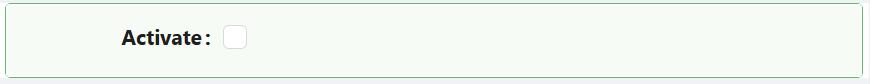

# Checkbox

The Checkbox component provides a simple control that lets users make a binary choice - checked or unchecked. It binds to a boolean field on your entity.

---

## Properties

The following properties are available to configure the behavior of the component from the form editor (this is in addition to [common properties](../common-component-properties.md)).

The panel is organised into three tabs: **Common**, **Events**, and **Appearance**.

---

### Common

The Common tab holds only the standard Property Name, Label, Tooltip, Visible, and Interaction Mode settings described in [common properties](../common-component-properties.md), plus the Validations panel below.

___

### Validations

A collapsible panel at the bottom of the Common tab.

#### **Required** `boolean`

The form cannot be submitted while the Checkbox has no value.

:::note Required is not the same as "must be ticked"
Required means the field has to hold a value. A checkbox the user has never touched has no value, so Required makes them decide either way. To force it to be ticked specifically, add a Custom Validator.
:::

---

### Events

The Checkbox exposes the standard event handlers described in [common properties](../common-component-properties.md#events): On Change, On Focus, On Blur, On Click, On Mouse Enter, On Mouse Move, On Mouse Leave, On Key Down, and On Key Up.

---

### Appearance

The Appearance tab holds the standard Dimensions, Border, Background, Shadow, Margin & Padding, and Custom Styles panels described in [common properties](../common-component-properties.md#appearance), configurable per device.

#### Check Mark

The panel normally labelled **Font** is called **Check Mark** on this component, because the settings here size and colour the tick itself. It offers **Size**, **Weight**, and **Color** only, without the Family and Align options found on text components.
