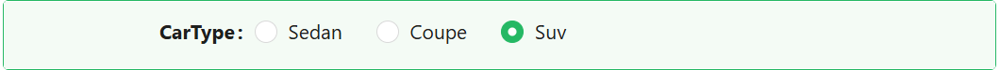
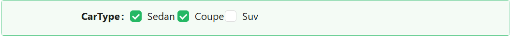
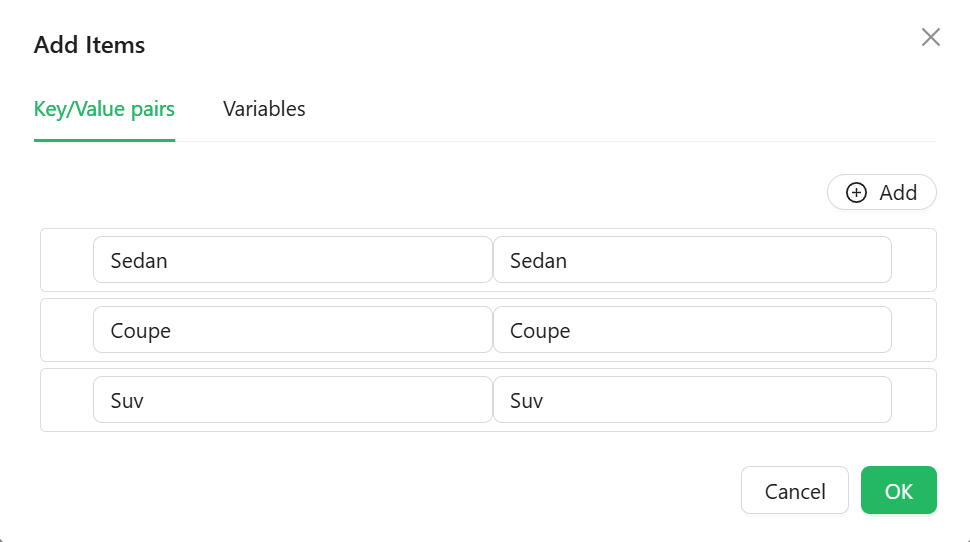

# Checkbox Group

The Checkbox Group component lets users select one or more options from a list of checkboxes. Its options can come from a fixed list you type in, a reference list, or a URL you fetch at runtime.

---

## Properties

The following properties are available to configure the behavior of the component from the form editor. These are in addition to the [common properties](../common-component-properties.md) shared by all Shesha components.

The panel is organised into three tabs: **Common**, **Events**, and **Appearance**. Properties below appear in the same order as the live panel.

---

### Common

The Common tab starts with the standard Property Name, Label, Tooltip, Visible, and Interaction Mode settings described in [common properties](../common-component-properties.md), followed by the two panels below.

___

### Data

A collapsible panel on the Common tab.

#### **Data Source Type** `object`

Where the list of checkbox items comes from.

| Option | Description |
|---|---|
| `Values` | A fixed list of label/value pairs you enter directly. |
| `Reference list` | The items come from a Shesha reference list. |
| `API URL` | The items are fetched from a custom API endpoint at runtime. |

#### **Items** `object`

Shown only when Data Source Type is **Values**. Opens a dialog editor for entering label/value pairs. The Value column uses the expression editor, so a value can be calculated rather than typed.

#### **Reference List** `object`

Shown only when Data Source Type is **Reference list**. Picks the reference list whose items populate the checkboxes.

#### **Data Source URL** `function`

Shown only when Data Source Type is **API URL**. A script that returns the URL to fetch the items from.

#### **Reducer Function** `function`

Shown only when Data Source Type is **API URL**. A script that transforms the raw array returned by the API into `{ value, label }` objects the checkboxes can render.

___

### Validations

A collapsible panel at the bottom of the Common tab.

#### **Required** `boolean`

The form cannot be submitted while no option is selected.

---

### Events

The Checkbox Group exposes the standard event handlers described in [common properties](../common-component-properties.md#events): On Change, On Focus, On Blur, On Click, On Mouse Enter, On Mouse Move, On Mouse Leave, On Key Down, and On Key Up.

---

### Appearance

#### **Direction** `object`

How the checkboxes are arranged.

| Option | Description |
|---|---|
| `Horizontal` | Laid out in a row. This is the default. |
| `Vertical` | Stacked in a column. |

:::tip Vertical for longer labels
Horizontal suits a handful of short options. Once the labels run past a couple of words, Vertical is easier to scan and does not wrap awkwardly on a narrow screen.
:::

#### Checkbox Style

A collapsible panel styling the checkboxes themselves, separately from the component's outer box. It holds a **Check Mark** panel (Size, Weight, and Color for the tick), plus its own Dimensions, Border, Background, Shadow, Margin & Padding, and Custom Styles settings.

The tab also holds the standard [Font, Dimensions, Border, Background, Shadow, Margin & Padding, and Custom Styles](../common-component-properties.md#appearance) panels for the component itself, configurable per device.
