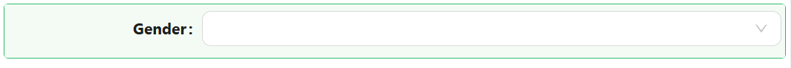
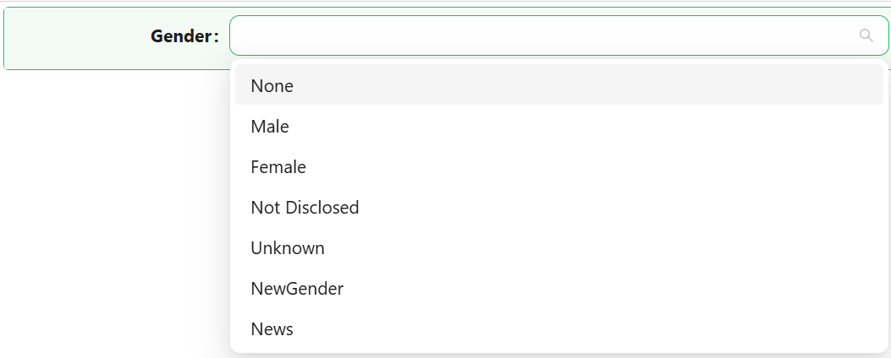

# Dropdown

The Dropdown component lets users pick one or more values from a list. The list can be a fixed set of label/value pairs you define yourself, or a reference list defined on the backend, and the component can display its selected values as plain text or as coloured tags.

---

## Properties

The following properties are available to configure the behavior of the component from the form editor (this is in addition to [common properties](../common-component-properties.md)).

The panel is organised into three tabs: **Common**, **Events**, and **Appearance**. Properties below appear in the same order as the live panel.

---

### Common

#### **Binding Format** `object`

Controls what gets written to the bound property when the user makes a selection.

| Option | Description |
|---|---|
| `Item Value` | Stores the option's value, which for a reference list is its integer value. |
| `Item Label` | Stores the option's display text. |

:::tip Prefer Item Value
Storing the value rather than the label keeps your data stable when someone renames an option later. Use Item Label only when the text itself is the thing you need to save.
:::

___

#### **Read-only Placeholder** `string`

Text displayed when the component has no value and is in read-only mode. Use it to say "Not captured" rather than leaving an empty gap on a details view.

___

#### **Style** `object`

How the selected values are displayed.

| Option | Description |
|---|---|
| `Plain text` | The selection is shown as ordinary text. |
| `Tags` | Each selection is shown as a coloured pill-shaped tag. |

___

The next two properties are shown only when Style is **Tags**.

#### **Show Item Name** `boolean`

Shows the option's display name, or the reference list item's name, inside the tag.

#### **Show Icon** `boolean`

Shows the option's icon on the left side of the display name inside the tag.

___

#### **Enable Multi-Select** `boolean`

Lets the user select more than one option at a time. When off, choosing a new option replaces the current one.

___

#### **Data source** `object`

Where the list of options comes from.

| Option | Description |
|---|---|
| `Values` | A fixed list of options you define directly on the component. |
| `Reference list` | The options come from a reference list defined on the backend. |

:::tip Reference list for anything shared
Define the options once as a reference list whenever more than one form uses them, or whenever an administrator should be able to change them without a developer. Use Values only for a short list that belongs to this one form.
:::

#### **Values** `array`

Shown only when Data source is **Values**. Define each option inline with a Label, a Value, and optionally a Colour and an Icon.

#### **Reference List** `object`

Shown only when Data source is **Reference list**. Picks the reference list this Dropdown draws its options from. See [Reference Lists](../../../back-end-basics/reference-lists.md).

___

### Advanced

A collapsible panel at the bottom of the Common tab, collapsed by default. Most forms never need it.

#### **Filter** `object`

Shown only when Data source is **Reference list**. Narrows which items of the reference list are offered, using the standard query builder.

#### **Disable Item Value** `boolean`

Shown only when Data source is **Reference list**. Turning it on reveals Disabled values below.

#### **Disabled values** `string`

Shown only when Data source is **Reference list** and Disable Item Value is on. An array of item values that appear in the list but cannot be selected, for example `[1, 2, 3]`.

#### **Hidden values** `string`

Shown only when Data source is **Reference list**. An array of item values to leave out of the list entirely, for example `[1, 2, 3]`.

:::note Disabled and Hidden do different jobs
A disabled value is still visible, which tells the user the option exists but is not available to them. A hidden value is gone. Use Disabled when the absence would be confusing, Hidden when the option is simply not part of this form.
:::

#### **Key Value (legacy)** `function`

A script returning the key from the stored value. Retained only for forms saved against the removed Custom value format.

#### **Custom Value (legacy)** `function`

A script returning the value to store as the field value. Retained only for forms saved against the removed Custom value format.

:::warning Do not use the legacy settings on new forms
Both legacy fields exist so that older forms keep working. Use Binding Format on a new form instead.
:::

___

### Validations

A collapsible panel at the bottom of the Common tab.

#### **Required** `boolean`

The form cannot be submitted while the Dropdown has no value.

#### **Message** `string`

The text shown when validation fails, in place of the default message.

#### **Custom Validation** `function`

Your own validation rule, written as a script that returns a promise.

---

### Events

The Dropdown exposes the standard event handlers described in [common properties](../common-component-properties.md#events): On Change, On Focus, On Blur, On Click, On Mouse Enter, On Mouse Move, On Mouse Leave, On Key Down, and On Key Up.

---

### Appearance

The Appearance tab holds the standard [Font, Dimensions, Border, Background, Shadow, Margin & Padding, and Custom Styles](../common-component-properties.md#appearance) panels, configurable per device, plus the panel below.

#### Tag Style

Shown only when Style is **Tags**. It styles the tags themselves, separately from the component's outer box, with its own Font, Dimensions, Border, Background, Shadow, Margin & Padding, and Custom Styles panels.

#### **Variant** `object`

How each tag is filled when the option carries its own colour.

| Option | Description |
|---|---|
| `Solid` | The colour fills the tag. |
| `Outlined` | The colour is drawn as a border around the tag. |
| `Filled` | The colour is applied as a soft tint. |
