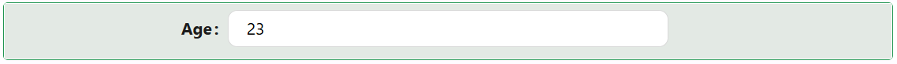

# NumberField

The NumberField component is an input for numeric data entry. It supports several display formats (integer, decimal, currency, percent, or a custom format), an optional thousands separator, and a prefix or suffix (text or icon) shown alongside the value, such as a currency symbol or unit.



---

## Properties

The following properties are available to configure the behavior of the component from the form editor (this is in addition to [common properties](../common-component-properties.md)).

The panel is organised into three tabs: **Common**, **Events**, and **Appearance**. Properties below appear in the same order as the live panel. The Events tab exposes the standard handlers described in [common properties](../common-component-properties.md#events), so they are not repeated here.

:::note Step and High Precision are no longer exposed
Neither the **Step** property (the increment used by the up and down controls) nor **High Precision** appears on the settings panel. Use the Format panel below to control how the number is displayed.
:::

:::tip Binding to an entity property fills in some settings automatically
When Property Name is bound to a numeric entity field, NumberField automatically copies that field's Label, Description, Min Value, and Max Value from the entity's metadata, and infers the Format (Integer, Percent, or Decimal) from the field's data type. You can still override any of these manually afterwards.
:::

### Common

The Common tab starts with the standard Property Name, Label, Placeholder, Tooltip, Visible, and Interaction Mode settings described in [common properties](../common-component-properties.md), followed by the panels below.

___

### Format

A collapsible panel on the Common tab.

#### **Format** `object`

Controls how the entered number is displayed and validated.

| Option | Description |
|---|---|
| `Integer` | Whole numbers only, with no decimal places. |
| `Decimal` | A number with a configurable count of decimal places. |
| `Currency` | A decimal number, with the Prefix/Suffix settings available for a currency symbol. |
| `Percent` | A decimal number, displayed with a `%` suffix. |
| `Custom` | A decimal number, with the Prefix/Suffix settings available for a custom unit. |

#### **Num decimal places** `number`

The number of decimal places to display and round the value to. Shown only when Format is not `Integer`.

#### **Thousands separator** `string`

A character inserted between every group of three digits, such as a comma in `1,000,000`. Leave blank for no grouping separator.

#### **Custom format** `string` / `function`

A [numbro.js](https://numbrojs.com/old-format.html) format string, or a script if you switch the field to JS mode, producing a fully custom display for the value. Use it when the built-in Format options are not enough.

**Form type to use:** Edit Form - or any form type that captures a number.

**Example - Show the value to two decimal places with a thousands separator:**

```javascript
// The component's current value is available as `value`.
return value == null ? '' : value.toLocaleString(undefined, { minimumFractionDigits: 2 });
```

___

The next four properties are shown only when Format is `Currency` or `Custom`.

#### **Prefix** `string`

Text shown at the start of the input, before the number.

#### **Prefix Icon** `string`

An icon shown at the start of the input, before the text.

#### **Suffix** `string`

Text shown at the end of the input, after the number.

#### **Suffix Icon** `string`

An icon shown at the end of the input, after the text.

___

### Validations

These settings sit in a collapsible **Validations** panel at the bottom of the Common tab, not on a separate tab.

#### **Required** `boolean`

The form cannot be submitted while the Number Field has no value. See the [common Required property](../common-component-properties.md#validations).

#### **Min Value** `number`

The minimum value the user is allowed to enter. If Property Name is bound to an entity field, this is pre-filled from that field's metadata but can be overridden.

#### **Max Value** `number`

The maximum value the user is allowed to enter. If Property Name is bound to an entity field, this is pre-filled from that field's metadata but can be overridden.

___

### Appearance

The Appearance tab holds the standard [Font, Dimensions, Border, Background, Shadow, Margin & Padding, and Custom Styles](../common-component-properties.md#appearance) panels, configurable per device.
