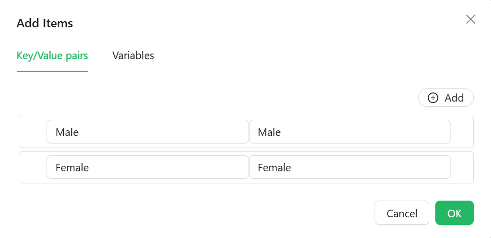

# Radio

The Radio component lets users pick a single option from a small, always-visible set of choices. Its options can come from a fixed list you type in, a reference list, or a URL you fetch at runtime.


---

## Properties

The following properties are available to configure the behavior of the component from the form editor (this is in addition to [common properties](../common-component-properties.md)).

The panel is organised into three tabs: **Common**, **Events**, and **Appearance**. Properties below appear in the same order as the live panel.

---

### Common

The Common tab starts with the standard Property Name, Label, Tooltip, Visible, and Interaction Mode settings described in [common properties](../common-component-properties.md), followed by the two panels below.

___

### Data

A collapsible panel on the Common tab.

#### **Data Source Type** `object`

Chooses where the radio options come from.

| Option | Description |
|---|---|
| `Values` | Define label/value pairs directly in a dialog editor. |
| `Reference list` | Populate options from a selected reference list. |
| `API URL` | Fetch options from a custom endpoint at runtime. |

#### **Items** `object`

Shown only when Data Source Type is **Values**. Opens a dialog editor for typing in label/value pairs. The Value column uses the expression editor, so a value can be calculated rather than typed.



#### **Reference List** `object`

Shown only when Data Source Type is **Reference list**. Picks which reference list supplies the options. If the component's Property Name is bound to a reference-list-typed entity property, this is filled in automatically.

#### **Data Source URL** `function`

Shown only when Data Source Type is **API URL**. A script that returns the URL to fetch options from.

#### **Reducer Function** `function`

Shown only when Data Source Type is **API URL**. A script that reshapes the raw fetched response into the label/value pairs the component needs.

**Form type to use:** Any form type - Radio is available in every script context.

**Example - Map a custom API response into label/value pairs:**

```javascript
return data.map((item) => ({ label: item.displayName, value: item.code }));
```

___

### Validations

A collapsible panel at the bottom of the Common tab.

#### **Required** `boolean`

The form cannot be submitted while no option is selected.

#### **Message** `string`

The text shown when validation fails, in place of the default message.

#### **Custom Validator** `function`

Your own validation rule, written as a script that returns a promise.

---

### Events

The Radio exposes the standard event handlers described in [common properties](../common-component-properties.md#events): On Change, On Focus, On Blur, On Click, On Mouse Enter, On Mouse Move, On Mouse Leave, On Key Down, and On Key Up.

---

### Appearance

#### **Direction** `object`

Lays the options out `Horizontal` (the default) or `Vertical`.

:::tip Vertical for longer labels
Horizontal works well for two or three short options. Once the labels run to more than a couple of words, Vertical is far easier to scan and does not wrap awkwardly on a narrow screen.
:::

#### Radio Style

A collapsible panel styling the radio buttons themselves, with its own Dimensions, Border, Background, Shadow, Margin & Padding, and Custom Styles settings, separate from the component's outer box.

The tab also holds the standard [Font, Dimensions, Border, Background, Shadow, Margin & Padding, and Custom Styles](../common-component-properties.md#appearance) panels, configurable per device.
