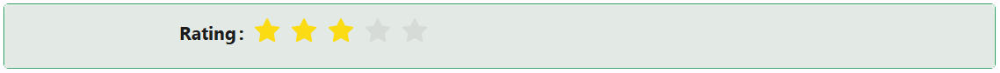

# Rate

The Rate component lets users give a star (or custom icon) rating by clicking one of a row of repeated icons. It binds to a numeric field on your entity.

---

## Properties

The following properties are available to configure the behavior of the component from the form editor (this is in addition to [common properties](../common-component-properties.md)). Rate groups its settings into **Common**, **Events**, and **Appearance** tabs (plus a **Security** tab holding only the standard Permissions setting, not covered further here).

:::note
Rate hides its label by default the first time it is added to a form. Use the standard [Label](../common-component-properties.md#common) property to show it again.
:::

### Common

#### **Max Rating** `number`

The number of rating icons to display (for example, 5 for a typical 5-star rating). Defaults to 5 if left blank. This field is internally named `count`, but its on-screen label is "Max Rating".

#### **Icon** `string`

Picks a single icon to use for every rating position, replacing the default filled star (`StarFilled`, applied automatically the first time the component is added). This is one icon for the whole row, not a different icon per position.

___

### Events

#### **On Change** `function`

Fires when the user picks a rating. The script also receives `value`, the newly selected rating, alongside the standard script variables.

:::note
Half-star ratings are not available
:::

___

### Appearance

#### **Style** `function`

A script that returns the style of the element as an object, conforming to `CSSProperties`. The editor opens in a dialog rather than inline, and is the only Appearance control Rate exposes.
