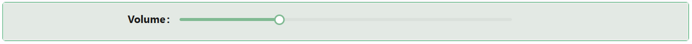

# Slider

The Slider component lets users pick a whole number by dragging a handle along a track, between a minimum and maximum bound. It binds to an integer field on your entity.

:::note Single value, integers only
This component supports a single handle only - there is no dual-handle "range" mode for picking a lower and upper bound together. It also only binds to integer fields (32-bit or 64-bit); it does not support decimal/float values.
:::

---

## Properties

The following properties are available to configure the behavior of the component from the form editor (this is in addition to [common properties](../common-component-properties.md)).

### Common

#### **Property Name** `string`

:::tip Auto-fills Minimum and Maximum
Binding a Property Name that has a validation range defined on the backend entity automatically fills in the **Minimum** and **Maximum** settings below from that metadata.
:::

___

### Data

#### **Minimum** `number`

The minimum allowable value on the slider.

#### **Maximum** `number`

The maximum allowable value on the slider.

___

### Appearance

#### **Enable Style On Readonly** `boolean`

When the component becomes read-only, Shesha strips its visual styling down to typography only by default. Enable this to keep the full custom style applied even when the field is read-only.

#### **Custom Styles** `function`

A single Style script, opened in a dialog editor. This is the only control on Slider's Appearance tab.
