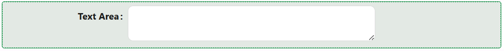

# Text Area

The Text Area component allows users to input multiple lines of text. It is commonly used when you need to collect longer-form textual information, such as user comments, messages, or any other type of free-form text. The Text Area component provides a larger input area compared to a single-line [Text Field](./text-field.md) component.

---

## Properties

The following properties are available to configure the behavior of the component from the form editor (this is in addition to [common properties](../common-component-properties.md)).

The panel is organised into three tabs: **Common**, **Events**, and **Appearance**. Properties below appear in the same order as the live panel.

---

### Common

The Common tab starts with the standard Property Name, Label, Placeholder, Tooltip, Visible, and Interaction Mode settings described in [common properties](../common-component-properties.md), followed by the two panels below.

___

### Behaviour

A collapsible panel on the Common tab.

#### **Auto Size** `boolean`

Expands and shrinks the text area as the user types, instead of keeping a fixed height.

#### **Allow Clear** `boolean`

Adds a clear button that resets the field in one click.

#### **Show Chars Count** `boolean`

Shows a live character count next to the field. Pair it with Max Length below so the count tells the user how many characters remain.

#### **Spell Check** `boolean`

Lets the browser check the entered text for typos.

___

### Validations

A collapsible panel at the bottom of the Common tab, not a separate tab.

#### **Required** `boolean`

The form cannot be submitted while the Text Area has no value.

#### **Min Length** `number`

The minimum number of characters the entered text must contain.

#### **Max Length** `number`

The maximum number of characters the entered text can contain.

:::tip Pair Max Length with Show Chars Count
On its own, Max Length simply stops the user typing once they hit the limit, which is confusing. Turning on Show Chars Count makes the limit visible while they write.
:::

#### **Custom Validation** `function`

Your own validation rule, written as a script that returns a promise.

---

### Events

The Text Area exposes the standard event handlers described in [common properties](../common-component-properties.md#events): On Change, On Focus, On Blur, On Click, On Mouse Enter, On Mouse Move, On Mouse Leave, On Key Down, and On Key Up.

---

### Appearance

The Appearance tab holds the standard [Font, Dimensions, Border, Background, Shadow, Margin & Padding, and Custom Styles](../common-component-properties.md#appearance) panels, configurable per device.
