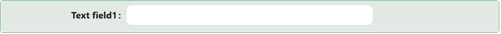

# Text Field

The Text Field component provides a clean, customizable input for short strings like names, titles, or search queries. It supports various formatting options, validation rules, and interactive behaviors such as placeholders, tooltips, and live feedback. Ideal for capturing brief, user-entered information, it can be tailored for read-only displays, inline editing, or integrated seamlessly within larger forms.

---

## Properties

The following properties are available to configure the behavior of the component from the form editor (this is in addition to [common properties](../common-component-properties.md)).

### Common

#### **Type** `object`

Specify the input type:

| Option | Description |
|---|---|
| `Text` | Regular text input. This is the default. |
| `Password` | Masks the entered text for sensitive information. |
| `Email` | An email address input. |
| `URL` | A web address input. |
| `Phone Number` | A telephone number input. |

:::tip Use Text Field for passwords
Text Field with Type set to `Password` is the supported way to capture a password. It replaces the Password Combo component, which is hidden from the toolbox.
:::

#### **Prefix** `string`

Text shown at the start of the input, before the value (for example a currency symbol).

#### **Prefix Icon** `string`

An icon shown at the start of the input, before the text.

#### **Suffix** `string`

Text shown at the end of the input, after the value (for example a unit like `%` or `kg`).

#### **Suffix Icon** `string`

An icon shown at the end of the input, after the text.

#### **Spell Check** `boolean`

Allows the browser to detect typos. Only shown when Type is `Text`.

___

### Auto-format

A collapsible panel on the Common tab, shown only when Type is `Text`. Auto-format inserts a separator between groups of characters as the user types, which makes long reference numbers, account numbers, and ID numbers far easier to read back.

#### **Enable auto-format** `boolean`

Turns the formatting on. The separator is display only: the value stored on the record and sent in the API payload never includes it.

#### **Group lengths** `string`

The length of each group, separated by commas. For example `3,4` groups the value as three characters, then four.

#### **Separator** `string`

The character or characters shown between groups, for example `-`. With group lengths of `3,4` and a separator of `-`, the user typing `1234567` sees `123-4567` while `1234567` is what gets saved.

___

### Validations

A collapsible panel at the bottom of the Common tab.

#### **Required** `boolean`

The form cannot be submitted while the Text Field has no value. See the [common Required property](../common-component-properties.md#validations).

#### **Use standard password validation** `boolean`

Shown only when Type is `Password`. When enabled, the password is validated against the complexity rules defined in the application's authentication configuration. When disabled, no complexity validation is applied.

Min Length, Max Length, and Regular expression are shown only when Type is `Text`. For a password, complexity is governed by Use Standard Password Validation instead.

#### **Min Length** `number`

The minimum number of characters the entered text must contain. See the [common Validations group](../common-component-properties.md#validations).

#### **Max Length** `number`

The maximum number of characters the entered text can contain. See the [common Validations group](../common-component-properties.md#validations).

#### **Regular expression** `string`

A regular expression pattern the value must match. Only shown when Type is `Text`.

#### **Message** `string` / `function`

Custom message displayed when validation fails.

#### **Custom Validator** `function`

Your own validation rule, written as a script that returns a promise.

___

### Appearance

The Appearance tab holds the standard [Font, Dimensions, Border, Background, Shadow, Margin & Padding, and Custom Styles](../common-component-properties.md#appearance) panels, configurable per device.
