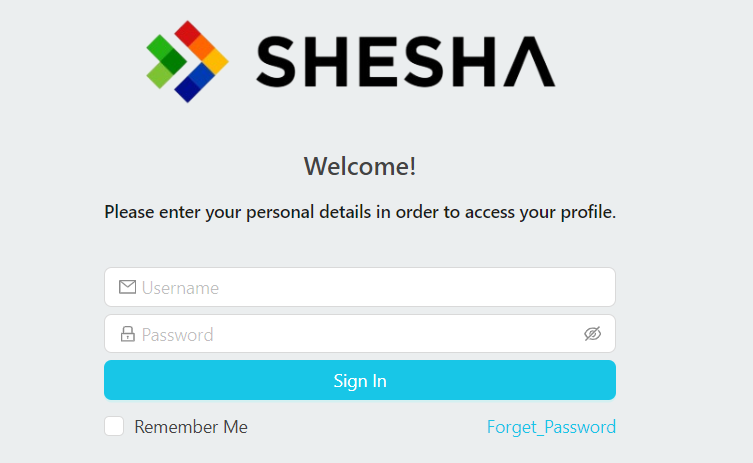

# Design

The login page in Shesha is a configurable form, not hard-coded markup. It is a configuration item identified as `Shesha/login` (`Shesha` is the module, `login` is the form name), so you can open it in the form designer and change it like any other form.

Because it ships as a standard Shesha form, the default login page can log a user in out of the box, but you can also customize what happens before and after the login process, for example running a script when login fails or redirecting to a different page on success.

:::note
If you are upgrading an older Shesha application that predates the configurable login page, you need to run the latest database migrations before the `Shesha/login` form configuration becomes available to edit.
:::

---

## Look and Feel

Out of the box, the configurable login page looks identical to the classic, hard-coded login page it replaced. Since it is now a regular form, you can redesign it completely using the same form components and settings you would use on any other Shesha form.

:::tip
To open the `Shesha/login` form for editing, find it in Configuration Studio's Solution Explorer and use the designer to change its layout. See [Editing items](../../../fundamentals/configuration-studio/editing-items.md) for how configuration items like forms are opened and edited.
:::

Pressing Enter on the login page signs the user in, so they do not have to reach for the mouse to submit.

:::note Login attempts are rate limited
The login and OTP endpoints accept a limited number of requests per minute from a single IP address, and reject the rest with `429 Too Many Requests`. This matters if you are testing a customised login page with an automated script. See [Rate Limiting on Login and OTP](../../../fundamentals/security/authentication.md#rate-limiting-on-login-and-otp).
:::
