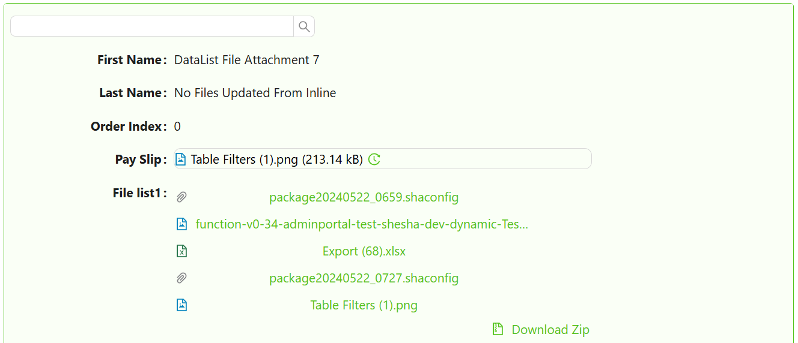

# DataList

A DataList displays a collection of records as a list of repeating sub-forms. Where a DataTable shows data in rows and columns, a DataList gives you complete control over how each item looks by rendering a fully configured form for every record. You can use it to build card-style layouts, custom list items, or any repeating pattern that a grid cannot express.

A DataList reads its data from a parent `DataTableContext` component. The same Pager, Quick Search, and Table View Selector components that work with a DataTable also work with a DataList, because both share the same data context.

A DataList has no page size of its own. It renders every record its data context hands it, so the number of items you see is decided on the parent `DataTableContext` through its **Data Fetching Mode** and **Default Page Size** properties. Set Data Fetching Mode to `Paging` to load one page of records at a time, or to `Fetch all` to load every matching record in a single request.

:::note
If fewer records appear than you expect, check the DataTableContext before changing anything on the DataList. A record that was never fetched cannot be displayed or scrolled to, whatever the DataList is set to.
:::



## Get Started

:::info
This guide assumes a DataTableContext is already configured on your form. [Learn how to set one up here.](../tables-lists/datatable-context.md#get-started)
:::

<LayoutBanners url="https://app.guideflow.com/embed/qp7wmnvtjk" type={1}/>

---

## Properties

The following properties are available to configure the behavior of the component from the form editor (this is in addition to [common properties](../common-component-properties.md)).

---

### Common

#### **Form Selection Mode** `object`

Form Selection Mode controls which form Shesha renders for each item in the list. There are three options.

| Mode | When to use |
|---|---|
| `Name` | You always want to render the same specific form for every item. Select it from the form picker. |
| `Dynamic` | The form to render is determined by the entity type and a form type (e.g. `ListItem`, `details`). Shesha resolves the correct form at runtime. |
| `Expression` | You write a JavaScript expression that returns a form identifier at runtime. Use this when the form depends on conditions that cannot be expressed with the other modes. |

When mode is `Name`, set **Form** to the specific form you want to render for each item.

When mode is `Dynamic`, set **Form Type** to the type of form to look up. Shesha uses the entity type to find the matching registered form.

When mode is `Expression`, write a JavaScript expression in **Form Identifier Expression** that returns an object with `name` and `module` properties identifying the form.

**Example - Return a form identifier dynamically based on item type:**
```js
// item is the current list record being rendered
return item.contactType === 1
  ? { name: 'person-list-item', module: 'MyApp' }
  : { name: 'organisation-list-item', module: 'MyApp' };
```

:::warning
The DataList must be placed inside a DataTableContext component. Without a parent data context, the component has no data source and will not render any items.
:::

---

#### **Selection Mode** `object`

Selection Mode controls whether the user can select items in the list and how many they can select at once.

| Option | Behaviour |
|---|---|
| `None` | Items cannot be selected. No selection UI is shown. This is the default. |
| `Single` | The user can select one item at a time. Clicking a selected item deselects it. |
| `Multiple` | Checkboxes appear on each item. The user can select any number of items. A Select All checkbox appears at the top. |

---

#### **Can Add Inline** `object`

Controls whether the user can add new records directly from the list without navigating to a separate form.

| Option | Behaviour |
|---|---|
| `Yes` | An add button appears. Clicking it opens a create form in a modal dialog. |
| `No` | Adding inline is disabled regardless of the parent context. |
| `Inherit` | The list inherits the add capability from the parent DataTableContext. This is the default. |

---

#### **Create Form** `object`

Appears when Can Add Inline is `Yes` or `Inherit`, and Form Selection Mode is `Name` or `Expression`. Selects the form that opens in the dialog when the user adds a new item. Defaults to the same form used to render list items if not set.

#### **Create Form Type** `object`

Appears when Can Add Inline is `Yes` or `Inherit`, and Form Selection Mode is `Dynamic`. The form type to look up for the create dialog, in the same way Form Type resolves the item-rendering form.

#### **Custom Create URL** `string`

Appears when Can Add Inline is `Yes` or `Inherit`. An optional API endpoint to use instead of the standard entity create endpoint. Leave blank to use the default.

#### **New List Item Init** `function`

Appears when Can Add Inline is `Yes` or `Inherit`. A JavaScript function that runs before the create form opens for a new item. Return an object from this function to pre-populate fields in the create form.

Available variables: `formData`, `form`, `actions`, `utils`, `page`, `application`.

**Example - Pre-populate fields on a new item:**
```js
// formData is the parent form's current data.
return {
  status: 1,
  organisationId: formData.id,
};
```

#### **Dialog Width** `string`

Appears when Can Add Inline is `Yes` or `Inherit`. Controls the width of the create dialog. Choose `Small` (40%), `Medium` (60%), or `Large` (80%) from the list, or type your own value directly into the dropdown and click **Apply** to use a custom width.

---

#### **Can Edit Inline** `object`

Controls whether the user can edit existing records directly within the list.

| Option | Behaviour |
|---|---|
| `Yes` | Edit controls appear on each item. |
| `No` | Editing inline is disabled. |
| `Inherit` | Inherits from the parent DataTableContext. This is the default. |

When Can Edit Inline is `Yes` or `Inherit`, the following additional settings appear.

#### **Show Edit Icon** `boolean`

When enabled, a dedicated edit icon appears on each list item so the user can click it to enter edit mode. When disabled, the item itself is the edit trigger.

#### **Edit Mode** `object`

Controls how many items can be in edit mode at once.

| Option | Behaviour |
|---|---|
| `All at Once` | All items are editable simultaneously. Use this for bulk editing scenarios. |
| `One by One` | Only one item can be in edit mode at a time. Switching to another item saves or cancels the current edit. |

#### **Save Mode** `object`

Controls when edited values are saved to the backend.

| Option | Behaviour |
|---|---|
| `Auto` | Shesha saves the item automatically when the user moves focus away from the edited field. |
| `Manual` | Save and cancel buttons appear on the item. The user must explicitly confirm or discard changes. |

#### **Custom Update URL** `string`

An optional API endpoint to use instead of the standard entity update endpoint. Leave blank to use the default.

---

#### **Can Delete Inline** `object`

Controls whether the user can delete records directly from the list.

| Option | Behaviour |
|---|---|
| `Yes` | A delete control appears on each item. |
| `No` | Inline deletion is disabled. |
| `Inherit` | Inherits from the parent DataTableContext. This is the default. |

#### **Custom Delete URL** `string`

Appears when Can Delete Inline is `Yes` or `Inherit`. An optional API endpoint to use instead of the standard entity delete endpoint. Leave blank to use the default.

---

### Events

#### **On List Item Save** `function`

A JavaScript function that runs before an inline edit or create is submitted to the backend. Return the modified data object from this function. Throw an error to cancel the save.

Available variables: `data`, `formData`, `form`, `actions`, `utils`, `page`, `user`, `application`.

**Example - Validate before saving:**
```js
if (!data.emailAddress) {
  throw new Error('Email address is required.');
}
return data;
```

#### **On Double-Click** `action`

Action to execute when a list item is double-clicked.

#### **On List Item Save Success** `action`

Fires after an inline create or edit is successfully saved to the backend. Use this to show a confirmation message or refresh related data.

#### **On Row Save** `function`

Appears when Can Add Inline or Can Edit Inline is not `No`. A second, lower-level hook that also runs when saving a new or updated item - use **On List Item Save** for validation and transformation; this one is provided for parity with DataTable's row-save handler.

Available variables: `data`, `formData`, `form`, `actions`, `utils`, `page`.

#### **On List Item Delete Success** `action`

Fires after an inline delete completes successfully. Use this to show a confirmation message or update related parts of the form.

#### **On List Item Click** `action`

Action to execute when a list item is clicked.

#### **On List Item Hover** `action`

Action to execute when hovering over a list item.

#### **On List Item Select** `action`

Appears when Selection Mode is not `None`. Action to execute when a list item is selected. Does not trigger on unselect.

#### **On Selection Change** `action`

Appears when Selection Mode is not `None`. Action to execute when the selection changes. Triggers on both select and unselect.

---

### Appearance

#### **Container Styles**

A collapsible panel grouping the layout settings for the list's item container.

##### **Orientation** `object`

Controls the layout direction of items in the list.

| Option | Behaviour |
|---|---|
| `Vertical` | Items stack top to bottom. This is the default. |
| `Horizontal` | Items sit side by side in a row. |
| `Wrap` | Items flow left to right and wrap onto new rows. |

##### **Gap** `number`

The gap between the DataList's cards, regardless of orientation.

:::note Per-orientation card sizing removed
The per-orientation size settings from older versions (List Item Width, Custom List Item Width, Card Minimum Width, Card Maximum Width, Card Height, Card Spacing and Show Border) are no longer available. Use the **Gap** setting above for spacing, and the **Dimensions**, **Margin & Padding** and **Custom Styles** controls in this panel to size and border the item container.
:::

##### **Dimensions** `object`

Sets the size of the list's item container, the element that holds every rendered item. The panel holds Width, Min Width and Max Width on the first row, then Height, Min Height and Max Height on the second. Every value accepts any CSS unit, and a value with no unit is treated as pixels.

Max Height is what makes the list scroll. Without it, the container grows to fit every record, so a long list stretches the page instead of scrolling. Once Max Height is set, the container stops at that height, shows as many records as fit, and scrolls to reach the rest.

To choose a value, multiply the rendered height of one item by the number of items you want visible. An item that renders at 92px gives roughly 500px for five visible items.

:::warning
This is not the same panel as the Dimensions panel at the top of the Appearance tab. The top-level panel sizes each individual item. This one sizes the container holding them. Setting Max Height on the top-level panel resizes the items and the list still will not scroll.
:::

:::tip
Use `px` or `vh` for Max Height. A `%` value only works when the parent element has a definite height of its own, which form containers usually do not, so a percentage often behaves as though no cap was set at all.
:::

##### **Margin & Padding** `object`

Spacing around and inside the item container. This behaves the same way as the common Margin and Padding setting, but it is scoped to the item container rather than to the component as a whole.

##### **Custom Styles** `object`

A Style script that returns a CSS object, applied to the item container. Use it when the Dimensions, Margin and Padding controls above cannot express the layout you need.

---

#### **Group Styles**

A collapsible panel for styling grouped sections. Grouping itself is configured on the parent DataTableContext.

##### **Collapsible** `boolean`

When enabled, grouped sections within the list show a collapse/expand toggle. Users can hide a group's items to save space.

##### **Collapsible By Default** `boolean`

When enabled alongside Collapsible, all grouped sections start collapsed when the form loads.

##### **Header Style** `function`

A JavaScript expression that returns a CSS style object applied to group header rows.

Available variables: `data`.

**Example - Style group headers with a coloured background:**
```js
return {
  backgroundColor: '#f0f4ff',
  fontWeight: '600',
  padding: '8px 12px',
};
```

---

#### **Empty State**

A collapsible panel controlling what is shown when the list has no records to display.

##### **Icon** `object`

An icon displayed alongside the empty state message.

##### **Primary Text** `string`

The main message shown when the list has no records to display. Defaults to `No Data`.

##### **Secondary Text** `string`

A supporting message shown below the primary text when the list is empty. Defaults to `No data is available for this list`.
