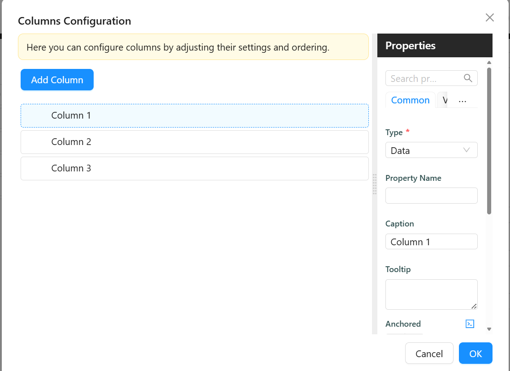
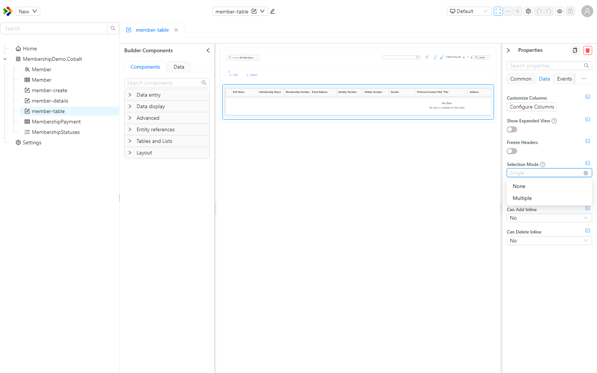
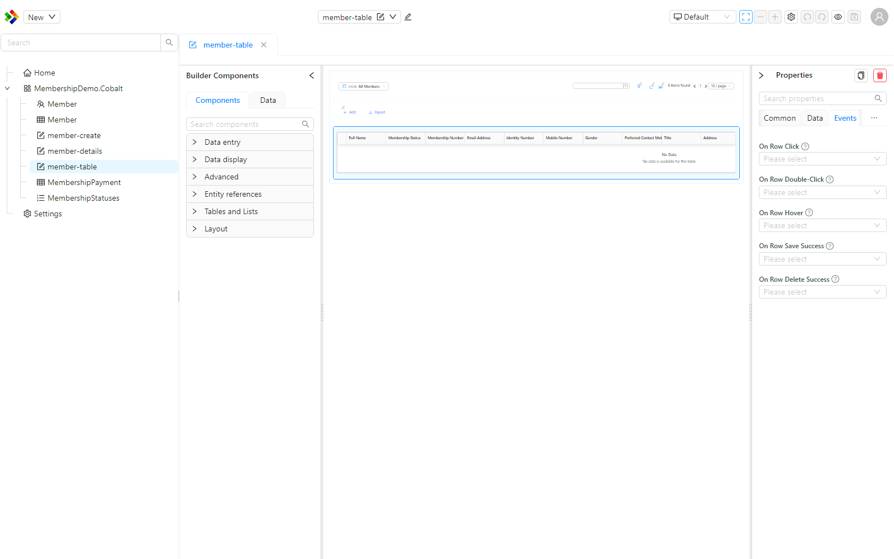
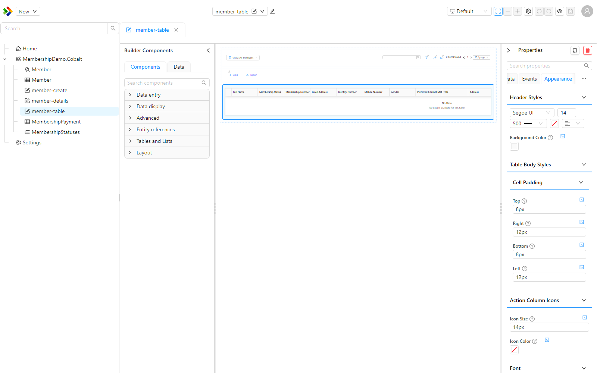

# DataTable

A DataTable displays records from a data source in rows and columns. You configure which columns to show, how each column looks and behaves, and whether users can add, edit, or delete records directly inside the table. A DataTable reads its data from a parent DataTableContext component, which handles fetching, filtering, sorting, and paging so the DataTable only needs to focus on display.


## Get Started

:::info
This guide assumes a DataTableContext is already configured on your form. [Learn how to set one up here.](../tables-lists/datatable-context.md)
:::

<LayoutBanners url="https://app.guideflow.com/embed/qkqw5zjf1k" type={1}/>

---

## Properties

The following properties are available to configure the behavior of the component from the form editor (this is in addition to [common properties](../common-component-properties.md)).

The panel is organised into three tabs: **Common**, **Events**, and **Appearance**. The Columns, CRUD, and Layout groups below sit on the Common tab, Row events sits on the Events tab, and the styling groups sit on the Appearance tab.

---

### Columns

#### **Customize Columns**

Opens the column builder, where you define what the table shows. Each column maps to a field in your data source. You configure how the column header looks, how the cell renders in view mode, and what component appears when a row is being edited or created.



Each column in the builder has the following settings:

**Type** - Determines what kind of column this is and which other settings appear for it.

| Option | When to use |
|---|---|
| `Data` | Show a field value from the record. This is the default for most columns. |
| `Action` | Show a button or link that triggers a configurable action when clicked. |
| `CRUD Operations` | Show a built-in set of edit, save, and delete icons for inline row editing. |
| `Form` | Embed a small form inside the cell using a separate form definition. |

:::note
Scripts on an `Action` column now run with the full page context. Variables such as `pageContext`, `form`, and `setGlobalState` are injected and available, where in earlier versions they could arrive as `undefined`.
:::

**Property Name** - The field name from the data source this column reads its value from. Use dot notation for nested fields, for example `address.town`. Applies to `Data` and `Form` column types.

**Caption** - The text shown in the column header. If left blank, Shesha uses the property name.

**Tooltip** - Short text shown when the user hovers over the column header.

**Anchored** - Pins the column so it stays visible when the user scrolls horizontally. Choose `Left` to pin to the left edge or `Right` to pin to the right edge.

**Is Visible** - Controls whether the column is shown. Uncheck this to hide a column without removing it from the configuration.

**Display Component** - The component used to render the cell value in view mode.

**Edit Component** - The component used inside the cell when the row is being edited inline.

**Create Component** - The component used inside the cell when a new row is being created inline. If left blank, Shesha uses the Edit Component.

---

#### **Show Expanded View** `boolean`

When enabled, each row can be expanded to show an expanded, read-only view of the record built from the table's default display components. This is limited to columns that use the default display component - columns with a custom Display Component configured are not shown in the expanded view.

---

#### **Selection Mode** `object`

Controls whether and how users can select rows. This uses the same selection model as the DataList component.

| Option | When to use |
|---|---|
| `None` | Rows cannot be selected. Use this for a display-only table. |
| `Single` | Only one row can be selected at a time. |
| `Multiple` | A checkbox appears at the start of each row, and users can select several rows at once. Use this for bulk actions on the selected records. |

When Selection Mode is `Single` or `Multiple`, the On Row Select and On Selection Change events become available. See [Row events](#row-events).



---

#### **Freeze Headers** `boolean`

When enabled, the column headers stay fixed at the top of the table while the user scrolls down through a long list of rows.

---

### CRUD

The CRUD settings control whether users can add, edit, or delete records directly inside the table without opening a separate form.

#### **Can Edit Inline** `object`

Controls whether rows can be edited directly in the table.

| Option | Behaviour |
|---|---|
| `Yes` | Inline editing is always enabled. |
| `No` | Inline editing is always disabled. |
| `Inherit` | Inherits the setting from the parent DataTableContext. |
| `Expression` | Uses a JavaScript expression to decide at runtime. |

---

#### **Can Edit Inline Expression** `function`

Appears when Can Edit Inline is set to `Expression`. A JavaScript expression that returns `true` to enable inline editing or `false` to disable it.

Available variables:

| Variable | Type | Description |
|---|---|---|
| `formData` | `object` | Current values of all fields on the parent form. |
| `page.state` | `object` | Data shared by every component on the current page |
| `utils.moment` | `function` | The Moment.js library, for working with dates and times |

**Form type to use:** Table / List View.

**Example - Disable editing when the record status is closed:**

```js
return formData.status !== 3;
```

---

#### **Row Edit Mode** `object`

Appears when Can Edit Inline is `Yes`, `Inherit`, or `Expression`. Controls how many rows can be in edit mode at the same time.

| Option | Behaviour |
|---|---|
| `One by one` | Only one row can be edited at a time. Clicking edit on another row discards any open changes. |
| `All at once` | All rows can be edited simultaneously. Use this for bulk editing scenarios. |

---

#### **Save Mode** `object`

Appears when Can Edit Inline is `Yes`, `Inherit`, or `Expression`. Controls when edited row data is saved.

| Option | Behaviour |
|---|---|
| `Auto` | Changes are saved automatically when the user moves focus away from the row. |
| `Manual` | The user must click the Save icon on the row to commit the change. |

---

#### **Custom Update URL** `string`

Appears when Can Edit Inline is `Yes`, `Inherit`, or `Expression`. An optional endpoint to override the default URL that row updates are posted to. Leave blank to use the standard entity update endpoint.

---

#### **Can Add Inline** `object`

Controls whether users can create new records by adding a row directly in the table.

| Option | Behaviour |
|---|---|
| `Yes` | Inline row creation is always enabled. |
| `No` | Inline row creation is always disabled. |
| `Inherit` | Inherits the setting from the parent DataTableContext. |
| `Expression` | Uses a JavaScript expression to decide at runtime. |

---

#### **Can Add Inline Expression** `function`

Appears when Can Add Inline is set to `Expression`. A JavaScript expression that returns `true` to allow row creation or `false` to prevent it.

Available variables: `formData`, `form`, `utils`, `page`.

---

#### **New Row Capture Position** `object`

Appears when Can Add Inline is `Yes`, `Inherit`, or `Expression`. Controls where the empty new-row input appears in the table.

| Option | Behaviour |
|---|---|
| `Top` | The new row input appears at the top of the table. |
| `Bottom` | The new row input appears at the bottom of the table. |

---

#### **Custom Create URL** `string`

Appears when Can Add Inline is `Yes`, `Inherit`, or `Expression`. An optional endpoint to override the default URL that new rows are posted to. Leave blank to use the standard entity create endpoint.

---

#### **New Row Init** `function`

Appears when Can Add Inline is `Yes`, `Inherit`, or `Expression`. A JavaScript function that runs when a new row is first added to the table. Use it to pre-fill default values on the empty row before the user starts typing. Return an object with the field values to pre-populate.

Available variables:

| Variable | Type | Description |
|---|---|---|
| `formData` | `object` | Current values of all fields on the parent form. |
| `page.state` | `object` | Data shared by every component on the current page |
| `actions.callApi` | `object` | HTTP client for calling APIs. Exposes `get`, `post`, `put`, `patch`, and `delete` |
| `utils.moment` | `function` | The Moment.js library, for working with dates and times |

**Form type to use:** Table / List View.

**Example - Pre-fill the new row with the parent form's selected person:**

```js
return {
  personId: formData.personId,
  status: 1,
};
```

---

#### **On Row Save** `function`

Appears when Can Add Inline or Can Edit Inline is not `No`. A JavaScript function that runs when a row is about to be saved. Use it to validate or transform the row data before it is posted to the server. Your function must return the data object that should be saved.

Available variables:

| Variable | Type | Description |
|---|---|---|
| `data` | `object` | The current row field values. |
| `formData` | `object` | Current values of all fields on the parent form. |
| `page.state` | `object` | Data shared by every component on the current page |
| `actions.callApi` | `object` | HTTP client for calling APIs. Exposes `get`, `post`, `put`, `patch`, and `delete` |
| `utils.moment` | `function` | The Moment.js library, for working with dates and times |

**Form type to use:** Table / List View.

**Example - Add a timestamp to the row before saving:**

```js
return {
  ...data,
  lastModifiedOn: utils.moment().toISOString(),
};
```

:::warning
If On Row Save does not return a value, the row save will fail silently. Always return the full data object you want to save.
:::

---

#### **Can Delete Inline** `object`

Controls whether users can delete rows directly from the table.

| Option | Behaviour |
|---|---|
| `Yes` | Inline row deletion is always enabled. |
| `No` | Inline row deletion is always disabled. |
| `Inherit` | Inherits the setting from the parent DataTableContext. |
| `Expression` | Uses a JavaScript expression to decide at runtime. |

---

#### **Can Delete Inline Expression** `function`

Appears when Can Delete Inline is set to `Expression`. A JavaScript expression that returns `true` to allow deletion or `false` to prevent it.

Available variables: `formData`, `form`, `utils`, `page`.

**Form type to use:** Table / List View.

**Example - Only allow deleting rows that have not yet been approved:**

```js
return formData.approvalStatus !== 2;
```

---

#### **Custom Delete URL** `string`

Appears when Can Delete Inline is `Yes`, `Inherit`, or `Expression`. An optional endpoint to override the default URL used for row deletions. Leave blank to use the standard entity delete endpoint.

---

### Row events

These events let you respond to how a user interacts with a row. Each one is an [Action Configuration](../../configured-views/action-configurations.md), so you choose an action to run, such as navigate, show a dialog, or execute a script, when the interaction happens. The row involved in the interaction is available to the action.

| Event | Fires when |
|---|---|
| `On Row Click` | A row is clicked. |
| `On Row Double-Click` | A row is double-clicked. |
| `On Row Hover` | The pointer hovers over a row. |
| `On Row Select` | A row is selected. Available when Selection Mode is `Single` or `Multiple`. |
| `On Selection Change` | The set of selected rows changes. Available when Selection Mode is `Single` or `Multiple`. |
| `On Row Save Success` | An inline row edit or creation has been saved successfully to the server. |
| `On Row Delete Success` | An inline row deletion has completed successfully. |



:::note
Scripts run from these events receive the full page context, including `pageContext`, `form`, and `setGlobalState`.
:::

---

### Layout

#### **Table Container Style** `function`

A JavaScript expression that returns a CSS style object applied to the outer wrapper around the table. Found under the Appearance tab's **Custom Styles** panel, alongside Table Style.

Available variables: `formData`, `form`, `page`.

**Example - Add a border and rounded corners to the table container:**

```js
return {
  border: '1px solid #d9d9d9',
  borderRadius: '8px',
  overflow: 'hidden',
};
```

---

#### **Table Style** `function`

A JavaScript expression that returns a CSS style object applied directly to the table element. Found under the Appearance tab's **Custom Styles** panel, alongside Table Container Style.

Available variables: `formData`, `form`, `page`.

:::warning Min Height / Max Height removed from the panel
The standalone **Min Height** and **Max Height** settings under Layout, present in older versions, are no longer exposed on the properties panel. To constrain the table's height, set a fixed or max height in the **Table Container Style** script instead, for example `return { maxHeight: '600px', overflowY: 'auto' };`.
:::

---

### Appearance

The Appearance tab gives you control over how the table looks, without writing CSS. The options are grouped as follows.



| Group | What you can control |
|---|---|
| Header styles | Header font (family, size, weight, colour, alignment) and background colour. |
| Table body styles | Cell padding (top, right, bottom, left). |
| Action column icons | Icon size and colour for the built-in CRUD action icons. |
| Font / Dimensions / Row Dimensions / Border / Background / Shadow / Margin & Padding | Generic per-device styling for the table element itself. |
| Table specific | Striped rows, hover highlight, row background, alternate row background, hover background, sort indicator colour, and (when Selection Mode is `Single` or `Multiple`) selected row background. |
| Cell styling | Cell border colour, whether cell borders are shown, and row dividers. |

The `Freeze Headers` option keeps the header row fixed (sticky) while the body scrolls. For one-off styling beyond these options, use the Table Container Style and Table Style functions described under [Layout](#layout).

---

:::warning Empty Table settings removed from the panel
The **Primary Text**, **Secondary Text** and **Icon** settings for the table's empty state, present in older versions, are no longer exposed on the properties panel for DataTable.
:::
