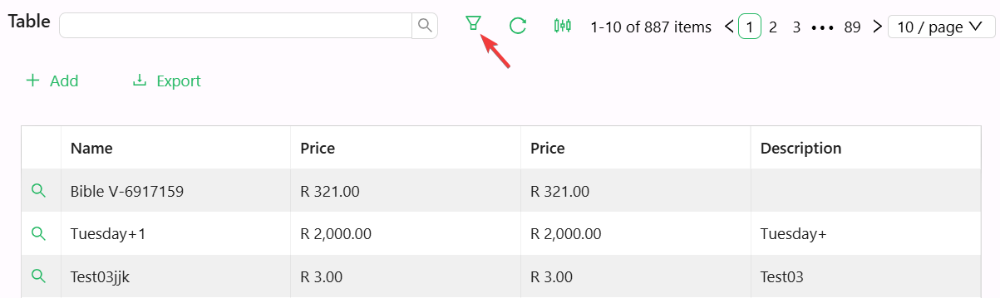

# Table Filter

The Table Filter component is a button that opens the advanced filter panel for a DataTable, letting users build their own query-builder filter at runtime. It must be placed inside a [Data Table Context](./datatable-context.md) - it has no table to filter otherwise.

:::warning Requires a Data Table Context
If you add a Table Filter outside a Data Table Context, the designer shows a disabled, greyed-out placeholder button instead of a working filter button, and flags a validation error on the component.
:::

## Properties

The following properties are available to configure the behavior of the component from the form editor (this is in addition to [common properties](../common-component-properties.md)).

### Common

#### **Label** `string`

The text shown on the button.

#### **Tooltip** `string`

Text shown when the user hovers over the button.

#### **Icon** `object`
Name of an optional icon displayed on the button.

___

### Appearance

#### **Type** `object`
Controls the visual style of the button:
- Default *(first option)*
- Primary
- Dashed
- Link *(default)*
- Text
- Ghost

:::note
The component defaults to the `Link` button style when newly added, even though `Default` is listed first in the dropdown.
:::
