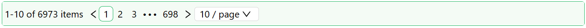

# Table Pager

The Table Pager component shows pagination controls (page numbers, page size, and a total-item count) for a DataTable or DataList on the same form. It must be placed inside a [Data Table Context](./datatable-context.md) - it reads the current page, total rows, and page size directly from that context rather than from its own data.

:::warning Requires a Data Table Context
If you add a Table Pager outside a Data Table Context, the designer raises a validation error and the component falls back to a disabled, greyed-out placeholder pager instead of a working one. The same placeholder also shows if the Data Table Context has no DataTable or DataList configured in it yet.
:::

:::note Hidden below 1202px viewport width
When paging is active, the whole pager - not just the size changer or total count - renders nothing once the browser viewport drops below 1202px wide. It disappears on tablet-width windows and smaller, regardless of the **Show Size Changer** and **Show Total Items** settings below.
:::

---

## Properties

The following properties are available to configure the behavior of the component from the form editor (this is in addition to [common properties](../common-component-properties.md)).

### Common

#### **Show Size Changer** `function`

Toggles the page size selector dropdown. Defaults to enabled. Scriptable via the "fx" toggle.

#### **Show Total Items** `function`

Toggles the display of the total item count. Defaults to enabled. Scriptable via the "fx" toggle.

___

### Appearance

#### **Font** `object`

Typography for the pager - Family, Size, Weight, Colour, and Align.
