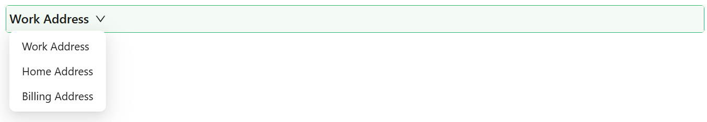

# Table View Selector

The Table View Selector component lets users switch between named, predefined filters on a table, such as "My Records" or "Overdue" - instead of building a filter from scratch every time. Each named view is defined once in the designer and applied with a single click. This component must be used inside a [Data Table Context](./datatable-context.md) - it has nothing to select between otherwise.

:::note Outside a Data Table Context
If you add this component outside a Data Table Context, the designer shows a "View: Default" placeholder in its place and flags a validation error, rather than the real view list.
:::

See [Filtering](../../how-to-guides/filtering.md) for a worked example of setting up filters end to end.

---

## Properties

The following properties are available to configure the behavior of the component from the form editor (this is in addition to [common properties](../common-component-properties.md)).

### Common

#### **Filters** `object[]`

The list of named views to offer, managed as a draggable, reorderable list - dragging an item changes where its view sits in the selector. Clicking a filter's settings icon opens a **Configure Filter** dialog with:

| Field | What it does |
|---|---|
| Title (`name`) | The label shown for this view |
| Tooltip | Optional hover text |
| Permissions | Optional permission names restricting who sees this view |
| Query builder | The visual query builder used to build the filter expression applied when this view is selected, with an accompanying expression viewer and a Variables tab documenting the `data` and `page.state` values available to it |

A new Table View Selector always starts with one default filter ("Default", no expression, showing all records) so the component has something to display even before you configure it.

#### **Show Icon** `boolean`

Displays a layout icon next to the selected view's label.
