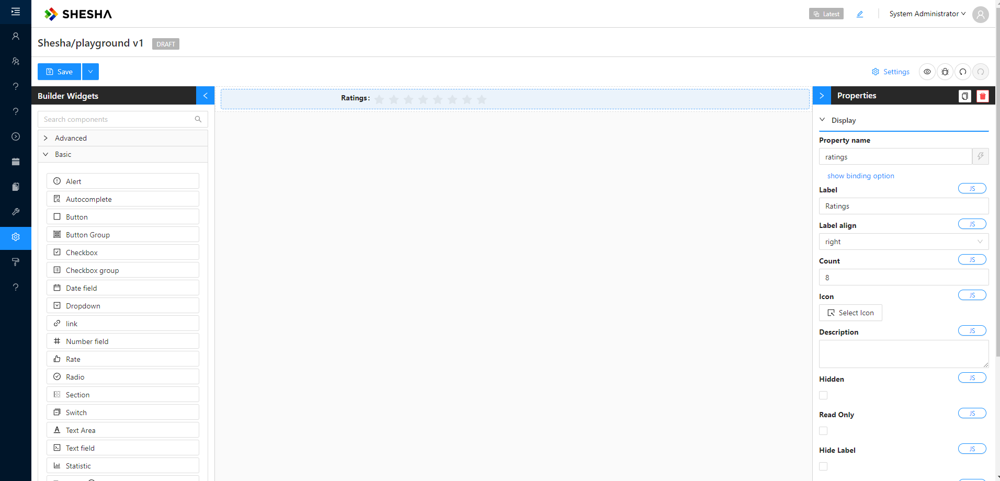
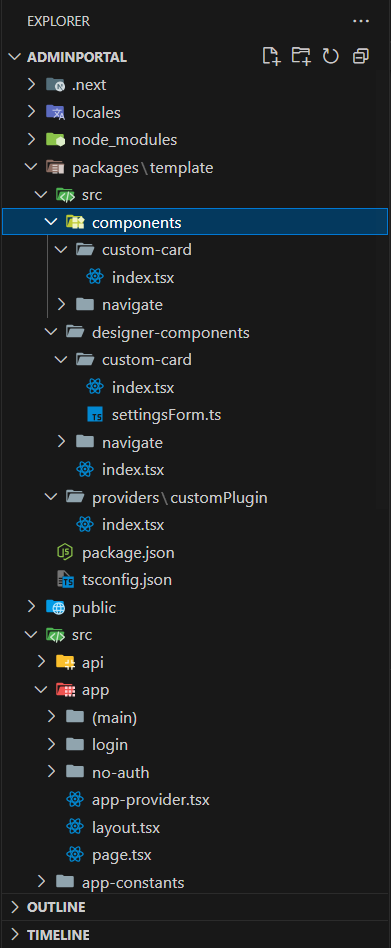
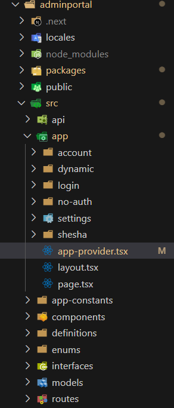

# Custom Components

## Overview

The Shesha Form Builder is a versatile tool that offers a wide range of form components to cover most common scenarios. However, to meet unique requirements, Shesha allows the creation of custom components. These custom components can be seamlessly integrated into the Form Builder, enabling easy addition via a drag-and-drop interface.

## Background

The Shesha Form Builder uses a JSON schema to assemble the form structure. Once the schema is available, it is injected into the builder, where it is interpreted to render components with their specific configurations.



#### Example JSON Schema

```ts
{
  "components": [
    {
      "id": "LAuoz8VcEzPdMTc5zFK-n",
      "type": "rate",
      "propertyName": "ratings",
      "componentName": "ratings",
      "label": "Ratings",
      "labelAlign": "right",
      "parentId": "root",
      "hidden": false,
      "isDynamic": false,
      "version": 1,
      "count": 8,
      "settingsValidationErrors": []
    }
  ],
  "formSettings": {
    "layout": "horizontal",
    "colon": true,
    "labelCol": {
      "span": 6
    },
    "wrapperCol": {
      "span": 18
    }
  }
}
```

:::note
The JSON schema above shows two properties: `components` (an array of form components) and `formSettings`. If there are multiple components in the UI form, they would appear as additional entries within the `components` array.
:::

## Folder Structure

Shesha adopts a [monorepo](https://monorepo.tools) structure with [NPM workspaces](https://www.geeksforgeeks.org/getting-started-with-npm-workspaces), allowing shared dependencies between multiple projects or modules within a single application.

- The root workspace directory is typically named `packages`, where all relevant modules are stored.
- Within the `src` folder, we need to add three new folders: the `components` folder, `designer-components`, and the `providers` folder.

#### Components Folder

This folder contains the core implementation of the component.

- `src/components/custom-card/index.tsx`
  Contains the standard `.tsx` file with the UI logic and necessary props for the `custom-card` component.

#### Designer Components Folder

This folder is responsible for integrating the component into the **Shesha Framework** and making it configurable for other developers. This is done by exporting an `IToolboxComponent` definition for the component, and adding it to an array of components that is passed to `registerFormDesignerComponents`.

- `src/designer-components/custom-card/index.tsx`
  Wraps the core component and registers it with the Shesha design system, including metadata such as the component name and settings.

- `src/designer-components/custom-card/settingsForm.ts`
  Provides a configuration form that allows developers to customize the component's behavior and appearance through a UI.

:::note
The framework's own built-in components (for example `shesha-reactjs/src/designer-components/alert/`) follow this same `index.tsx` + `settingsForm.ts` layout. There is no single aggregator file you need to add these to - your own plugin only needs to list the components it exposes, as shown in the `providers` section below.
:::

#### Providers Folder

- Components are exposed through the `index.tsx` file inside `\src\providers\custom-plugin`, which needs to be wrapped around the main application's provider.

  

#### Example Code: Exposing Components

```ts
import { useSheshaApplication } from "@shesha-io/reactjs";
import { TheComponents } from "../../designer-components";
import React, { PropsWithChildren, useEffect } from "react";

export const REPORTING_PLUGIN_NAME = "Custom-Plugin";

export interface ICustomPluginProps {}

export const CustomPlugin: React.FC<PropsWithChildren<ICustomPluginProps>> = ({
  children,
}) => {
  const { registerFormDesignerComponents } = useSheshaApplication();

  useEffect(() => {
    registerFormDesignerComponents(REPORTING_PLUGIN_NAME, TheComponents);
  }, []);

  return <>{children}</>;
};
```

:::note
`registerFormDesignerComponents` expects `(owner: string, componentGroups: IToolboxComponentGroup[])` - a list of **groups**, each with its own `components` array, not a flat list of components. `TheComponents` below is already shaped this way.
:::

#### Viewing Exposed Components

To view the list of exposed components in the Shesha Form Builder, open `Custom Components` via the builder widgets, as shown in the image below:

.PNG)

#### Data Structure

The `src\designer-components\index.tsx` file uses an array to group components. This structure allows for organizing multiple component modules when needed.

The array is typed using the `IToolboxComponentGroup` interface, ensuring that the correct structure is followed. It is recommended to type `TheComponents` as demonstrated in the example below:

#### Example Code: `TheComponents`

```ts
import { IToolboxComponentGroup } from "@shesha-io/reactjs";
import CustomCardComponent from "./custom-card";
import CustomNavigationComponent from "./navigate";

export const TheComponents: IToolboxComponentGroup[] = [
    {
        name: "Custom Components",
        components: [CustomCardComponent, CustomNavigationComponent],
        visible: true
    }
]
```

## Component Definition

In this example, we will demonstrate the standard way of creating a component in Next.js, including the use of typed props that extend the `IConfigurableFormComponent` interface from the Shesha Framework.

:::note
This component will be handled by the Factory method within the custom-card designer component.
:::

#### Example Component: `CustomCard`

```ts
import { IConfigurableFormComponent } from "@shesha-io/reactjs";
import React from "react";

export interface ICustomCard extends IConfigurableFormComponent {
  title: string;
  description: string;
  imageUrl?: string;
  footer?: React.ReactNode;
}

const CustomCard: React.FC<ICustomCard> = ({ title, description, imageUrl, footer }) => {

    return (
    <div style={{ border: "1px solid #ddd", borderRadius: 8, padding: 16, maxWidth: 350 }}>
      {imageUrl && (
        
      )}
      <h3>{title}</h3>
      <p>{description}</p>
      {footer && <div style={{ marginTop: 16 }}>{footer}</div>}
    </div>
  );
};

export default CustomCard;
```

## Designer Component Definition

The custom-card component must implement the `IToolboxComponent` interface to maintain consistency within the Form Builder, and this rule applies to all custom components. One more thing to point out is the Factory method - this is the method that will return our custom card JSX from the components folder.

#### Example Component: `CustomCard`

```ts
import React from "react";
import CustomCard, { ICustomCard } from "../../components/custom-card";
import { getSettings } from "./settingsForm";
import { IdcardOutlined } from "@ant-design/icons";
import {
  ComponentFactoryArguments,
  ConfigurableFormItem,
  IToolboxComponent,
  validateConfigurableComponentSettings,
} from "@shesha-io/reactjs";

const CustomCardComponent: IToolboxComponent<ICustomCard> = {
  type: "CustomCard",
  icon: <IdcardOutlined />,
  isInput: false,
  isOutput: true,
  name: "Custom Card",
  Factory: ({ model }: ComponentFactoryArguments<ICustomCard>) => {
    return (
      <ConfigurableFormItem model={model}>
        {(value, onChange) => (
          <CustomCard
            title={model.title}
            description={model.description}
            type={model.type}
            imageUrl={model.imageUrl}
            id={model.id}
          />
        )}
      </ConfigurableFormItem>
    );
  },
  initModel: (model) => ({
    ...model,
    title: "Hello Shesha",
    description: "sample",
    imageUrl:
      "https://www.w3schools.com/images/w3schools_green.jpg",
  }),
  settingsFormMarkup: getSettings,
  validateSettings: (model) =>
    validateConfigurableComponentSettings(getSettings, model),
};

export default CustomCardComponent;
```

:::warning
`validateConfigurableComponentSettings` currently only validates markup passed as a static object. When `settingsFormMarkup` is a factory function (the pattern shown above, and the pattern used throughout the framework's own built-in components), settings validation is skipped rather than enforced. Do not rely on it to catch invalid settings for components built this way.
:::

#### Key Properties of [IToolboxComponent](https://github.com/shesha-io/shesha-framework/blob/main/shesha-reactjs/src/interfaces/formDesigner.ts):

- `type`: Unique identifier for the component.
- `name`: Displayed in the toolbox, often set as the default label.
- `icon`: The icon shown in the toolbox.
- `Factory`: A method that returns a JSX element and defines how the component is rendered in the form.
- `settingsFormMarkup`: Defines the component's configuration form, typically displayed in the side menu or metadata section of the builder.
- `initModel`: Initial values can be defined and will be applied during the form configuration initialization.

:::note
`IToolboxComponent` has grown beyond these core properties over time (it now also supports things like `migrator`, `getDefaultStyles`, `useCalculateModel` and others for more advanced components). The properties above are the ones you need to get a basic custom component working - check the interface in the framework repo if you need the more advanced options.
:::

## Form Configuration

The `settingsFormMarkup` property defines the component's configuration, typically displayed in the side menu or metadata section of the builder. It can be either a static markup object, or - as shown here - a factory function that receives a fluent form builder (`fbf`) you use to build the markup.

Shesha's built-in components no longer use the old `DesignerToolbarSettings` class - it has been removed from the framework. The current pattern is a `SettingsFormMarkupFactory` function that receives `{ fbf }` (a `FormBuilderFactory`) and calls its fluent `add...()` methods to build the settings form, ending with `.toJson()`.

#### Example: `settingsForm` Configuration

```ts
import { nanoid } from 'nanoid';
import { SettingsFormMarkupFactory } from '@shesha-io/reactjs';
import { FormLayout } from 'antd/lib/form/Form';

export const getSettings: SettingsFormMarkupFactory = ({ fbf }) => {
    const searchableTabsId = nanoid();
    const commonTabId = nanoid();
    const dataTabId = nanoid();

    return {
        components: fbf().addSearchableTabs({
            id: searchableTabsId,
            propertyName: 'settingsTabs',
            label: 'settings',
            hideLabel: true,
            labelAlign: 'right',
            size: 'small',
            tabs: [
                {
                    key: 'common',
                    title: 'Common',
                    id: commonTabId,
                    components: fbf()
                        .addContextPropertyAutocomplete({
                            id: nanoid(),
                            propertyName: 'propertyName',
                            parentId: commonTabId,
                            label: 'Property Name',
                            size: 'small',
                            validate: {
                                required: true
                            },
                            jsSetting: true,
                        }).toJson()
                },
                {
                    key: 'data',
                    title: 'Data',
                    id: dataTabId,
                    components: fbf()
                        .addPropertyAutocomplete({
                            id: nanoid(),
                            propertyName: 'title',
                            label: 'Title',
                            parentId: dataTabId,
                            validate: {
                                required: true
                            },
                            jsSetting: true,
                        }).addPropertyAutocomplete({
                            id: nanoid(),
                            propertyName: 'imageUrl',
                            label: 'ImageUrl',
                            parentId: dataTabId,
                            validate: {
                                required: false
                            },
                            jsSetting: true,
                        })
                        .addPropertyAutocomplete({
                            id: nanoid(),
                            propertyName: 'description',
                            label: 'Description',
                            parentId: dataTabId,
                            validate: {
                                required: true
                            },
                            jsSetting: true,
                        }).toJson()
                }
            ]
        }).toJson(),
        formSettings: {
            colon: false,
            layout: 'vertical' as FormLayout,
            labelCol: { span: 24 },
            wrapperCol: { span: 24 }
        }
    };
};
```

.PNG)

## Factory Method

The `Factory` property is a key method in the `IToolboxComponent` interface. It returns a JSX element and handles rendering in the form.

#### How Factory Works:

- The `Factory` method takes a [`ComponentFactoryArguments`](https://github.com/shesha-io/shesha-framework/blob/main/shesha-reactjs/src/interfaces/formDesigner.ts) object as an argument. The primary property of interest is `model`, which holds the component's configuration values.
- The `ConfigurableFormItem` component is responsible for managing the form's state, validation, visibility, and more.

:::note
[`ConfigurableFormItem`](https://github.com/shesha-io/shesha-framework/blob/main/shesha-reactjs/src/components/formDesigner/components/formItem.tsx) is a form item and is responsible for handling state, validation, visibility, and many more features in the Shesha Form Builder.
:::

## Rendering the Factory Property

The Factory property includes the `ConfigurableFormItem` component as its top-level parent. While using `ConfigurableFormItem` is not mandatory, it is the preferred approach. The children of `ConfigurableFormItem` receive a function with `value` and `onChange` as its first two parameters (it also receives an optional `propertyName` and context object, which most components don't need).

- `value`: Represents the current value of the active component.
- `onChange`: The event handler that triggers value changes.

The function that is the child of `ConfigurableFormItem` must return the component that will be rendered in the form builder. The component can either receive values directly or ignore them, depending on the specification. In the provided example, the values from the model are directly passed to the components.

## Model

The model contains the component's configuration values (e.g., title, size, border settings). The model is passed to the `ConfigurableFormItem`, and it reflects changes made via the form builder interface.

#### Example of Model Definition:

```ts
import { IConfigurableFormComponent } from "@shesha-io/reactjs";

export interface ICustomCard extends IConfigurableFormComponent {
  title: string;
  description: string;
  imageUrl?: string;
  footer?: React.ReactNode;
}
```

## Exposing Component

To expose custom components, wrap your application's root provider with the `Custom-Plugin`. This step makes the components available in the form builder.

Navigate to the `app-provider.tsx` file located in the `frontend` project directory: `src --> app --> app-provider.tsx`



:::warning `StoredFilesProvider` renamed
In v0.46 the framework renamed `StoredFilesProvider` to `AttachmentsEditorProvider` and removed its `baseUrl` prop. The code below still uses the older name, which matches the `@shesha-io/reactjs` release the current starter project depends on. Check which version your project uses and pick the matching name.
:::

#### Example: Wrapping with `Custom-Plugin`

```ts
"use client";

import React, { FC, PropsWithChildren} from "react";
import {
  GlobalStateProvider,
  ShaApplicationProvider,
  StoredFilesProvider,
  useNextRouter,
} from "@shesha-io/reactjs";
import { AppProgressBar } from "next-nprogress-bar";
import { useTheme } from "antd-style";
import { CustomPlugin } from "../../packages/template/src/providers/customPlugin";

export interface IAppProviderProps {
  backendUrl: string;
}

export const AppProvider: FC<PropsWithChildren<IAppProviderProps>> = ({
  children,
  backendUrl,
}) => {
  const nextRouter = useNextRouter();
  const theme = useTheme();

  return (
    <GlobalStateProvider>
      <AppProgressBar height="4px" color={theme.colorPrimary} shallowRouting />
      <ShaApplicationProvider
        backendUrl={backendUrl}
        router={nextRouter}
        noAuth={nextRouter.path?.includes("/no-auth")}
      >
        <CustomPlugin>
          <StoredFilesProvider baseUrl={backendUrl} ownerId={""} ownerType={""}>
            {children}
          </StoredFilesProvider>
        </CustomPlugin>
      </ShaApplicationProvider>
    </GlobalStateProvider>
  );
};
```
