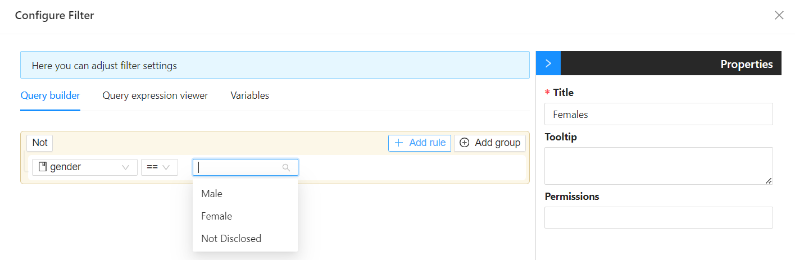
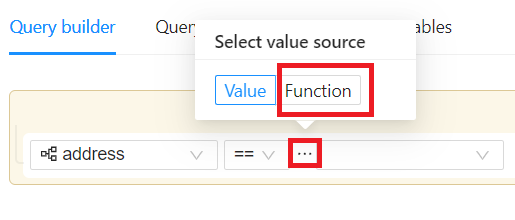
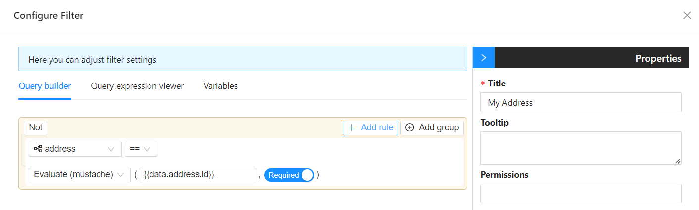

# Filtering

Filtering narrows down a set of data to just the records a user needs, based on specific criteria. Shesha supports this in a few different ways depending on whether the criteria are fixed in advance or need to change based on user input or form data.

The main ways to filter data in Shesha are:

1. [Table View Selector](../form-components/tables-lists/table-view-selector.md) - lets the user switch between a set of named, predefined filters. Must be used inside a [DataTable Context](../form-components/tables-lists/datatable-context.md).
2. [Permanent Filter](../form-components/tables-lists/datatable-context.md#permanent-filter-object) - a filter built with the visual query builder that always applies to a DataTable Context, and cannot be changed or removed by the user at runtime.

---

## Filtering Using Static Values

Filtering with static values means the criteria are fixed in advance, rather than changing based on user input or form data. This is the simplest case in the query builder: you pick a field, an operator, and a fixed value.

Common uses for static filtering:

- **Category filters** - showing only records in a specific category, such as "Electronics."
- **Status filters** - showing only records with a specific status, such as "Open" or "Closed."
- **Time-based filters** - showing records from a fixed range, such as "the last 7 days."

:::note
Because the value is fixed in the query builder, changing what a static filter matches means editing the filter itself in the designer - it does not adapt automatically to different users or data.
:::

---

## Filtering with Dynamic Values

Filtering with dynamic values means the criteria change based on form data, context values, or other runtime state, rather than being fixed in the query builder. The query builder's **Evaluate (mustache)** function lets you write a [Mustache](https://mustache.github.io/) template expression that is evaluated against the current form data before the filter runs.

Select the `Evaluate (mustache)` function to enter your expression:

:::info
Query Builder filters that use `Evaluate (mustache)` or other scripted conditions are evaluated on the front end, against the current form data and contexts, before the filter is sent to the server as part of the data request. The server always receives the already-resolved value, never a raw, unevaluated expression.
:::
