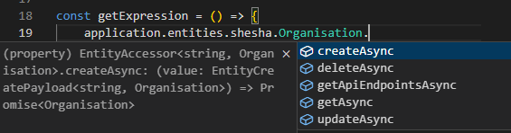

# Entities Actions

The `application.entities` object provides access to the entities API (all the different functions you can use to interact with entities). Shesha uses modules to group different parts of the application, and entities are grouped the same way.

To get the entities from a specific module, use this pattern:

`application.entities.[module-name-here].[entity-name-here]`

To call one of the CRUD functions on that entity, use this pattern:

`application.entities.[module-name-here].[entity-name-here].[function-name-here]`

For example, to access the entity `Shesha.Core.Organisation` from the `Shesha` module, use this pattern:

`application.entities.shesha.Organisation`

Each entity type exposes 5 methods:

1. `createAsync` - create a new entity.
2. `getAsync` - fetch entity data from the back-end.
3. `updateAsync` - update an entity.
4. `deleteAsync` - delete an entity.
5. `getApiEndpointsAsync` - get the API endpoints available for this entity.

All listed operations use the default CRUD API endpoints and don't require manual usage of URLs.



---

## createAsync - create a new entity

```typescript
try {
 const newPerson = await application.entities.shesha.Person.createAsync({
  firstName: 'Jane',
  lastName: 'Doe',
  emailAddress1: 'test@mail.com',
  mobileNumber1: '1234567890',
 });
 actions.showMessage.success('Person created successfully!');
}
catch (error) {
 console.error('Failed to create person.', error);
}
```

---

## getAsync - fetch entity data from the back-end

```typescript
const personId = '...';
try {
  const person = await application.entities.shesha.Person.getAsync(personId);
  const { firstName, lastName } = person;
  actions.showMessage.success(`Person data fetched. First name: '${firstName}', Last name: '${lastName}'`);
}
catch (error) {
  console.error('Failed to fetch person data. ', error);
}
```

---

## updateAsync - update existing entity

`updateAsync` requires the entity's `id`. Every other property is optional, so only the fields that changed need to be included in the payload.

```typescript
try {
 const updatedPerson = await application.entities.shesha.Person.updateAsync({
  id: personId,
  emailAddress1: 'newemail@mail.com',
  mobileNumber1: '5555555555',
 });
  actions.showMessage.success('Updated person successfully.', updatedPerson);
}
catch (error) {
 console.error('Failed to update person.', error);
}
```

---

## deleteAsync - delete an entity

```typescript
try {
	await application.entities.shesha.Person.deleteAsync(personId);
	  actions.showMessage.success('Deleted person successfully.');
}
catch (error) {
	console.error('Failed to delete person.', error);
}
```

---

## getApiEndpointsAsync - get the API endpoints for this entity

Returns the CRUD endpoints (`create`, `read`, `update`, `delete`) that back this entity type, each as an `{ httpVerb, url }` object. This is useful when you need to call an endpoint directly, for example with `http`, instead of going through `createAsync`/`getAsync`/`updateAsync`/`deleteAsync`.

```typescript
try {
  const endpoints = await application.entities.shesha.Person.getApiEndpointsAsync();
  console.log(endpoints.read.httpVerb, endpoints.read.url);
}
catch (error) {
  console.error('Failed to get API endpoints.', error);
}
```
