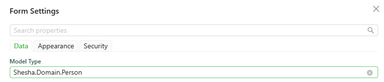

# Form Instance API

The `form` object is the current form: the data the user has entered, the mode it is in, the other components on it, and the functions to read, change, and submit it. It is available in every Shesha script and is the object most scripts spend their time in.

---

## Reading Form State

#### **form.data** `object`

The form's current field values. Each property is named after the `Property Name` of a component on the form.

```javascript
const firstName = form.data.firstName;
```

The top-level `formData` variable is the same data, so `formData.firstName` and `form.data.firstName` are interchangeable.

#### **form.getFormData()** `function`

Returns the form's current data. Use this where you need the freshest values rather than a copy captured earlier in the script, for example inside a callback that runs after an `await`.

```javascript
const currentData = form.getFormData();
```

#### **form.mode** `string`

The current form mode, one of `edit`, `readonly`, or `designer`.

```javascript
const getHidden = () => {
  // Hide the save button when the form is being viewed rather than edited.
  return form.mode === 'readonly';
};
```

#### **form.state** `object`

A store scoped to this form. It behaves like a plain object, so any property you set on it becomes available under that name to every script on the form. Use it for a value that several components on the form need to share but that is not a field on the record.

```javascript
form.state.calculatedTotal = form.data.quantity * form.data.unitPrice;
```

#### **form.components** `object`

Typed access to the other components on the form, keyed by their `Property Name`. It lets a script read or drive another component, including a DataTable or a DataList, without reaching into Shesha's internals.

**Form type to use:** Table / List View - use when showing multiple records.

**Example - Refresh a table after saving:**

```javascript
const onSubmitSuccess = () => {
  form.components.membersTable?.api?.refreshTable();
};
```

**Example - Read the row a user has selected in a table:**

```javascript
const onClickAsync = async () => {
  const selected = form.components.membersTable?.selectedRow;
  if (!selected) {
    actions.showMessage.warning('Select a row first.');
    return;
  }
  actions.navigateToForm({ name: 'member-details', module: 'Membership' }, { id: selected.id });
};
```

:::info This replaces the old selectedRow variable
Earlier versions of Shesha exposed a single `selectedRow` variable that pointed at the nearest table. It is no longer suggested or type-checked. Reading the component directly through `form.components` is explicit about which table you mean, which matters as soon as a page has more than one.
:::

#### **form.settings** `object`

The form's own configuration, including `modelType` - the entity the form is bound to - and its configured `getUrl`, `postUrl`, `putUrl`, and `deleteUrl`.

```javascript
console.log(form.settings.modelType);
```

#### **form.modelType** `string`

The entity type the form is bound to, if any.

#### **form.defaultApiEndpoints** `object`

The default CRUD API endpoints for the form's entity. Available only when the form's `Model type` is an existing entity.



```javascript
console.log(form.defaultApiEndpoints);
```

which logs:

```json
{
  "read": {
    "httpVerb": "GET",
    "url": "api/dynamic/Shesha/Person/Crud/Get"
  },
  "list": {
    "httpVerb": "GET",
    "url": "api/dynamic/Shesha/Person/Crud/GetAll"
  },
  "create": {
    "httpVerb": "POST",
    "url": "api/dynamic/Shesha/Person/Crud/Create"
  },
  "update": {
    "httpVerb": "PUT",
    "url": "api/dynamic/Shesha/Person/Crud/Update"
  },
  "delete": {
    "httpVerb": "DELETE",
    "url": "api/dynamic/Shesha/Person/Crud/Delete"
  }
}
```

#### **form.initialValues** `object`

The values the form had when it first loaded, before the user changed anything. Useful for working out what has actually changed.

#### **form.arguments** `object`

The arguments passed to the form by whatever opened it, such as the values supplied when navigating to it or opening it in a dialog.

#### **form.parentFormValues** `object`

The field values of the parent form, when this form is rendered inside a SubForm.

___

## Updating Form Data

#### **form.setFieldsValue(values)** `function`

Merges an object of field values into the form's current data. This is how a script changes what is on the form.

**Form type to use:** Edit Form - use when the user is updating an existing record.

**Example - Build a full name from two other fields:**

```javascript
const onChange = () => {
  const { firstName, lastName } = form.data;
  form.setFieldsValue({ fullName: [firstName, lastName].filter(Boolean).join(' ') });
};
```

#### **form.clear()** `function`

Clears every field value on the form.

```javascript
form.clear();
```

#### **form.addDelayedUpdateData(data)** `function`

Adds data to the form's deferred-update queue and returns the pending updates. Shesha uses this for child data that has to be saved after the parent record exists, such as newly uploaded files.

```javascript
const groups = form.addDelayedUpdateData(form.data);
```

___

## Submitting and Reporting Validation

#### **form.submit()** `function`

Submits the form, the same as the user clicking its submit button.

```javascript
form.submit();
```

#### **form.setValidationErrors(payload)** `function`

Sets the validation errors shown by a [Validation Errors](../form-components/data-display/validation-errors.md) component. It accepts a plain string, an API error response, or a caught `Error`, so you can usually hand it whatever you caught.

**Form type to use:** Edit Form - use when the user is updating an existing record.

**Example - Show an API failure on the form:**

```javascript
const onClickAsync = async () => {
  try {
    await actions.callApi.post('/api/services/app/Members/Submit', form.data);
  } catch (error) {
    // Passing the caught error straight through surfaces the back-end's own messages.
    form.setValidationErrors(error);
  }
};
```

___

## Advanced

#### **form.formInstance** `object`

The underlying Ant Design form instance. See the [Ant Design Form documentation](https://ant.design/components/form) for its API.

#### **form.shaForm** `object`

The internal Shesha form instance. Prefer the properties and methods above for everyday scripting. This is an escape hatch into Shesha's own form machinery and is not covered by the compatibility guarantees the rest of this page carries.

---

## Older Property Names

These names still resolve at runtime, so existing scripts keep working, but they are no longer suggested or type-checked in the editor.

| Old name | Use instead |
|---|---|
| `form.formMode` | `form.mode` |
| `form.formSettings` | `form.settings` |
| `form.formArguments` | `form.arguments` |
| `form.context` | `form.state` |
| `form.clearFieldsValue()` | `form.clear()` |
| `form.setFieldValue(name, value)` | `form.setFieldsValue({ name: value })` |
| `form.setFormData(payload)` | `form.setFieldsValue(values)` |
