# Permission Based Security Model

Shesha adopts a permission-based model, which means users can only perform restricted actions if they've been granted that specific permission. Think of it like having different keys for different doors in a building - you can only enter the rooms you're authorised to access.

This walkthrough shows how to create a new permission, assign it to a role, and use it to restrict a menu item. For the underlying concepts (roles, role types, and how RBAC works in Shesha), see [Authorization and Access Control](./access-control.md).

This article assumes you have configured your Shesha project so that it's up and running. If you haven't, you can set up your project [here](../../get-started/setting-up.md).

---

## Creating a Permission

From the homepage, navigate to the **Permissions Configurator** by clicking the **Permissions** button.

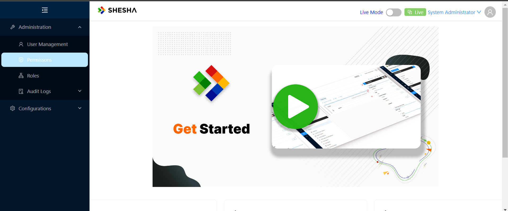

On the **Permissions Configurator** page, create a new permission by clicking **Create root**.

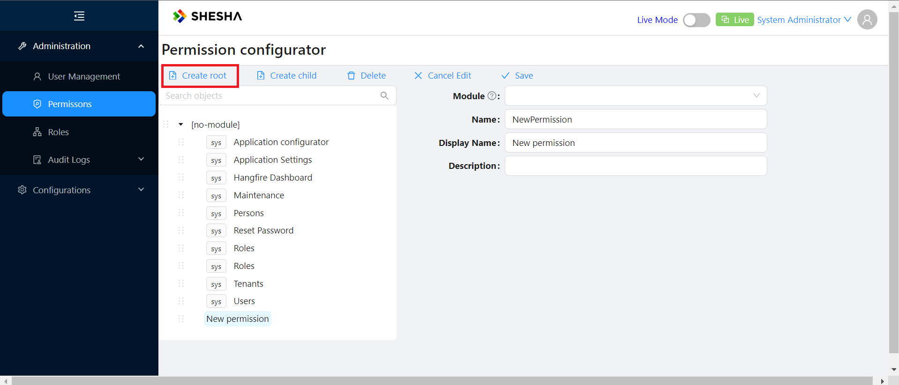

This opens a modal where you specify:

1. The module you want to apply the permission to.
2. The name of the permission.
3. The display name of the permission, as shown in the list alongside other permissions.
4. A description of what the permission does.

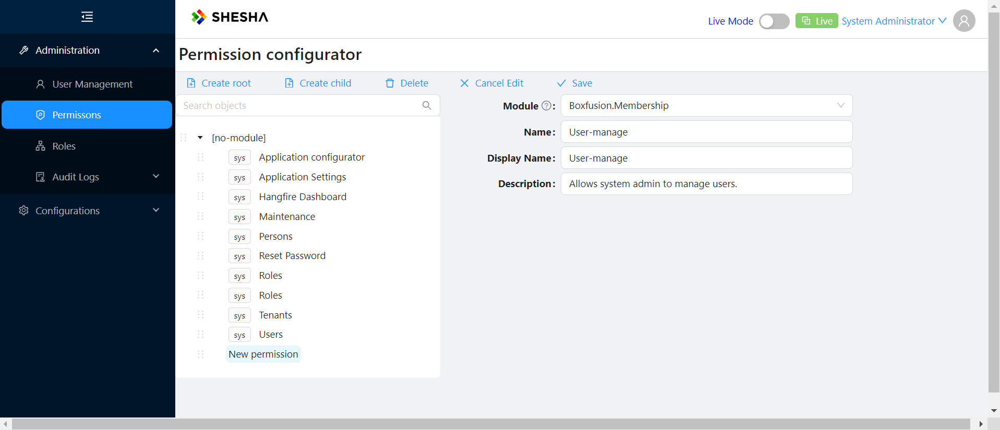

Click **Save** to create the new permission. It now appears in the permissions list.

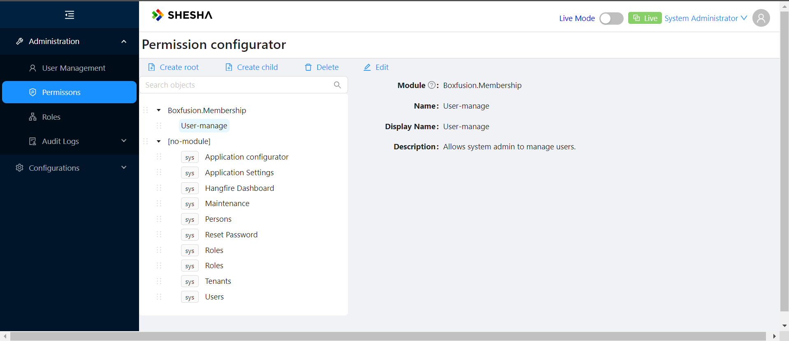

You can also define a permission without a module.

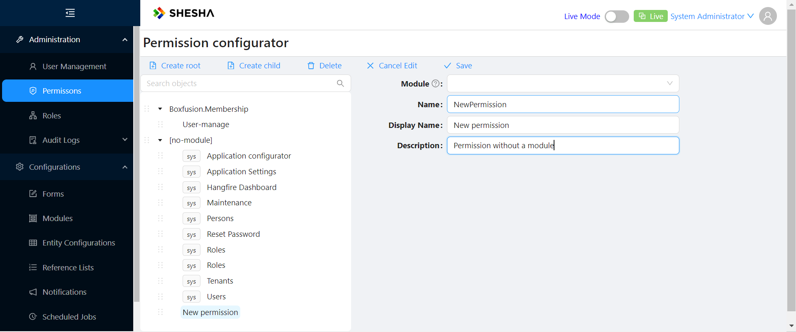

A permission created this way appears under the **no-module** section of the list.

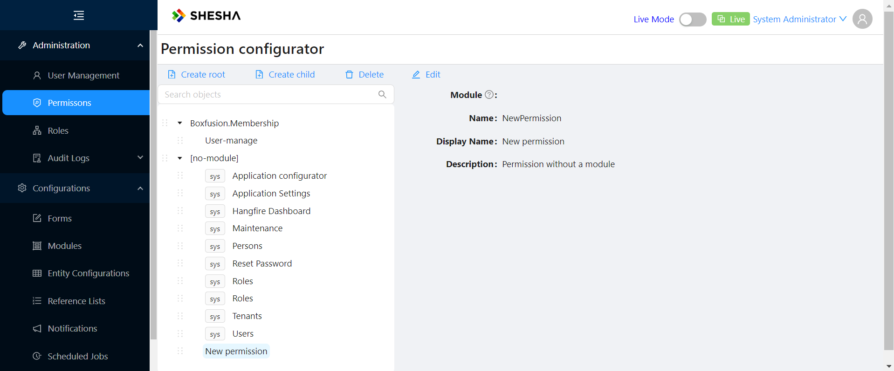

---

## Assigning a Permission to a Role

Next, assign the newly created permission to a role. Navigate to the **Roles** modal by clicking the **Roles** button to see the available roles.

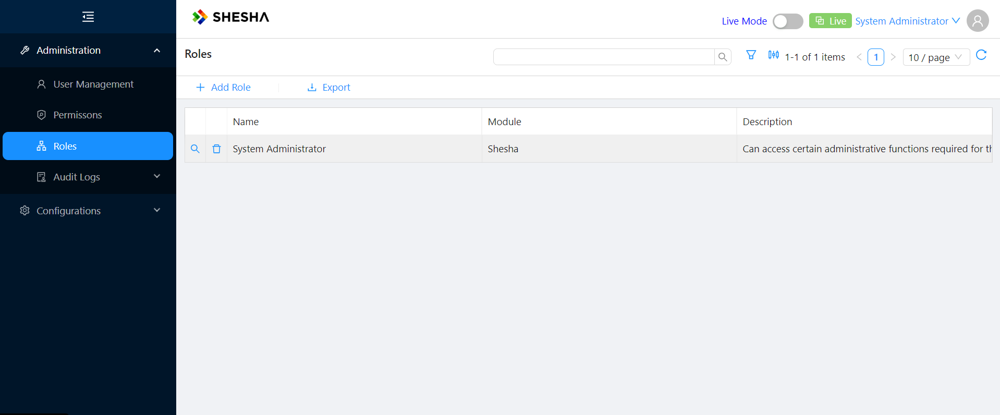

Click the magnifier icon next to a role, for example **System Administrator**, to open it.

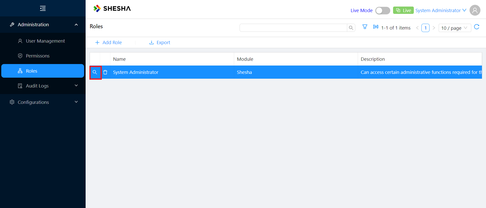

Click **Edit**.

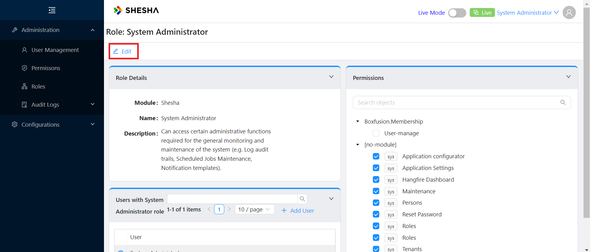

Select the checkbox for the newly created permission and click **Save**.

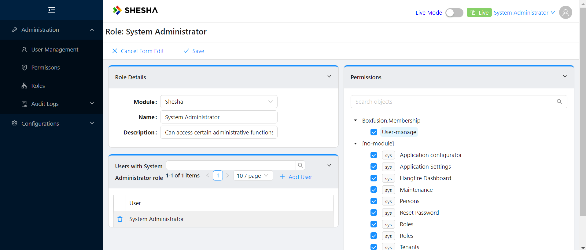

---

## Restricting a Menu Item to the Permission

To make an area of the application, such as an administration menu group, available only to users whose role has the permission you just created, switch the application to **Edit Mode**. Click the **Live Mode** toggle in the top menu bar to switch it.

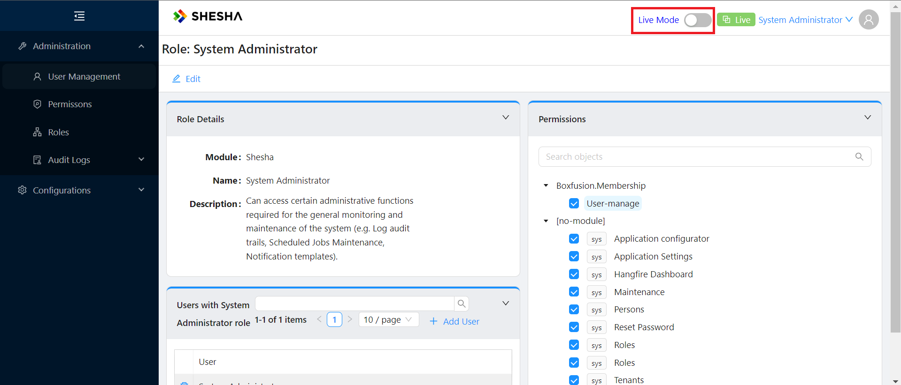

Once switched, the top menu bar changes and a notification confirms the application is now in **Edit Mode**. See [Toggling Edit Mode](../../front-end-basics/configured-views/toggling-edit-mode.md) for more on this toggle.

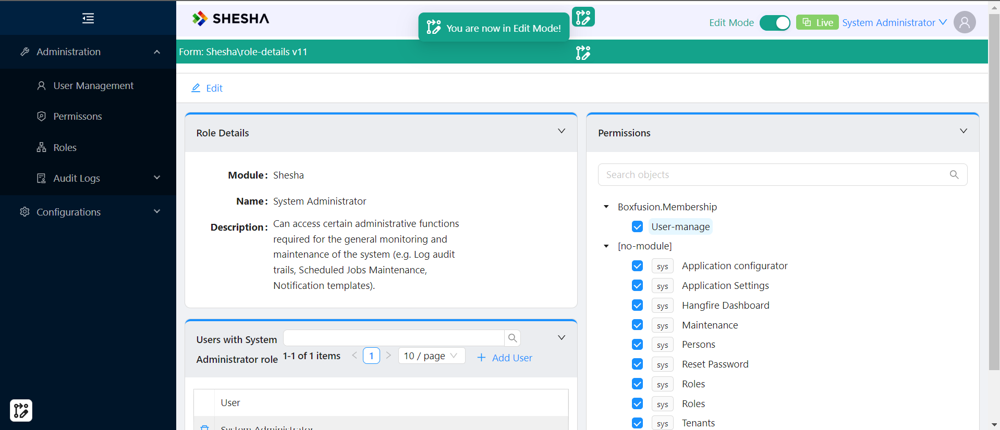

While in Edit Mode, click the **Permissions** button in the sidebar again to bring up the edit-mode permissions modal.

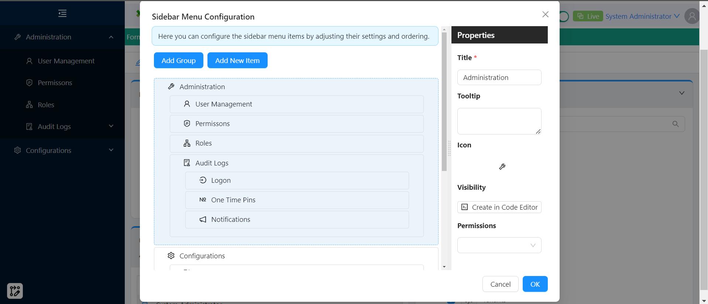

Add the newly created permission to the menu group.

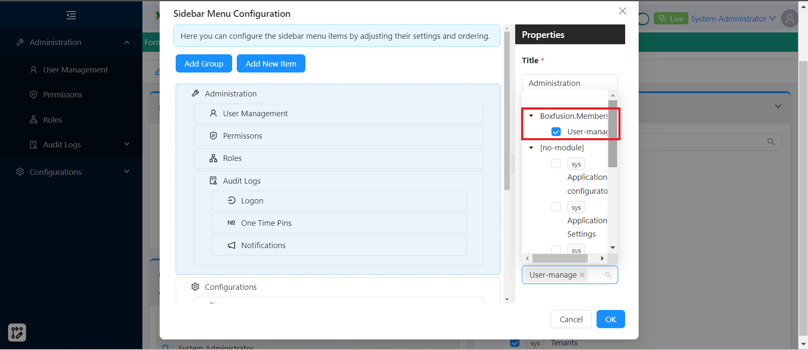

:::note
Assigning permissions this way also applies to individual form components within a form - see the [Permissions](../../front-end-basics/form-components/common-component-properties.md#permissions) common property.
:::
