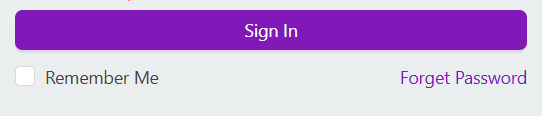
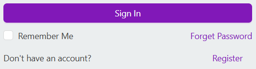
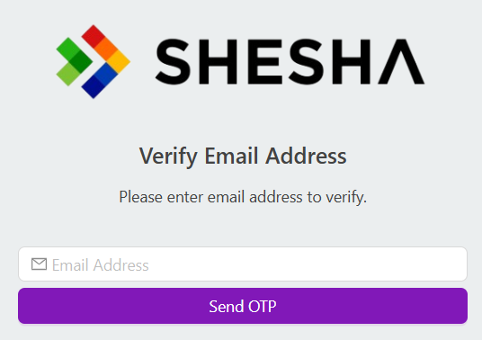
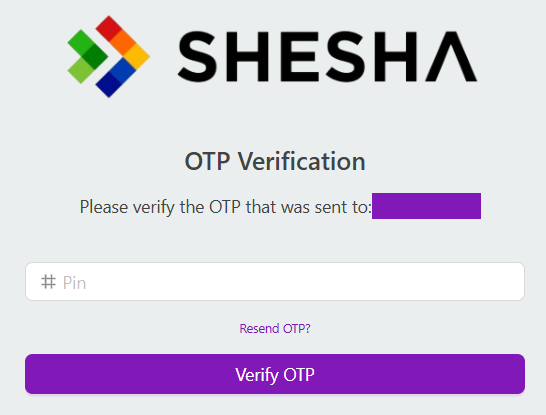
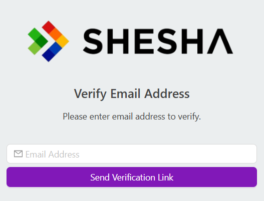
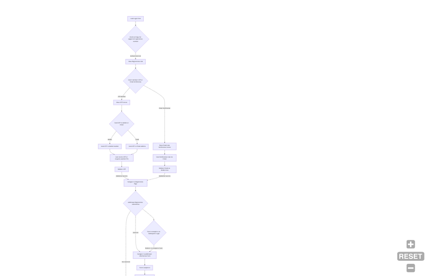

# User Registration

Shesha lets users create their own accounts instead of requiring an administrator to create every account manually. You choose exactly how people sign up (by email, by mobile number, or not at all), what verification they must complete first, and whether they need to fill in extra information before their account is usable.

---

## Self-Registration vs Admin-Created Accounts

A user account can come into existence in a Shesha application in one of two ways:

- **Self-registration** - the user creates their own account through the public registration form this page describes. It's optional: set **Supported Registration Method** (below) to **None** to turn it off entirely.
- **Admin registration** - an administrator creates the account on the user's behalf instead. See [User Management](../../for-administrators/user-management.md) for that flow.

The rest of this page covers self-registration.

---

## Configuration Options

These are configured through `UserManagementSettings`, the compound application setting that controls registration.

### Supported Registration Method

Exactly one registration method is active at a time.

| Option | Behaviour |
|---|---|
| **None** | New registration is disabled. The Register link is hidden from the login page. |
| **Email Address** | Users register with their email address and must verify it before their account is usable. |
| **Mobile Number** | Users register with their mobile number and must verify it with an OTP before their account is usable. |

When Email Address or Mobile Number is selected, the Register link appears on the login page and the user must supply and verify that detail:

**Email Address:**

**Mobile Number:**

:::note A fourth option exists but isn't wired up yet
The underlying `SupportedRegistrationMethods` enum also defines an `OAuth` value, for registering via an external identity provider. It isn't currently used by the registration flow itself - it's unrelated to the separate [Custom Authentication Providers](./authentication.md#custom-authentication-providers) extension point, which is about logging in with an existing external identity, not self-registration.
:::

### Require Email Verification

When email registration requires verification, Shesha emails the user a single-use link containing a unique token with an expiration time.

### User Email as Username

Controls whether the user's email address doubles as their login username.

| Value | Behaviour |
|---|---|
| `false` | The user sets a separate username, and Shesha enforces that it's unique. |
| `true` | The user's email address is also their username. |

### Go to URL After Registration

The URL the user is redirected to once registration succeeds.

### Additional Registration Information

Configures a form for capturing extra details beyond the basic registration fields. When set, the new account stays incomplete until that form is submitted.

:::note
While a registration is incomplete, logging in redirects the user straight to the Additional Registration Information form instead of the application. Submitting that form calls `POST /api/services/app/UserManagement/CompleteRegistration` to finalize the account - if the user closes the form without submitting, they're sent back to it the next time they log in.
:::

---

## Registration Flow

1. The user submits the registration form (email or mobile number, depending on the configured method).
2. Shesha creates the account and, if Additional Registration Information is configured, marks it incomplete.
3. The user verifies their email or mobile number via the emailed link or SMS OTP.
4. If Additional Registration Information was configured, the user completes that form before the account can be used - any login attempt before this redirects them back to it.
5. The user is redirected to the configured Go to URL, with a fully active account.

---

## Customising the Registration Form

The base registration form only ever collects and saves the fields defined on the DTO behind the registration endpoint (`POST /api/services/app/UserManagement/Create`): username, password, password confirmation, first name, last name, mobile number, email address, type of account, and whether the user must change their password on first login.

You can't add extra fields to this base form and have them saved automatically - the endpoint only maps the properties defined on that DTO. If you need to collect more information at signup, such as a department or a set of terms and conditions, use **Additional Registration Information** above instead. It captures that data through a separate form completed right after the base registration step, rather than extending the base form itself.

---

## Registering a Custom Person Entity

Out of the box, self-registration always creates a base `Person` record. The registration endpoint's `CreateAsync` method is not declared `virtual`, and it's hard-wired to `IRepository<Person, Guid>` - so unlike the SMS gateway or [`IHomePageRouter`](../how-to-change-home-page.md#custom-routing-per-user) extension points, there's no built-in setting or override interface that lets self-registration create a subclass of `Person` instead.

If your application needs self-registered users to end up as a custom `Person` subclass, this isn't a supported customisation point today. Replacing the built-in `IUserManagementAppService` implementation to change this behaviour would be a much larger change than the other extension points on this page, and isn't officially documented - treat it as an open gap rather than something to attempt without further guidance.
