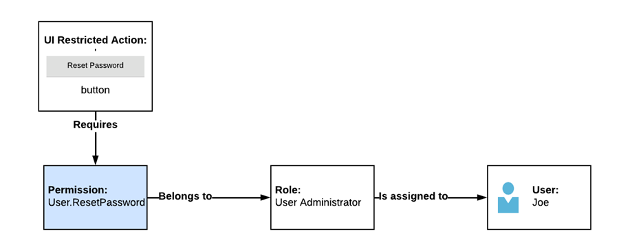
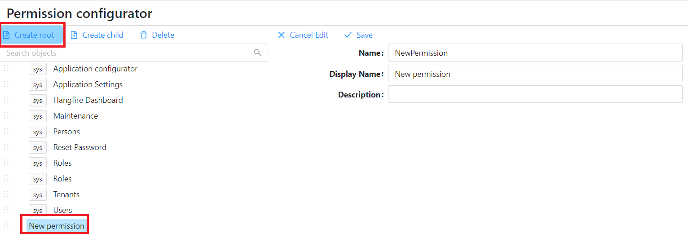
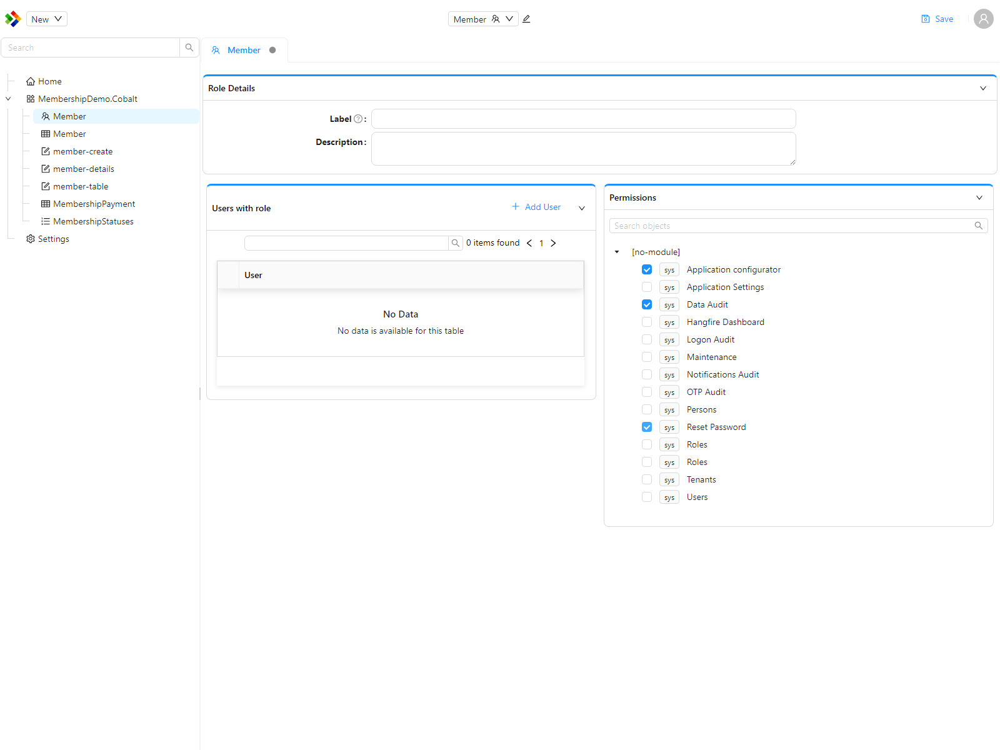
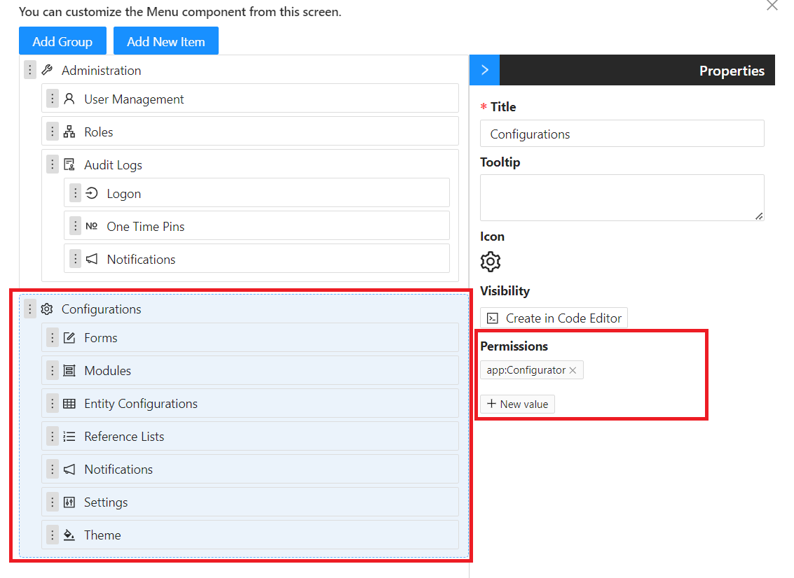
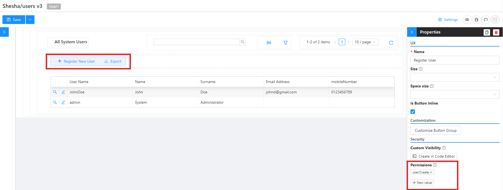
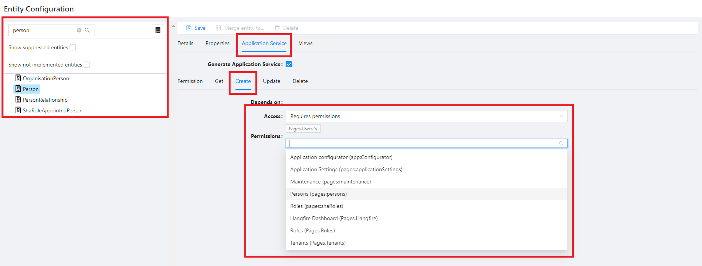

# Authorization and Authentication

## Permission Based Security Model

In more advanced applications, ensuring that specific actions are only performed by authorized users is crucial. This concept is commonly known as `Authorization` or `Access Control`. Shesha employs a `Permissions-based security model` to enforce authorization, where restricted actions can only be executed by users assigned the relevant permission. However, assigning permissions directly to users is not the standard practice; instead, it is done through roles. Roles are associated with one or more permissions, and by assigning a role to a user, the user automatically inherits all linked permissions.

Consider a scenario where access to the `Reset Password` functionality needs restriction. In this case, the **Reset Password** button on the form configurator is a restricted action. The form configurator allows specifying the required permission(s) for a component through the **Visible Permissions** property (or **Edit Mode Permissions**, if the component should still be visible but read-only to users without the permission). For example, it could be set to the permission `User.ResetPassword`. This permission would then be linked to the role `User Administrator`. To grant user Joe the ability to reset passwords, you would assign the role `User Administrator` to Joe. The scenario is illustrated in the diagram below:

:::warning Component property renamed
The single **Required permissions** property shown in older screenshots has been replaced by two separate properties: **Visible Permissions** (`visiblePermissions`) controls whether the component is rendered at all, and **Edit Mode Permissions** (`editModePermissions`) controls whether it is editable versus read-only. A `permissions` property still exists on some components for backward compatibility, but it is deprecated - use `visiblePermissions` or `editModePermissions` instead.
:::

In addition to making the button invisible, proper application security requires restricting access to the Reset Password functionality at the API level. Shesha allows configurators to specify which permissions are necessary to access APIs through the configuration environment.

### Side note: Why not just use Roles on their own without Permissions?

Designing an application solely around role-based security can lead to an ever-expanding number of roles and complex logic to handle all possible scenarios, especially when users can be members of multiple roles. Role-based security is effective with a small and stable number of roles. For more complex scenarios, a permission-based security system provides a flexible solution with fewer maintenance challenges.

# Managing Roles and Permissions

## Managing Permissions

Permissions are managed as configuration items inside the **Configuration Studio**, the same tool used to manage forms, entities, reference lists, and roles.

To create a new permission:

1. Open the **Configuration Studio** from the main menu.
2. In the Solution Explorer, choose **New > Permission**.
3. Specify the `Name`, `Display Name`, and `Description` of the permission, and set a `Parent` if it belongs under an existing permission, then save.

:::note
A permission with no `Parent` is a root-level permission. Nesting permissions under a parent is optional and is mainly used to group related permissions together in the Permissions panel shown when editing a role.
:::

### Permission Naming Conventions

Permission names must be unique within a module and follow the naming convention: `{Name of thing to secure}-{Action name}`. Examples include:

- `User-View`
- `User-Create`
- `User-Update`
- `User-Delete`
- `User-ResetPassword`
- `User-Suspend`

:::note Shesha's own built-in permissions use a different pattern
This dash-separated pattern is a recommended convention for permissions you define in your own application. Shesha's built-in framework permissions instead use a dot-separated, hierarchical style, for example `Pages.Users` and `Pages.Roles` (see `PermissionNames` in `Shesha.Framework`). Either style works technically - pick one convention for your own application and stay consistent.
:::

### Permission Granularity

For efficient management, consider permission granularity. Instead of creating separate permissions for every action, you can group related actions. For example:

- `User-View`
- `User-Manage` (combining Update, Delete, Reset Password, and Suspend permissions)

This allows for both read-only and full user management capabilities.

## Managing Roles

To manage roles and associate permissions with each role:

1. Open the **Configuration Studio** and locate the role in the Solution Explorer, or create a new one with **New > Role**.
2. Open the role to view its details. The **Permissions** panel lists every permission grouped by module - tick the permissions you want to associate with the role, then **Save**.

[More on Role vs. Permission-based Access Control](https://softwareengineering.stackexchange.com/questions/299729/role-vs-permission-based-access-control)

## Securing the Front-end

### Limiting visibility of Main Menu items and Toolbar buttons

To restrict access to views from the main menu based on user permissions:

1. Toggle Edit Mode and Open the Menu configurator
2. Select the menu item to restrict
3. Specify the required Permission(s) to access the view.

### Limiting visibility of Form Components

To restrict access to form components based on user permissions:

1. Open form designer
2. Select the component you want to restrict
3. Set the required permission(s) on **Visible Permissions** (to hide the component entirely) or **Edit Mode Permissions** (to keep it visible but read-only).

## Securing APIs

### Limiting Access to APIs

To limit access to an API based on user permissions:

1. From the Configuration main menu, select **Entity Configurations**
2. Search through the list of enities available in your application and select the applicable one
3. Navigate to the **Application Service** tab and select the endpoint to secure

   - Ensure **Requires permission** is selected for the **Access** property
   - Select the permission(s) required for users to access the endpoint.

     _Note: Users need any one of the specified permissions to access the API._

### Limiting Access to Data

While permissions define actions, row-level filtering in Shesha restricts what data a user can see. For example:

- A Salesperson may only see customers within a specific region.
- Administrators may only see users belonging to a particular organizational unit in decentralized User Administration.

:::warning "Data Filters" is now called Specifications
This capability is implemented through Shesha's **Specifications** framework (`Shesha.Specifications` namespace) rather than a feature called "Data Filters". A specification is a reusable, named filter that can be marked global (applied automatically) or made available to the front-end. See the framework-contributors documentation on Specifications for how to implement one.
:::
